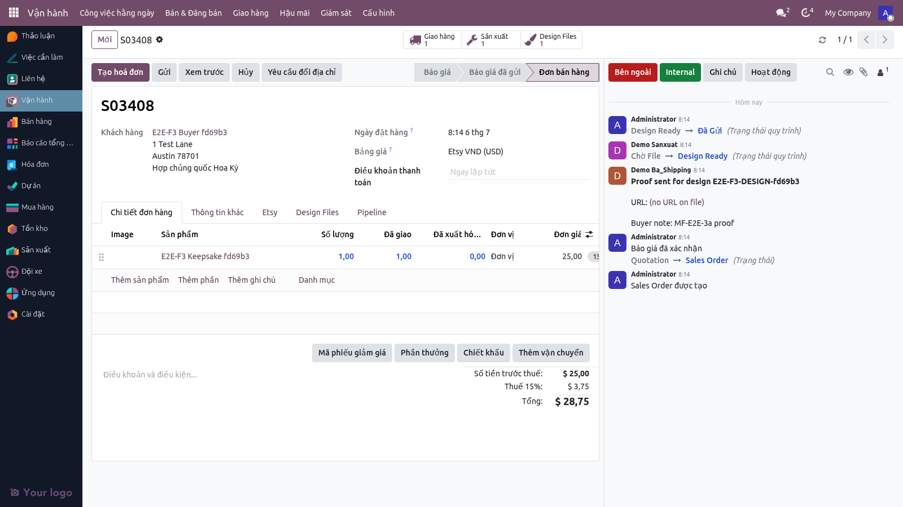
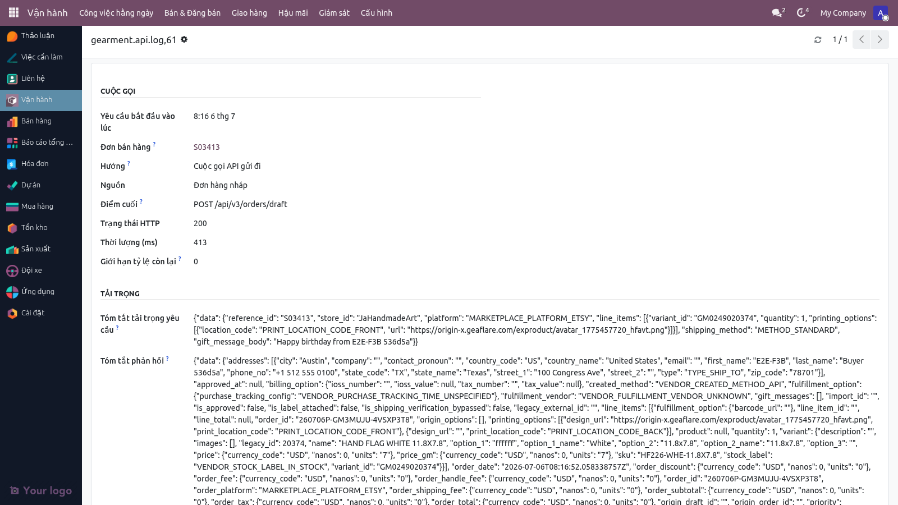

# Quy trình giao hàng — In nội bộ (MTO) & Dropship Gearment

**Phiên bản:** 1.1 · **Ngày:** 2026-07-05 · **Ngôn ngữ:** Tiếng Việt

> Tài liệu mô tả cách một đơn Etsy đi từ khi vào hệ thống đến khi khách nhận hàng. Hai đường: **MTO** (in nội bộ, đội xưởng thực hiện) và **Dropship** (Gearment thực hiện). Dùng cho Chủ shop và các đội liên quan.

### Màn hình thực tế

*Giao diện trạng thái pipeline VN trong quy trình giao hàng.*

---

## Hệ quyết định MTO hay Dropship

Khi đơn vào hệ thống, từng dòng sản phẩm được tự động phân tuyến:

- Sản phẩm có **mã SKU Gearment** trong cấu hình → đi **Dropship Gearment**.
- Sản phẩm **không có** mã SKU Gearment → đi **MTO in nội bộ**.

Một đơn có thể chứa cả hai loại — hệ thống xử lý từng dòng riêng.

---

## Đường MTO (in nội bộ)

### 17 trạng thái pipeline VN

Đơn MTO chạy qua các trạng thái:

1. **Mới nhận** — đơn vừa vào, chờ BA tiếp nhận.
2. **BA kiểm tra** — BA xác minh thông tin khách + cá nhân hoá.
3. **Thiết kế** — đội Marketing/PD upload file thiết kế in.
4. **Chờ duyệt thiết kế** — BA hoặc khách (nếu cần) duyệt file.
5. **Đã duyệt** — chuẩn bị sản xuất.
6. **Sản xuất** — đội xưởng in / khắc.
7. **QC** — kiểm tra chất lượng trước đóng gói.
8. **Đóng gói** — chuẩn bị bưu kiện.
9. **Chờ nhãn vận chuyển** — chờ in nhãn (USPS / UniUni / YunExpress).
10. **Đã in nhãn** — sẵn sàng giao cho đối tác vận chuyển.
11. **Giao bưu vận** — đối tác đã nhận.
12. **Đang vận chuyển** — có tracking, đang theo dõi.
13. **Đã giao** — khách đã nhận, tracking báo Delivered.
14. **Có vấn đề** — khách báo lỗi / yêu cầu hậu mãi.
15. **Hoàn trả** — quy trình hậu mãi đang chạy.
16. **In lại** — đơn cần in lại.
17. **Hoàn tất** — đóng đơn.

### Các đội tham gia

- **BA Lead / BA User** — kiểm tra đơn + chốt thiết kế.
- **Marketing** — upload file thiết kế (kanban 3 cột Pending/Approved/Rejected).
- **PD (Production Design)** — chuyển file thiết kế thành file in chuẩn.
- **Sản xuất** — in / khắc.
- **QC + Đóng gói** — kiểm tra + đóng gói.
- **Shipping** — in nhãn + gửi bưu vận.

### File thiết kế

- Upload qua **Design Files** trên form đơn — mỗi dòng sản phẩm có thể có nhiều file (mặt trước, mặt sau, ảnh tham chiếu).
- File chính lưu trên **Google Drive**; hệ thống lưu link + preview.
- Giới hạn upload trực tiếp: 10 MB (file lớn hơn → để trên GDrive + dán link).
- File bị từ chối → BA + Marketing được thông báo qua chatter.

### Phiếu Design + báo "Đã duyệt thiết kế" cho xưởng

- Khi xác nhận đơn bán, hệ thống tự tạo một **Phiếu Design** riêng (bật/tắt trong
  Cấu hình → Bán hàng). Đội sản xuất bấm **Duyệt** trên phiếu này khi file đạt.
- Sau khi duyệt, **đơn sản xuất** hiện huy hiệu xanh **"Design Ready"** + nút mở
  nhanh Phiếu Design. Trước khi duyệt, đơn sản xuất báo vàng "chờ duyệt thiết kế".
  Đây chỉ là chỉ báo — không chặn xưởng bắt đầu sản xuất.

### Tự động chuyển trạng thái

Các bước tự động hiện có trên đường MTO:

- **Đơn sản xuất được xác nhận** → đơn bán tự sang bước "CHỜ FILE".
- **Xác nhận Phiếu xuất kho (giao hàng)** → đơn bán tự sang bước **"ĐÃ GỬI"**
  (mới từ 2026-07-06 — trước đây BA phải tự đổi tay).

  
- **Tất cả đơn sản xuất hoàn thành** → đơn bán tự sang "HOÀN THÀNH".

Các bước giữa (ĐÃ SẢN XUẤT, ĐÃ ĐÓNG GÓI) vẫn do đội thao tác đổi tay.

---

## Đường Dropship Gearment

### Luồng chuẩn

1. **Đơn vào hệ thống** với sản phẩm có mã SKU Gearment.
2. Hệ thống tự đặt tuyến **Dropship** + đặt **Gearment** làm nhà cung cấp.
3. BA Shipping mở wizard **"Báo giá Gearment"** → hệ thống gửi yêu cầu báo giá đến Gearment.
4. Gearment trả giá → BA Shipping duyệt giá → trạng thái chuyển **"Đã duyệt giá"**.
5. Hệ thống tự động gửi đơn sang Gearment (qua API v3).
6. Gearment xác nhận đơn → tạo Tracking → hệ thống nhận webhook + cập nhật tracking.
7. Hệ thống gửi tracking lên Etsy (đường viết-ngược) → trạng thái Etsy: Shipped.
8. Khi khách nhận → Gearment báo Delivered → đơn đóng.

### Bulk action (cho khi cron bị tạm dừng)

Khi cron đồng bộ tự động bị tạm dừng:

- Mở **Operations Dashboard** → lọc các đơn ở trạng thái "Đã duyệt giá Gearment".
- Chọn nhiều dòng → bấm server action **"Đồng bộ Gearment hàng loạt"**.
- Hệ thống xử lý từng đơn với savepoint riêng — một đơn lỗi không làm hỏng các đơn khác.
- Tiến độ hiển thị qua bus notification (toast trên góc phải màn hình).

### Vai trò + quyền

- Chỉ **BA Shipping** mới được bấm "Báo giá Gearment" và "Đồng bộ Gearment hàng loạt".
- Người dùng thường có thể xem nhưng không gửi đơn sang Gearment.

### Cá nhân hoá (personalization) & lời chúc quà tặng

- **Chữ cá nhân hoá** (tên, ngày, câu khắc…) khách nhập trên Etsy **không gửi
  dạng chữ sang Gearment** — Gearment chỉ in theo file thiết kế. Đội thiết kế
  đọc nội dung cá nhân hoá trên dòng đơn hàng và **đưa thẳng vào file thiết
  kế** trước khi duyệt. File duyệt xong mới đẩy đơn được (hệ thống đã chặn đơn
  thiếu file).
- **Lời chúc quà tặng** (gift message) khách trả tiền trên Etsy thì hệ thống
  **gửi kèm sang Gearment** (trường gift_message_body chính thức của Gearment)
  để in thiệp kèm gói hàng.

  

### Lưu ý về dịch vụ vận chuyển nhanh

Hiện Gearment chỉ nhận **giao tiêu chuẩn (Standard)**. Nếu khách Etsy đã trả
tiền cho dịch vụ nhanh (Express / Priority / Rush), hệ thống vẫn gửi Standard
nhưng **ghi cảnh báo** vào log để đội vận hành biết và chủ động xử lý với
khách (hoàn phí ship nhanh hoặc báo trước thời gian giao). Khi Gearment công
bố các phương thức nhanh qua API, hệ thống sẽ nối thẳng — không cần đổi quy
trình.

---

## Trạng thái Etsy được cập nhật từ hệ thống

Khi hệ thống nhận tracking (từ Gearment hoặc từ Excel GKE tracking import cho MTO):

1. Gọi Etsy API → đặt receipt sang **"Shipped"** + đính kèm tracking + tên carrier.
2. Etsy gửi email "Đơn đã được giao" đến khách.
3. Nếu Etsy báo lỗi → đơn ghi nhận "Tracking push failed" + cron thử lại sau 5 phút.

Trên form đơn, tab **"Etsy"** có khu vực hiển thị trạng thái push tracking (none / pending / pushed / failed) + thời điểm + lỗi gần nhất nếu có.

---

## Câu hỏi thường gặp

**Q:** _Đơn có cả sản phẩm Gearment và sản phẩm in nội bộ — xử lý sao?_
A: Hệ thống tự xử lý: sản phẩm Gearment đi đường Dropship, sản phẩm in nội bộ đi đường MTO trong cùng một đơn. Khách nhận hai bưu kiện riêng. Tracking từng bưu kiện được push riêng lên Etsy.

**Q:** _Khách yêu cầu in lại vì lỗi sản xuất._
A: Mở đơn → chuyển trạng thái sang **"In lại"** → ghi lý do trong chatter → đội sản xuất tạo phiếu in mới + thông báo BA Shipping in nhãn lại. Quy trình hậu mãi chi tiết xem `FLOW_HAU_MAI_VN.md` (sắp ra mắt).

**Q:** _Gearment báo lỗi khi gửi đơn — hệ thống làm gì?_
A: Log lỗi vào nhật ký Gearment API (xem trong form đơn → tab "Gearment"). Cron thử lại sau 5 phút (lên đến 3 lần). Sau đó đơn ở trạng thái "Lỗi đồng bộ" để BA can thiệp.

**Q:** _Làm sao biết khi nào tracking đã được Etsy ghi nhận?_
A: Mở đơn → tab "Etsy" → cột "Trạng thái push tracking" sẽ là **"pushed"** + thời gian. Nếu là **"failed"**, xem cột "Lỗi gần nhất".

**Q:** _Hệ thống nhập tracking từ Excel GKE — nhập tay được không?_
A: Có. Mở wizard **"Nhập tracking GKE"** trong menu Logistics → upload file Excel theo schema đã duyệt → hệ thống bóc tách + áp vào các đơn tương ứng. Nếu schema cột thay đổi, hệ thống nhận diện qua hash + cảnh báo BA Manager để duyệt schema mới (chống lỗi nhập sai cột).

---

## Liên hệ

- Đơn kẹt ở trạng thái không tự chuyển → BA Lead.
- Lỗi Gearment báo giá / gửi đơn → BA Shipping Manager.
- Tracking lên Etsy bị từ chối → Đội Kỹ thuật.

> Tài liệu kỹ thuật chi tiết: `specs/004a-tracking-import/` (GKE Excel) + `multichannel_hub_fulfillment` module (Gearment) + `specs/006-master-plan/adrs/ADR-010-hybrid-dropship-mto.md` (hệ thống lai MTO+Dropship).
