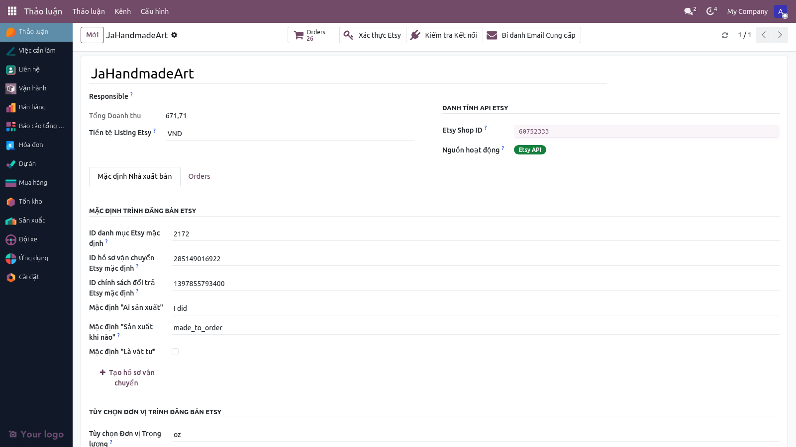
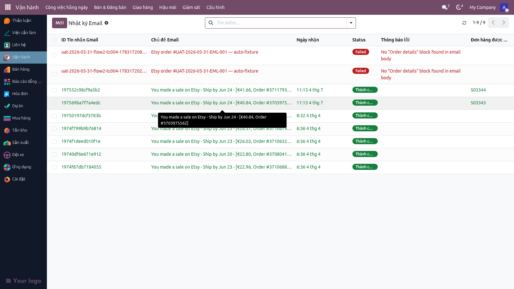
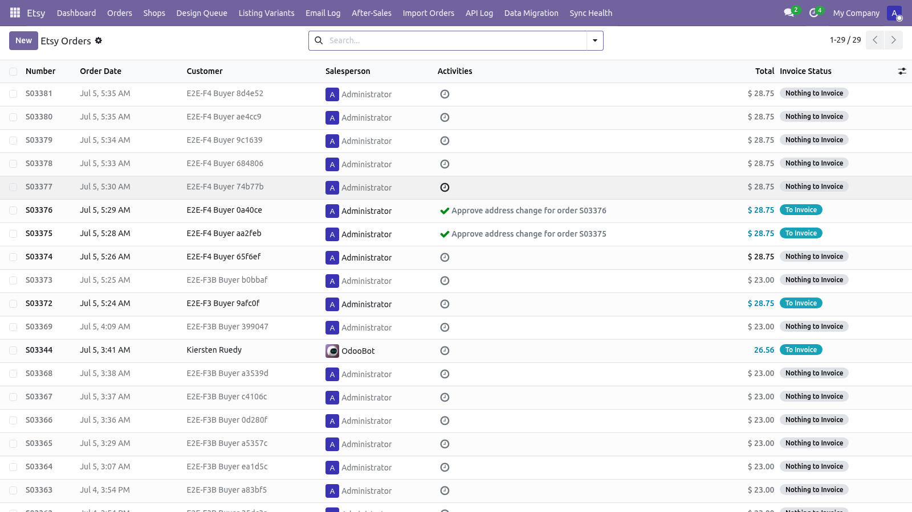
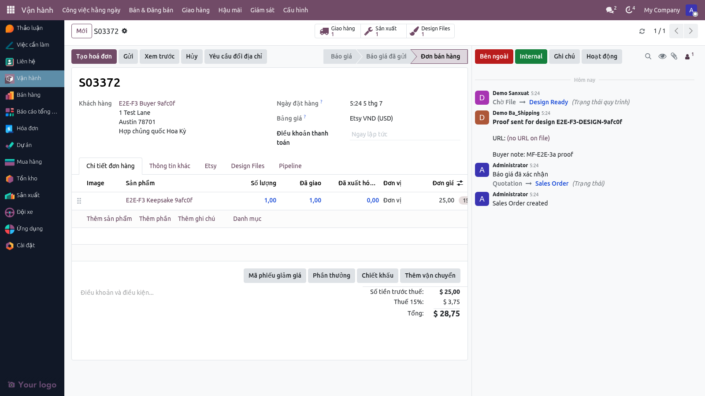
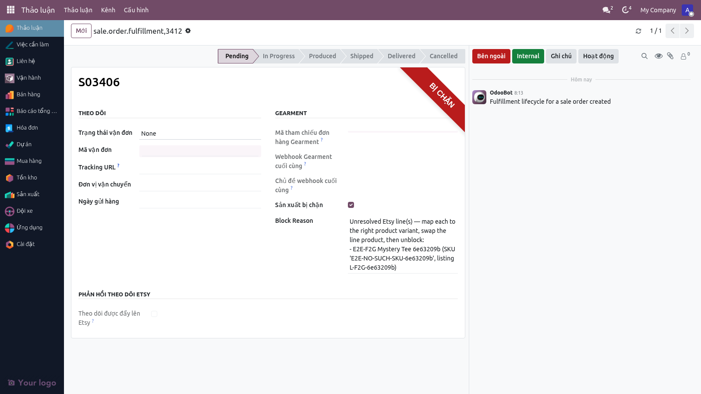
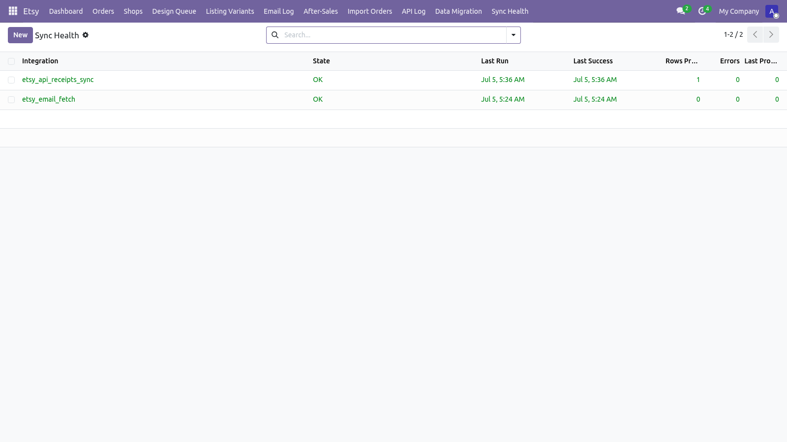

# Hướng dẫn sử dụng — Tiếp nhận đơn hàng Etsy

**Phiên bản:** 2.0 · **Ngày:** 2026-07-05 · **Ngôn ngữ:** Tiếng Việt
**Đối tượng:** Chủ shop, BA Lead, BA User, Đội Kỹ thuật
**Hệ thống:** Odoo 19 — module `etsy_integration`
**Tài liệu nghiệp vụ tham chiếu:** [`FLOW_DON_HANG_ETSY_VN.md`](./FLOW_DON_HANG_ETSY_VN.md)

> Hướng dẫn từng bước về cách đơn hàng Etsy được đưa vào hệ thống và cách BA xử lý ban đầu. Bao gồm hai đường: API (mới) và Email (cũ, dự phòng).

### Cập nhật v2.0 (2026-07-05)
Từ phiên bản này, giao diện hệ thống được làm mới với **Hatafa theme** (thanh điều hướng tím, sidebar tối). Menu chính **"Etsy"** được sắp xếp lại thành **"Vận hành"** (hub trung tâm) với 6 phần: Công việc hằng ngày, Bán & Đăng bán, Giao hàng, Hậu mãi, Giám sát, Cấu hình. Tất cả menu paths trong hướng dẫn này đã được cập nhật để phản ánh cấu trúc mới. Giao diện hoàn toàn **Tiếng Việt**.

---

> **Video hướng dẫn (2026-07-06):** Hai quy trình đầy đủ đã được quay video từng bước trên giao diện hệ thống:
> - **Dropship từ A-Z** (tạo sản phẩm → đăng Etsy → đơn hàng → Gearment → tracking): [videos/huong_dan_dropship.mp4](./videos/huong_dan_dropship.mp4)
> - **Sản xuất nội bộ (MTO) từ A-Z** (tạo sản phẩm → đăng Etsy → đơn hàng → lệnh sản xuất → giao hàng → tracking): [videos/huong_dan_mto.mp4](./videos/huong_dan_mto.mp4)
>
> Video không lưu trong kho mã nguồn — tải từ Google Drive dự án, hoặc dựng lại bằng `scripts/build_guide_videos.sh`.

## Mục lục

1. [Yêu cầu trước khi bắt đầu](#1-yêu-cầu-trước-khi-bắt-đầu)
2. [Vai trò và quyền](#2-vai-trò-và-quyền)
3. [Cấu hình shop Etsy lần đầu](#3-cấu-hình-shop-etsy-lần-đầu)
4. [Đường API — Authorize Etsy](#4-đường-api--authorize-etsy)
5. [Đường Email — kết nối Gmail](#5-đường-email--kết-nối-gmail)
6. [Xem đơn hàng vừa vào](#6-xem-đơn-hàng-vừa-vào)
7. [BA xử lý đơn ban đầu](#7-ba-xử-lý-đơn-ban-đầu)
8. [Khắc phục sự cố](#8-khắc-phục-sự-cố)
9. [Câu hỏi thường gặp](#9-câu-hỏi-thường-gặp)
10. [Checklist kiểm thử UAT](#10-checklist-kiểm-thử-uat)
11. [Báo lỗi cho ai](#11-báo-lỗi-cho-ai)

---

## 1. Yêu cầu trước khi bắt đầu

- Có tài khoản Odoo với vai trò **BA User** hoặc cao hơn.
- Shop Etsy đã đăng ký App trên Etsy Developer Portal (Admin làm một lần).
- Tài khoản Gmail nhận email báo đơn (cho đường email).
- Trình duyệt Chrome / Edge.

---

## 2. Vai trò và quyền

| Vai trò | Xem đơn | Sửa đơn | Authorize Etsy | Cấu hình shop |
|---|---|---|---|---|
| **BA User** | ✅ | ✅ (giới hạn) | ❌ | ❌ |
| **BA Lead** | ✅ | ✅ | ✅ | ✅ |
| **Admin / System** | ✅ | ✅ | ✅ | ✅ |

---

## 3. Cấu hình shop Etsy lần đầu

> _Admin/BA Lead làm một lần cho mỗi shop._

### 3.1 Tạo bản ghi Etsy Shop

1. Mở menu **Vận hành → Cấu hình → Cửa hàng Etsy**.
2. Bấm **Tạo mới**.
3. Điền:
   - **Tên shop** — ví dụ "JaHandmadeArt"
   - **Etsy API Shop ID** — ID số của shop trên Etsy (lấy từ URL Etsy Shop Manager hoặc gọi `GET /users/me`).
   - **Nguồn đơn đang hoạt động** — chọn `api` hoặc `email`.
   - **Default Taxonomy ID** — taxonomy mặc định cho listing (Admin cấu hình).
   - **Default Shipping Profile ID** — shipping profile mặc định.
   - **Default Return Policy ID** — return policy mặc định.
4. Bấm **Lưu**.

> Ghi chú: readiness state (trạng thái sẵn sàng, ví dụ `1406133708616` cho made_to_order 3-5 ngày) được đặt ở lớp listing/wizard khi đăng bán, không phải là ô nhập trên form cửa hàng.

### 3.2 Kiểm tra cấu hình

- [ ] Form shop hiển thị đủ 3 ID mặc định (Taxonomy, Shipping Profile, Return Policy).
- [ ] Cờ **active_source** đặt đúng (`api` cho shop đã chuyển, `email` cho shop chưa chuyển).

---

## 4. Đường API — Authorize Etsy

### 4.1 Bấm "Authorize Etsy"

1. Mở **Vận hành → Cấu hình → Cửa hàng Etsy → [tên shop]**.
2. Bấm nút **"Authorize Etsy"** ở đầu form.
3. Trình duyệt mở tab mới đến trang đăng nhập Etsy.
4. Đăng nhập tài khoản Etsy của shop.
5. Etsy hỏi cấp quyền — bấm **"Allow Access"**.
6. Etsy chuyển hướng về Odoo → hệ thống lưu access token + refresh token.

> Ảnh chụp: `docs/screenshots/etsy_authorize_button.png`

### 4.2 Bấm "Test Connection"

1. Sau khi Authorize → bấm **"Test Connection"** trên form cửa hàng.
2. **Mong đợi:** Thông báo "Kết nối thành công — đã lấy được thông tin shop ID = ..."
3. Nếu lỗi:
   - **scope/permission** → bấm lại "Authorize Etsy".
   - **timeout** → kiểm tra mạng + Etsy status page.

### 4.3 Cron tự đồng bộ đơn

- Lịch chạy: **mỗi 5 phút**.
- Lần đầu: lấy hết đơn chưa có (có thể mất 10-30 phút tuỳ số đơn cũ).
- Lần sau: chỉ lấy đơn có thay đổi (incremental).

### 4.4 Theo dõi log API

**Menu:** Vận hành → Giám sát → **Nhật ký API Etsy** → danh sách các cuộc gọi API gần đây.

Mỗi dòng có:
- Thời điểm
- Endpoint gọi
- Mã shop
- Status (success / failed)
- Thông điệp lỗi (nếu có)

---

## 5. Đường Email — kết nối Gmail

### 5.1 Cấu hình Gmail OAuth

> _Admin làm một lần._

1. Mở **Vận hành → Cấu hình** → tìm **Gmail Settings**.
2. Bấm **"Authorize Gmail"** (giao diện tiếng Việt: "Xác thực Gmail").
3. Đăng nhập tài khoản Gmail nhận email Etsy.
4. Cấp quyền đọc thư.
5. Hệ thống lưu token và bắt đầu poll.

### 5.2 Cron đọc email

- Lịch chạy: **mỗi 10 phút**.
- Hệ thống tìm email mới với chủ đề `"New order from your Etsy shop"`.
- Bóc tách thông tin → tạo `sale.order`.

### 5.3 Xem nhật ký email

**Menu:** Vận hành → Giám sát → **Nhật ký Email** → danh sách email đã xử lý.

| Trạng thái (`parse_status`) | Ý nghĩa | Xử lý |
|---|---|---|
| `success` | Tạo đơn thành công | — |
| `skipped` | Bỏ qua (email lặp / không phải đơn) | — |
| `failed` | Không bóc tách được | BA xem thủ công |

### 5.4 Xử lý email parse failed

1. Mở email log → lọc `parse_status = failed`.
2. Bấm vào dòng để xem nội dung email gốc.
3. Lý do thường gặp: định dạng email mới của Etsy, ký tự lạ trong tên khách.
4. Báo Đội Kỹ thuật cập nhật parser.
5. Sau khi parser update → BA bấm **"Retry Parse"** trên dòng email log.

---

## 6. Xem đơn hàng vừa vào

### 6.1 Operations Dashboard

**Menu:** Vận hành → **Operations Dashboard**

> Đây là **dashboard chính** dùng hàng ngày. Mỗi dòng = một dòng sản phẩm trong đơn (không phải mỗi dòng = một đơn).

### 6.2 Các cột quan trọng

| Cột | Ý nghĩa |
|---|---|
| **DATE** | Ngày khách đặt |
| **SHOP** | Tên shop nguồn (JaHandmadeArt …) |
| **ORDER_ID** | Mã đơn Etsy (Receipt ID) |
| **SHIPPING_NAME** | Tên khách giao |
| **TRANSACTION_ID** | Mã transaction Etsy của dòng |
| **PERSONALISATION** | Chữ khắc / yêu cầu cá nhân hoá |
| **SKU** | Mã SKU sản phẩm |
| **QUANTITY** | Số lượng |
| **Label Status** | Nhãn xếp loại (US-od, VN-Tattoo, Chờ duyệt, …) |
| **BA Pic** | BA đang phụ trách |
| **PD Pic** | PD đang phụ trách |

### 6.3 Lọc đơn mới trong 24 giờ

1. Bấm **Filter → DATE = Trong 24 giờ qua**.
2. Hoặc dùng saved filter **"Đơn mới hôm nay"**.

### 6.4 Mở chi tiết đơn

Bấm vào ORDER_ID → form đơn `sale.order` hiển thị:
- Tab **Order Lines** — danh sách sản phẩm
- Tab **Other Info** — Etsy receipt_id, shop nguồn
- Tab **Etsy** — trạng thái push tracking, lỗi đồng bộ
- Tab **Design Files** — file thiết kế
- Tab **Pipeline** — lịch sử chuyển trạng thái
- **Chatter** — log tự động + ghi chú

---

## 7. BA xử lý đơn ban đầu

### 7.1 Bước 1 — Kiểm tra đơn

- [ ] Khách + địa chỉ giao đúng?
- [ ] Sản phẩm + cá nhân hoá rõ ràng?
- [ ] Có lệch giá / khuyến mãi bất thường?

### 7.2 Bước 2 — Quyết định tuyến

Hệ thống đã tự phân tuyến từng dòng:

- Dòng có **Mã SKU Gearment** → đường **Dropship** (xem [`HUONG_DAN_GIAO_HANG_VN.md`](./HUONG_DAN_GIAO_HANG_VN.md))
- Dòng không có → đường **MTO** (in nội bộ)

BA không cần đổi — chỉ kiểm tra hệ thống chọn đúng.

**Đơn bị giữ vì "Etsy Unresolved Item":** nếu đơn kéo về có mã SKU mà hệ thống
không tìm thấy sản phẩm tương ứng, dòng đó sẽ hiển thị sản phẩm giữ chỗ
**"Etsy Unresolved Item"** và đơn tự chuyển sang **Chặn sản xuất** (Production
Blocked) kèm lý do ghi rõ dòng nào chưa khớp. Hệ thống **không tự tạo sản phẩm
mới** nữa (tránh giao nhầm màu/size). BA xử lý:

1. Đọc **Lý do chặn** trên đơn → biết tên món hàng + SKU chưa khớp.
2. Tìm / tạo đúng sản phẩm-biến thể, điền SKU vào **Internal Reference**.
3. Sửa dòng đơn: đổi "Etsy Unresolved Item" thành đúng sản phẩm.
4. Bỏ tick **Chặn sản xuất** → đơn chạy tiếp bình thường.

### 7.3 Bước 3 — Gán BA phụ trách

1. Mở form đơn.
2. Trường **BA Pic** → chọn nhân viên BA.
3. Trường **PD Pic** → chọn nhân viên PD (đối với MTO).

### 7.4 Bước 4 — Đặt nhãn (Label Status)

Bấm vào ô **Label Status** → chọn từ dropdown 16 giá trị (US-od, VN-Tattoo, Chờ duyệt, …).

### 7.5 Bước 5 — Yêu cầu đổi địa chỉ (nếu cần)

Nếu khách báo đổi địa chỉ sau đặt:

1. Mở form đơn.
2. Bấm **"Yêu cầu đổi địa chỉ"**.
3. Điền địa chỉ mới + lý do.
4. BA Lead duyệt → địa chỉ áp dụng + các trường địa chỉ mở khoá.

> ⚠️ Sau khi đơn đã có tracking → không thể đổi địa chỉ. BA xử lý qua hậu mãi.

---

## 8. Khắc phục sự cố

### 8.1 Đơn không xuất hiện trong 5-10 phút

**Đường API:**
1. Mở Vận hành → Cấu hình → Cửa hàng Etsy → bấm Test Connection trên form.
2. Mở Vận hành → Giám sát → Nhật ký API Etsy → kiểm tra có lỗi `401 Unauthorized`? → Authorize lại.
3. Kiểm tra Etsy Status Page → API down?
4. Báo Đội Kỹ thuật nếu cả 3 mục trên đều OK.

**Đường Email:**
1. Mở Email Log → có email gần đây không?
2. Nếu không có → kiểm tra hộp Gmail có thư báo đơn không.
3. Nếu có thư trong Gmail nhưng không vào Odoo → báo Đội Kỹ thuật (cron Gmail có thể đã dừng).

### 8.2 Etsy báo lỗi "scope/permission"

- Token đã hết hạn hoặc Etsy đã cập nhật scope yêu cầu.
- BA Lead bấm **"Authorize Etsy"** → cấp lại quyền.

### 8.3 Đơn có nhưng thiếu thông tin

- **Đường email:** parser có thể bị thiếu trường mới của Etsy.
  - Xem Email Log → bấm `parse_status = failed` để xem email gốc.
  - Báo Đội Kỹ thuật + chuyển sang đường API cho shop đó nếu được.
- **Đường API:** thường không thiếu. Nếu có → báo Đội Kỹ thuật + cung cấp Receipt ID.

---

## 9. Câu hỏi thường gặp

**Q:** _Một shop dùng được cả hai đường API + Email cùng lúc không?_
A: Không. Mỗi shop chỉ chọn một (trường `active_source`). Lý do: tránh tạo đơn trùng.

**Q:** _Chuyển shop từ Email sang API thế nào?_
A: Admin/BA Lead vào Vận hành → Cấu hình → Cửa hàng Etsy → [shop] → đổi `active_source` từ `email` sang `api` → bấm Authorize Etsy + Test Connection.

**Q:** _Hệ thống lấy đơn cũ ngược về quá khứ bao xa?_
A: Lần đầu Authorize → lấy hết đơn chưa có trong Odoo, không giới hạn thời gian. Sau đó incremental.

**Q:** _Khách yêu cầu xoá đơn — BA xoá được không?_
A: Không xoá. Chuyển trạng thái pipeline sang "Hủy" + ghi lý do trong chatter. Lý do: cần audit + Etsy vẫn có đơn nguồn.

**Q:** _Đơn có ghi chú đặc biệt — chỗ nào xem?_
A: Form đơn → tab "Order Lines" → cột "PERSONALISATION" của từng dòng. Hoặc Operations Dashboard có sẵn cột này.

**Q:** _Đơn Etsy có "Gift Message" (lời nhắn quà) — hệ thống có lưu không?_
A: Có. Trường `gift_message` trên `sale.order` + hiển thị trong Operations Dashboard cột GIFT_MESSAGE.

---

## 10. Checklist kiểm thử UAT

> Người kiểm thử: BA Lead · **Ngày kiểm:** _________ · **Môi trường:** Staging

### TC-001: Authorize Etsy thành công

- [ ] Vào Vận hành → Cấu hình → Cửa hàng Etsy → JaHandmadeArt (staging)
- [ ] Bấm "Authorize Etsy"
- [ ] Đăng nhập Etsy + cấp quyền
- [ ] **Mong đợi:** Quay về Odoo với thông báo "Authorization successful"; trường `access_token` không trống
- [ ] **Pass / Fail:** _____

### TC-002: Test Connection

- [ ] Sau Authorize → bấm "Test Connection"
- [ ] **Mong đợi:** Thông báo thành công + hiển thị Etsy shop_id thực
- [ ] **Pass / Fail:** _____

### TC-003: Cron API kéo đơn mới

- [ ] Tạo đơn test trên Etsy sandbox (hoặc đợi đơn thật)
- [ ] Đợi ≤ 5 phút
- [ ] **Mong đợi:** Đơn xuất hiện trong Operations Dashboard với đầy đủ thông tin khách, sản phẩm, địa chỉ, cá nhân hoá
- [ ] **Pass / Fail:** _____

### TC-004: Đường email — parse đơn mới

- [ ] Chuyển một shop sang `active_source = email`
- [ ] Forward một email "New order from your Etsy shop" vào Gmail đã cấu hình
- [ ] Đợi ≤ 10 phút
- [ ] **Mong đợi:** Đơn xuất hiện + Email Log `parse_status = success`
- [ ] **Pass / Fail:** _____

### TC-005: Email parse failed → retry sau khi fix parser

- [ ] Gửi email có định dạng lạ (giả lập)
- [ ] **Mong đợi ban đầu:** Email Log `parse_status = failed`
- [ ] Đội Kỹ thuật cập nhật parser
- [ ] Bấm "Retry Parse"
- [ ] **Mong đợi sau:** `parse_status = success` + đơn được tạo
- [ ] **Pass / Fail:** _____

### TC-006: Yêu cầu đổi địa chỉ — workflow duyệt

- [ ] Mở đơn vừa vào (chưa có tracking)
- [ ] Đăng nhập BA User → bấm "Yêu cầu đổi địa chỉ" + điền địa chỉ mới
- [ ] **Mong đợi:** Trạng thái "Address change requested", các trường địa chỉ bị khoá
- [ ] Đăng nhập BA Lead → duyệt
- [ ] **Mong đợi:** Địa chỉ mới áp dụng, trường mở khoá lại
- [ ] **Pass / Fail:** _____

### TC-007: Etsy API Log ghi đúng

- [ ] Mở Vận hành → Giám sát → Nhật ký API Etsy
- [ ] **Mong đợi:** Mỗi cuộc gọi cron có 1 dòng; lỗi có chi tiết thông điệp; success có response status
- [ ] **Pass / Fail:** _____

### TC-008: Hai đường không tạo đơn trùng

- [ ] Cấu hình shop A = `api`, shop B = `email`
- [ ] Forward email đơn của shop A vào Gmail (giả lập đơn email)
- [ ] **Mong đợi:** Email Log `state = ignored` (vì shop A không dùng email), không tạo đơn trùng
- [ ] **Pass / Fail:** _____

### Tổng kết UAT

- [ ] 8/8 test cases Pass → **Approve**
- [ ] Có Fail → tạo Jira sub-task + báo Đội Kỹ thuật

---

## 11. Báo lỗi cho ai

| Loại lỗi | Liên hệ |
|---|---|
| Đơn không xuất hiện | Đội Kỹ thuật (kèm Receipt ID + thời điểm Etsy ghi đặt hàng) |
| Đơn có nhưng thiếu trường | BA Lead → Đội Kỹ thuật (kèm Email Log ID hoặc Etsy API Log ID) |
| Token Etsy hết hạn | BA Lead (bấm Authorize lại) |
| Cấu hình shop thiếu | Admin |
| Cron không chạy | Đội Kỹ thuật |

---

> **Tài liệu liên quan:**
> - Tổng quan nghiệp vụ: [`FLOW_DON_HANG_ETSY_VN.md`](./FLOW_DON_HANG_ETSY_VN.md)
> - Tiếp theo trong workflow: [`HUONG_DAN_GIAO_HANG_VN.md`](./HUONG_DAN_GIAO_HANG_VN.md)
> - Tài liệu kỹ thuật (tiếng Anh): `specs/001-etsy-order-migration/`, `specs/005-etsy-api-channel/`
