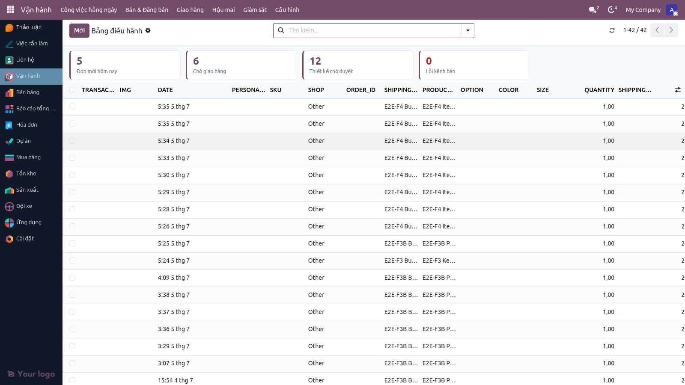
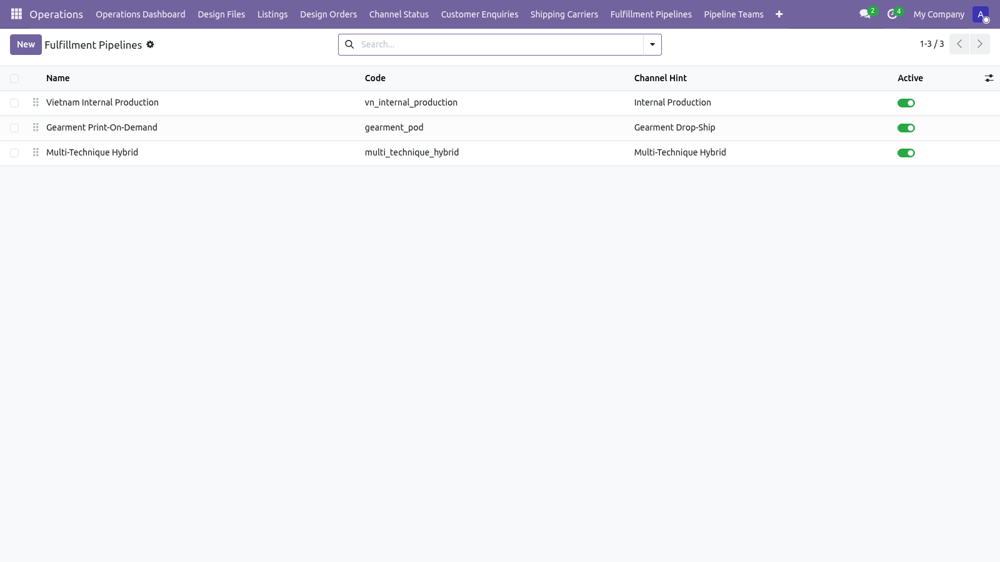
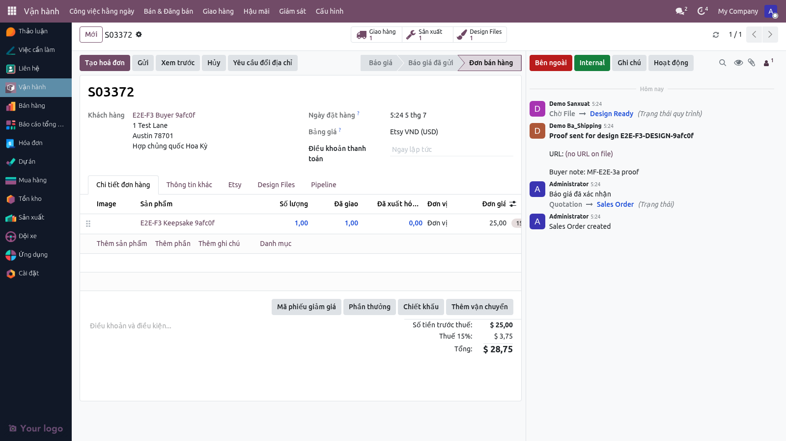
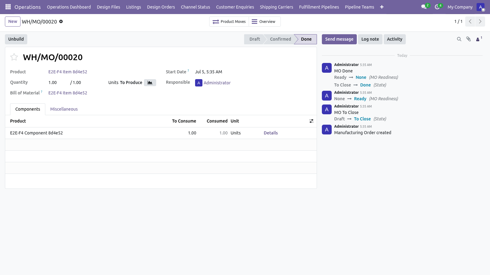
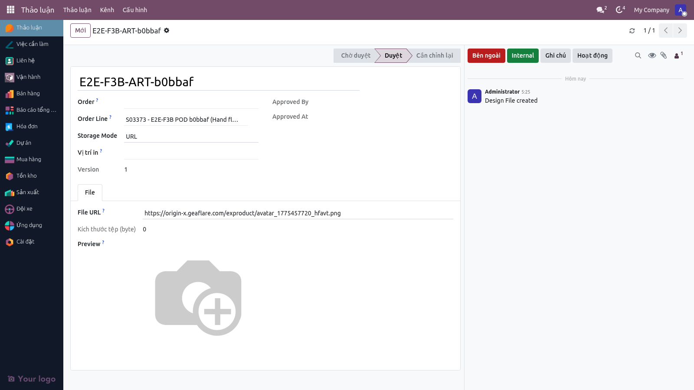
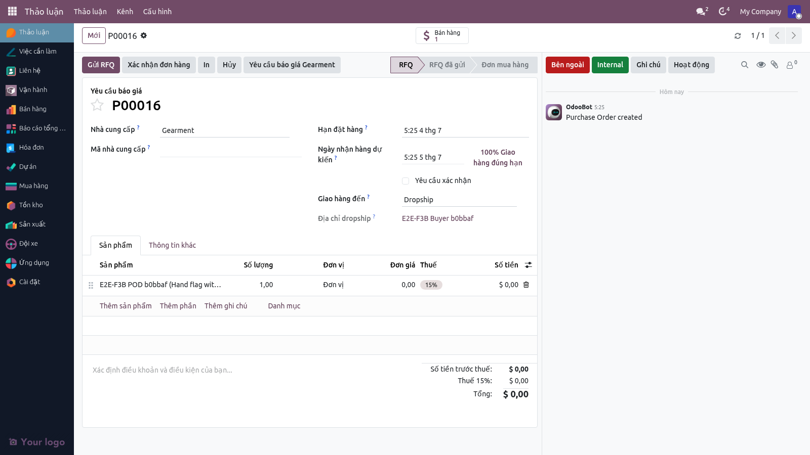
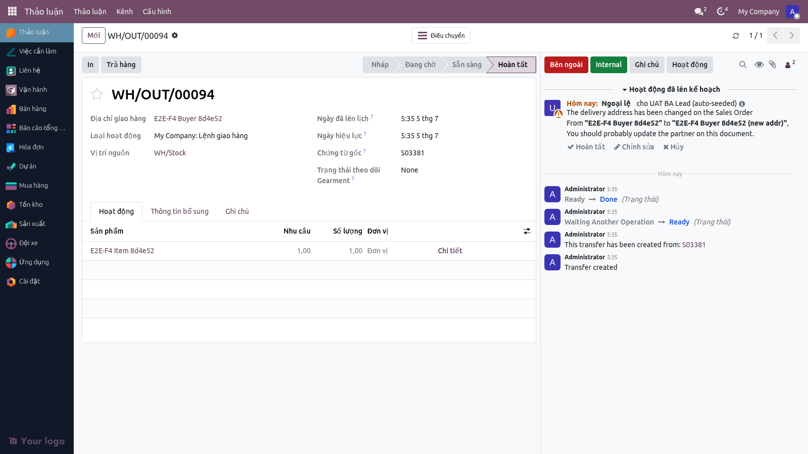
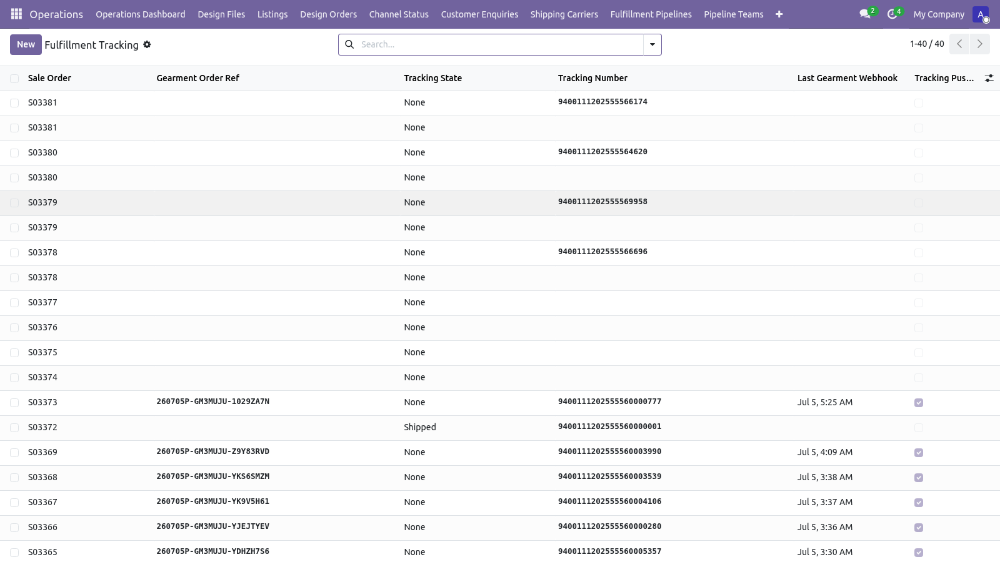
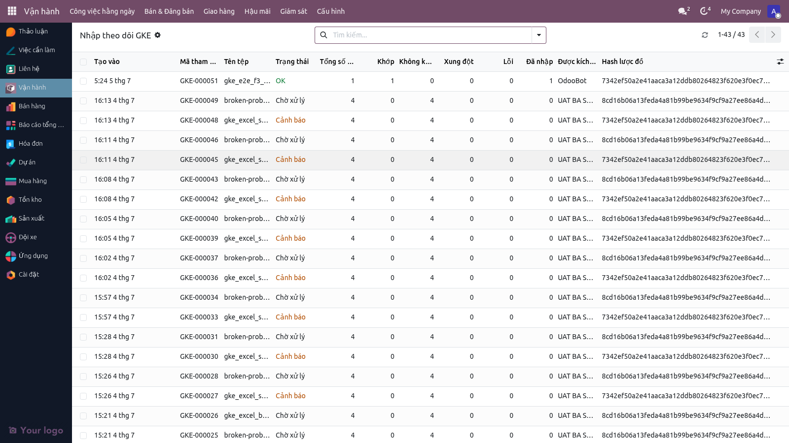

# Hướng dẫn sử dụng — Giao hàng (MTO nội bộ + Dropship Gearment)

**Phiên bản:** 2.0 · **Ngày:** 2026-07-05 · **Ngôn ngữ:** Tiếng Việt
**Đối tượng:** BA Lead, BA Shipping, Đội sản xuất, Đội QC + Đóng gói, PD, Marketing
**Hệ thống:** Odoo 19 — module `multichannel_hub_core` + `multichannel_hub_fulfillment` + `etsy_integration`
**Tài liệu nghiệp vụ tham chiếu:** [`FLOW_GIAO_HANG_VN.md`](./FLOW_GIAO_HANG_VN.md)

> Hướng dẫn từng bước cho hai đường giao hàng: MTO (in nội bộ) và Dropship Gearment. Bao gồm 17 trạng thái pipeline VN, quy trình design files, gọi Gearment, và push tracking lên Etsy.

### Cập nhật v2.0 (2026-07-05)
Từ phiên bản này, giao diện hệ thống được làm mới với **Hatafa theme**. Menu chính được sắp xếp lại thành **"Vận hành"** (hub trung tâm) với các phần: Công việc hằng ngày, Bán & Đăng bán, Giao hàng, Hậu mãi, Giám sát, Cấu hình. Lệnh sản xuất (MO) bây giờ hiển thị huy hiệu **"Design Ready"** khi thiết kế đã được duyệt. Tất cả menu paths đã được cập nhật.

---

## Mục lục

1. [Tổng quan 2 đường](#1-tổng-quan-2-đường)
2. [Vai trò và quyền](#2-vai-trò-và-quyền)
3. [Đường MTO — 17 trạng thái pipeline VN](#3-đường-mto)
4. [Quy trình Design Files](#4-quy-trình-design-files)
5. [Đường Dropship Gearment](#5-đường-dropship-gearment)
6. [Push tracking lên Etsy](#6-push-tracking-lên-etsy)
7. [Nhập tracking từ Excel GKE](#7-nhập-tracking-từ-excel-gke)
8. [Câu hỏi thường gặp](#8-câu-hỏi-thường-gặp)
9. [Checklist kiểm thử UAT](#9-checklist-kiểm-thử-uat)
10. [Báo lỗi cho ai](#10-báo-lỗi-cho-ai)

---

## 1. Tổng quan 2 đường

| Đường | Khi nào dùng | Ai làm | Tracking từ đâu |
|---|---|---|---|
| **MTO** | Sản phẩm không có Mã SKU Gearment | Xưởng VN | Nhập Excel GKE |
| **Dropship** | Sản phẩm có Mã SKU Gearment | Gearment Mỹ | Webhook Gearment |

Một đơn có thể có **cả hai loại** — hệ thống xử lý từng dòng riêng. Khách nhận 2 bưu kiện.

---

## 2. Vai trò và quyền

| Vai trò | Đổi pipeline | Upload design | Duyệt design | Báo giá Gearment | Push Etsy |
|---|---|---|---|---|---|
| **BA User** | ✅ giới hạn | ❌ | ❌ | ❌ | ❌ |
| **BA Lead** | ✅ | ✅ | ✅ | ❌ | ❌ |
| **BA Shipping** | ✅ giới hạn | ❌ | ❌ | ✅ | ✅ |
| **BA Shipping Manager** | ✅ | ❌ | ❌ | ✅ | ✅ |
| **Marketing / PD** | ✅ giới hạn | ✅ | ❌ | ❌ | ❌ |
| **Đội sản xuất** | ✅ giới hạn | ❌ | ✅ | ❌ | ❌ |
| **BA Manager** | ✅ | ✅ | ✅ | ✅ | ✅ |

---

## 3. Đường MTO

### 3.1 17 trạng thái pipeline VN

| # | Trạng thái | Ai chuyển | Ý nghĩa |
|---|---|---|---|
| 1 | Mới nhận | _Auto khi đơn vào_ | Đơn vừa vào, chờ BA |
| 2 | BA kiểm tra | BA Lead | Xác minh thông tin |
| 3 | Thiết kế | Marketing | Upload file thiết kế |
| 4 | Chờ duyệt thiết kế | _Auto_ | Đợi PD/sản xuất duyệt |
| 5 | Đã duyệt | PD / Sản xuất | File OK, chuẩn bị in |
| 6 | Sản xuất | Sản xuất | Đang in / khắc |
| 7 | QC | QC | Kiểm tra chất lượng |
| 8 | Đóng gói | QC / Đóng gói | Đóng bưu kiện |
| 9 | Chờ nhãn vận chuyển | _Auto_ | Đợi in nhãn |
| 10 | Đã in nhãn | BA Shipping | Sẵn sàng giao |
| 11 | Giao bưu vận | BA Shipping | Đã giao đối tác |
| 12 | Đang vận chuyển | _Auto khi có tracking_ | Có tracking |
| 13 | Đã giao | _Auto khi GKE báo Delivered_ | Khách nhận |
| 14 | Có vấn đề | BA | Khách báo lỗi |
| 15 | Hoàn trả | BA | Hậu mãi đang chạy |
| 16 | In lại | BA Lead | Cần in lại |
| 17 | Hoàn tất | _Auto_ | Đóng đơn |

### 3.2 Chuyển trạng thái

> ⚠️ **Không** sửa trực tiếp trường "Pipeline State" trên form đơn. Phải dùng **nút hành động** (action button) trên form hoặc kanban.

**Cách 1 — Trên form đơn:**
1. Mở đơn → tab Pipeline.
2. Bấm nút trạng thái mong muốn (ví dụ "Chuyển sang Sản xuất").
3. Hệ thống ghi audit + lưu lịch sử trong tab "Pipeline Transitions".

**Cách 2 — Bulk action trên Operations Dashboard:**
1. Chọn nhiều dòng.
2. Bấm **Action → "Bulk advance pipeline"**.
3. Chọn trạng thái đích.

### 3.3 Lệnh sản xuất (MO) — huy hiệu "Design Ready"

Từ 2026-07, khi sản phẩm được PD/Sản xuất duyệt thiết kế, lệnh sản xuất (MO - Manufacturing Order) tự động hiển thị huy hiệu **"Design Ready"** — báo hiệu thiết kế đã được phê duyệt và sẵn sàng in. Huy hiệu này là **chỉ thị thông tin** (tính toán từ trạng thái Design Files của đơn), giúp sản xuất nhanh nhận biết tiến độ mà không cần mở tab khác.

### 3.4 Xem lịch sử chuyển trạng thái

**Menu:** Vận hành → **Pipeline Transitions** → lọc theo Sale Order = số đơn.

Mỗi dòng có: ai bấm, từ bước nào sang bước nào, thời điểm, lý do (nếu có).

---

## 4. Quy trình Design Files

### 4.1 Upload file thiết kế (Marketing)

1. Mở đơn ở trạng thái **"Thiết kế"**.
2. Tab **Design Files** → bấm **"Upload file mới"**.
3. Chọn dòng sản phẩm áp dụng.
4. 2 lựa chọn lưu file:
   - **URL mode** (khuyến nghị): dán link Google Drive
   - **Filestore mode**: upload trực tiếp ≤ 10 MB
5. Bấm **Lưu** → file ở trạng thái **Pending**.

### 4.2 Duyệt file (PD / Sản xuất)

Mở **Design Files Kanban** (3 cột: Pending / Approved / Rejected):

- Kéo file từ Pending → Approved → file chuyển sang Approved.
- Kéo file từ Pending → Rejected → wizard hỏi lý do → file Rejected, Marketing được thông báo qua chatter.

> Hoặc bấm trực tiếp nút **"Duyệt"** / **"Từ chối"** trên form file.

### 4.3 Trạng thái sản phẩm (Design Status)

Tự động cập nhật trên `sale.order.line`:

| Trạng thái dòng | Lý do |
|---|---|
| **No design** | Chưa có file nào |
| **Pending** | Có file Pending, chưa duyệt |
| **Approved** | Tất cả file đều Approved |
| **Rejected** | Có file Rejected — Marketing phải upload lại |

> Quy tắc: lowest-state-wins (yếu nhất thắng — nếu có file Rejected thì cả dòng Rejected).

### 4.4 Giới hạn 10 MB

Hệ thống áp giới hạn 10 MB cho file upload trực tiếp. File lớn hơn → để trên Google Drive + dán link (URL mode).

> Cấu hình: `multichannel_hub.large_file_threshold_bytes` (ICP).

---

## 5. Đường Dropship Gearment

### 5.1 Điều kiện kích hoạt

- Đơn có ít nhất 1 dòng với sản phẩm có **Mã SKU Gearment**.
- Khi đơn vào hệ thống → tự động đặt tuyến **Dropship** + nhà cung cấp **Gearment**.

### 5.2 Bước 1 — Đơn mua (PO) dropship tự tạo

Khi đơn vào hệ thống, tuyến Dropship tự tạo một **Đơn mua hàng (PO) nháp**
với nhà cung cấp **Gearment** — "Giao hàng đến: Dropship" kèm địa chỉ người mua.
Xem tại **Mua hàng → Yêu cầu báo giá** (lọc nhà cung cấp Gearment).

### 5.3 Bước 2 — Yêu cầu báo giá Gearment (trên PO)

1. Mở PO nháp → bấm **"Yêu cầu báo giá Gearment"** trên đầu form
   (nút chỉ hiện với nhóm Mua hàng / BA Shipping, khi PO còn nháp hoặc đã gửi RFQ).
2. Hệ thống hỏi giá Gearment và **ghi thẳng chi phí vào dòng PO**:
   giá in từng sản phẩm + một dòng "Gearment shipping & fees" cho phí vận chuyển.
   Tổng PO = đúng chi phí Gearment → báo cáo Mua hàng theo dõi được chi tiêu.
3. Giá cao / địa chỉ sai? Xử lý xong bấm lại nút — giá mới ghi đè, chưa có gì
   gửi sang Gearment cho tới khi xác nhận.

> Tab **"Giao hàng"** trên đơn bán vẫn hiển thị trạng thái + tổng báo giá
> (nhãn màu: xanh = đã xác nhận, vàng = chờ duyệt, đỏ = hủy) và nút
> **"Xem báo giá"** để đối chiếu — nhưng thao tác báo giá chuẩn làm trên PO.

### 5.4 Bước 3 — Xác nhận PO → đơn sang Gearment

- Kiểm tra giá + địa chỉ dropship → bấm **"Xác nhận đơn hàng"** trên PO.
- Đơn được đẩy sang Gearment để in và gửi thẳng tới khách (không qua Hatafa).

### 5.5 Bước 4 — Bulk action khi cron tạm dừng

Khi cron sync tự động bị tạm dừng (debug / bảo trì):

1. Mở **Operations Dashboard**.
2. Lọc: Pipeline State = "Đã duyệt giá Gearment" + Push Status = "pending".
3. Chọn nhiều dòng → **Action → "Đồng bộ Gearment hàng loạt"**.
4. Hệ thống xử lý từng đơn với savepoint riêng — 1 đơn lỗi không ảnh hưởng đơn khác.
5. Toast notification ở góc phải thông báo tiến độ.

### 5.6 Bước 5 — Tracking từ Gearment

- Gearment xác nhận đơn → tạo tracking → webhook về Odoo.
- Hệ thống ghi tracking vào hồ sơ giao hàng của đơn; trạng thái: **"Đang vận chuyển"**.
- **Phiếu giao hàng** (Tồn kho) hiện dòng trạng thái Gearment ngay dưới "Tài liệu gốc" —
  kể cả cờ **"sản xuất bị chặn"** kèm lý do khi Gearment tạm dừng đơn.
- Lịch sử tín hiệu chi tiết: **Vận hành → Giám sát → Nhật ký Gearment**.

### 5.7 Bước 6 — Đơn Delivered

- Khi khách nhận → Gearment báo Delivered → cập nhật đơn.
- Trạng thái: **"Đã giao"** → tự đóng đơn → **"Hoàn tất"**.

---

## 6. Push tracking lên Etsy

### 6.1 Tự động sau khi có tracking

- Nguồn tracking: Gearment webhook (Dropship) hoặc Excel GKE (MTO).
- Cron push: chạy ngay sau khi tracking được ghi.
- Gọi Etsy API → đặt receipt sang **"Shipped"** + đính kèm tracking + tên carrier.
- Etsy gửi email "Đơn đã được giao" đến khách.

### 6.2 Xem trạng thái push

Mở đơn → tab **Etsy** → khu vực "Tracking push status":

| Trạng thái | Ý nghĩa |
|---|---|
| **none** | Chưa có tracking |
| **pending** | Có tracking, đợi push |
| **pushed** | Đã push thành công + ghi thời điểm |
| **failed** | Lỗi, ghi thông điệp lỗi |

### 6.3 Khi push failed

- Cron tự thử lại sau 5 phút (lên đến 3 lần).
- Sau 3 lần → trạng thái `failed` cố định + cần BA Shipping can thiệp.
- BA Shipping mở đơn → tab Etsy → bấm **"Push lại tracking"**.

---

## 7. Nhập tracking từ Excel GKE

### 7.1 Mở wizard

**Menu:** Vận hành → Giao hàng → **Nhập tracking**

### 7.2 Upload file

1. Bấm **"Chọn file"** → upload Excel GKE (định dạng đã duyệt).
2. Hệ thống bóc tách:
   - Mã đơn nội bộ (S00001…) hoặc mã đơn Etsy (Receipt ID)
   - Tracking number
   - Carrier (USPS / UniUni / YunExpress)
   - Ngày dự kiến giao
3. Bấm **"Preview"** → xem trước số dòng khớp / không khớp.
4. Bấm **"Import"** → áp dụng.

### 7.3 Khi schema Excel thay đổi

- Hệ thống nhận diện schema qua hash của hàng tiêu đề.
- Nếu hash thay đổi → import bị từ chối + cảnh báo BA Manager.
- BA Manager mở **Vận hành → Giao hàng → Schema Versions** → duyệt schema mới.
- Sau khi duyệt → BA Shipping import lại.

> ⚠️ Lý do: chống lỗi nhập sai cột (GKE đổi cột mà BA không biết).

### 7.4 Báo cáo import

Sau khi import:
- Số dòng khớp đơn → đã ghi tracking
- Số dòng không khớp → log vào `tracking.import.line` với `state = unmatched`
- Số dòng lỗi format → `state = error`

BA xem lại và xử lý thủ công.

---

## 8. Câu hỏi thường gặp

**Q:** _Đơn có cả sản phẩm Gearment + sản phẩm MTO — xử lý sao?_
A: Hệ thống tự xử lý: dòng Gearment đi Dropship, dòng MTO đi nội bộ — cùng đơn. Khách nhận 2 bưu kiện. Tracking từng bưu kiện push riêng lên Etsy.

**Q:** _Tôi cần in lại vì lỗi sản xuất._
A: Đổi pipeline sang **"In lại"** → ghi lý do trong chatter → sản xuất tạo phiếu in mới. Chi tiết xem [`HUONG_DAN_HAU_MAI_VN.md`](./HUONG_DAN_HAU_MAI_VN.md).

**Q:** _Gearment báo lỗi khi gửi đơn._
A: Mở đơn → tab Gearment → xem nhật ký API. Cron tự thử lại 3 lần (mỗi 5 phút). Sau đó đơn cố định ở "Lỗi đồng bộ Gearment" → BA Shipping can thiệp + báo Đội Kỹ thuật nếu cần.

**Q:** _Làm sao biết tracking đã được Etsy ghi nhận?_
A: Mở đơn → tab Etsy → "Tracking push status" = **pushed** + thời điểm.

**Q:** _Tracking GKE nhập tay được không?_
A: Có. Wizard "Nhập tracking GKE" chấp nhận file Excel. Một dòng = một đơn. Nếu nhập tay (không có Excel) → mở từng đơn → form sale.order.fulfillment → điền tracking thủ công.

**Q:** _Hệ thống có gửi nhãn vận chuyển không?_
A: Đối với Dropship Gearment → có (Gearment tự in nhãn). Đối với MTO → BA Shipping in nhãn thủ công + nhập tracking sau.

**Q:** _Nhiều file thiết kế cho cùng 1 sản phẩm — có giới hạn không?_
A: Không có giới hạn cứng. Mỗi dòng `sale.order.line` có thể có nhiều file. Hệ thống tổng hợp trạng thái theo quy tắc lowest-state-wins.

---

## 9. Checklist kiểm thử UAT

> Người kiểm thử: BA Lead + BA Shipping · **Ngày kiểm:** _________

### Đường MTO

#### TC-MTO-001: Chuyển pipeline qua đủ 17 trạng thái

- [ ] Tạo đơn UAT MTO (sản phẩm không có Mã SKU Gearment)
- [ ] Lần lượt: Mới nhận → BA kiểm tra → Thiết kế → Chờ duyệt → Đã duyệt → Sản xuất → QC → Đóng gói → Chờ nhãn → Đã in nhãn → Giao bưu vận → Đang vận chuyển → Đã giao → Hoàn tất
- [ ] **Mong đợi:** Mỗi lần chuyển → 1 dòng trong Pipeline Transitions; không có lỗi
- [ ] **Pass / Fail:** _____

#### TC-MTO-002: Upload + duyệt design file (URL mode)

- [ ] Marketing đăng nhập → upload file URL (link GDrive)
- [ ] PD đăng nhập → kéo file từ Pending sang Approved
- [ ] **Mong đợi:** Trạng thái dòng `sale.order.line.design_status` = "Approved"
- [ ] **Pass / Fail:** _____

#### TC-MTO-003: Reject design file

- [ ] Marketing upload file mới
- [ ] PD bấm Reject + điền lý do
- [ ] **Mong đợi:** File status = "Rejected", trạng thái dòng = "Rejected", Marketing được thông báo qua chatter
- [ ] **Pass / Fail:** _____

#### TC-MTO-004: Giới hạn 10 MB cho upload

- [ ] Marketing upload file 12 MB (filestore mode)
- [ ] **Mong đợi:** Hệ thống từ chối + thông báo "File vượt giới hạn 10 MB"
- [ ] **Pass / Fail:** _____

#### TC-MTO-005: Nhập tracking GKE từ Excel

- [ ] BA Shipping mở wizard "Nhập tracking GKE"
- [ ] Upload file Excel có 5 đơn UAT
- [ ] **Mong đợi:** 5 đơn được ghi tracking + chuyển sang "Đang vận chuyển" + đẩy lên Etsy
- [ ] **Pass / Fail:** _____

#### TC-MTO-006: Schema GKE thay đổi → reject

- [ ] Upload file Excel với cột bị đổi tên
- [ ] **Mong đợi:** Wizard báo "Schema mới chưa duyệt" + cảnh báo BA Manager
- [ ] BA Manager duyệt schema → BA Shipping import lại → thành công
- [ ] **Pass / Fail:** _____

### Đường Dropship Gearment

#### TC-DROP-001: Đơn có Mã Gearment → tự đặt Dropship

- [ ] Tạo đơn UAT với sản phẩm có Mã SKU Gearment
- [ ] **Mong đợi:** Pipeline = "Dropship - Mới nhận", tab Gearment hiển thị
- [ ] **Pass / Fail:** _____

#### TC-DROP-002: Báo giá Gearment

- [ ] BA Shipping bấm "Báo giá Gearment"
- [ ] **Mong đợi:** API call thành công, đơn chuyển "Đã gửi báo giá", Gearment API Log có 1 dòng
- [ ] **Pass / Fail:** _____

#### TC-DROP-003: Duyệt giá + tự push

- [ ] Gearment trả giá → BA Shipping bấm "Duyệt giá"
- [ ] Đợi ≤ 5 phút (chờ cron)
- [ ] **Mong đợi:** Đơn được gửi sang Gearment, trạng thái "Đã gửi Gearment"
- [ ] **Pass / Fail:** _____

#### TC-DROP-004: Bulk action đồng bộ Gearment

- [ ] Tạm dừng cron Gearment
- [ ] Tạo 5 đơn Dropship + duyệt giá hết
- [ ] Chọn 5 dòng → Action "Đồng bộ Gearment hàng loạt"
- [ ] **Mong đợi:** 5 đơn được push, toast notification hiển thị tiến độ, không lỗi
- [ ] **Pass / Fail:** _____

#### TC-DROP-005: Webhook tracking từ Gearment

- [ ] Gearment gửi webhook tracking cho 1 đơn UAT
- [ ] **Mong đợi:** Tracking ghi vào sale.order.fulfillment, đơn chuyển "Đang vận chuyển", cron push Etsy chạy
- [ ] **Pass / Fail:** _____

### Push tracking lên Etsy

#### TC-ETSY-PUSH-001: Push thành công

- [ ] Đơn có tracking + Pipeline = "Đang vận chuyển"
- [ ] Đợi ≤ 5 phút (cron push)
- [ ] **Mong đợi:** Tab Etsy → "Tracking push status" = `pushed` + thời điểm; Etsy Shop Manager hiển thị Shipped
- [ ] **Pass / Fail:** _____

#### TC-ETSY-PUSH-002: Push failed → retry

- [ ] Cố ý gửi tracking với format sai (giả lập)
- [ ] **Mong đợi ban đầu:** `failed` + 3 lần retry
- [ ] BA Shipping sửa + bấm "Push lại tracking"
- [ ] **Mong đợi sau:** `pushed`
- [ ] **Pass / Fail:** _____

### Tổng kết UAT

- [ ] MTO: 6/6 + Dropship: 5/5 + Etsy push: 2/2 = 13/13 Pass → **Approve**
- [ ] Có Fail → tạo Jira sub-task

---

## 10. Báo lỗi cho ai

| Loại lỗi | Liên hệ |
|---|---|
| Đơn kẹt ở 1 trạng thái pipeline | BA Lead |
| File thiết kế bị reject nhiều lần | BA Lead + Marketing Manager |
| Gearment báo giá / gửi đơn lỗi | BA Shipping Manager |
| Tracking lên Etsy bị từ chối | Đội Kỹ thuật |
| Excel GKE không nhận diện được | BA Shipping Manager (duyệt schema mới) |
| Webhook Gearment không về | Đội Kỹ thuật |

---

> **Tài liệu liên quan:**
> - Tổng quan nghiệp vụ: [`FLOW_GIAO_HANG_VN.md`](./FLOW_GIAO_HANG_VN.md)
> - Trước trong workflow: [`HUONG_DAN_DON_HANG_ETSY_VN.md`](./HUONG_DAN_DON_HANG_ETSY_VN.md)
> - Sau workflow (khi khách báo lỗi): [`HUONG_DAN_HAU_MAI_VN.md`](./HUONG_DAN_HAU_MAI_VN.md)
> - Tài liệu kỹ thuật (tiếng Anh): `specs/004a-tracking-import/`, `specs/006-master-plan/adrs/ADR-010-hybrid-dropship-mto.md`, module `multichannel_hub_fulfillment`
