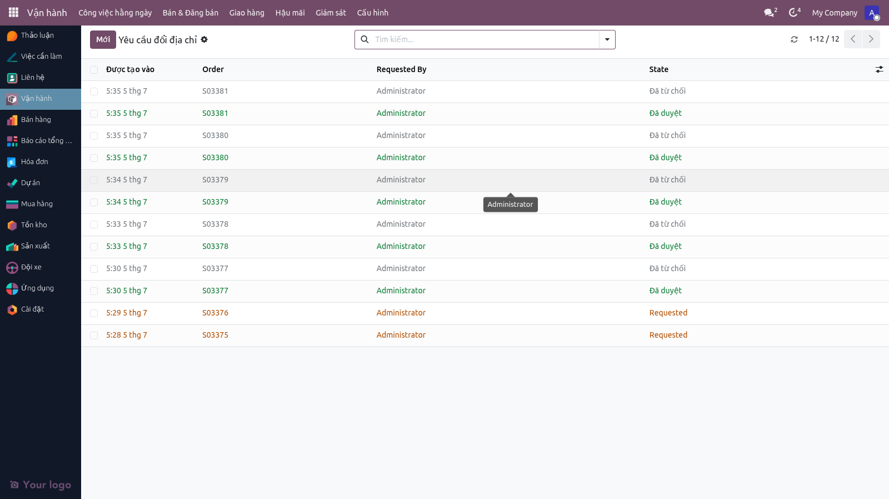
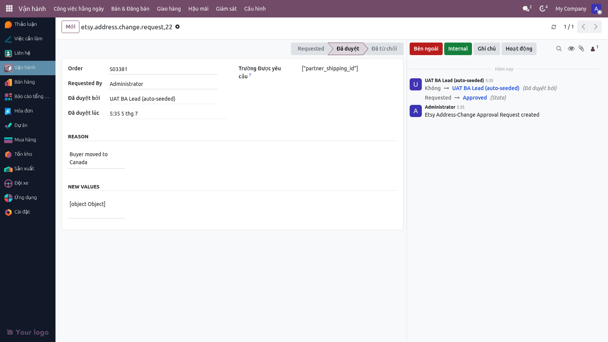
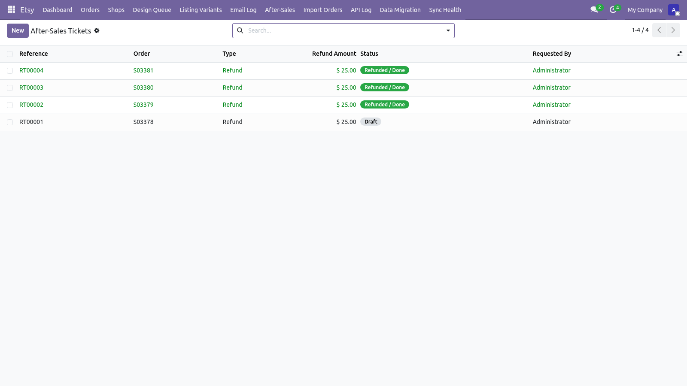
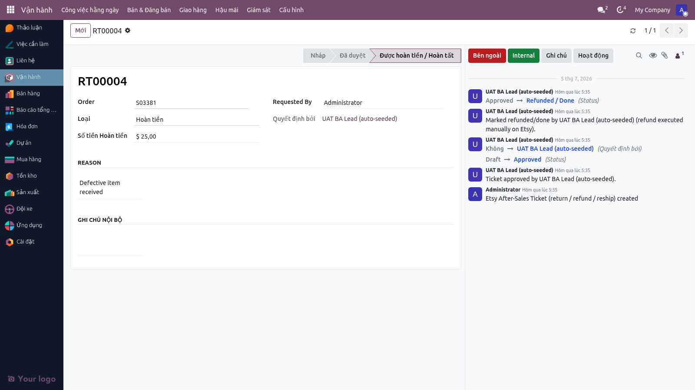

# Hướng dẫn sử dụng — Hậu mãi (In lại, Tin nhắn khách, Hoàn trả/Hoàn tiền)

**Phiên bản:** 2.0 · **Ngày:** 2026-07-05 · **Ngôn ngữ:** Tiếng Việt
**Đối tượng:** BA Lead, BA Marketing, BA Shipping, Kế toán, Chủ shop
**Hệ thống:** Odoo 19 — module `etsy_integration` + `multichannel_hub_core`
**Tài liệu nghiệp vụ tham chiếu:** [`FLOW_HAU_MAI_VN.md`](./FLOW_HAU_MAI_VN.md)

> Hướng dẫn từng bước cho các quy trình hậu mãi: in lại đơn lỗi, xử lý tin nhắn khách, và hoàn trả/hoàn tiền. Phần "Hoàn trả & Hoàn tiền" đã **hoạt động từ 2026-07-05** — workflow tạo ticket hậu mãi, duyệt, đánh dấu hoàn tiền được E2E-verify. Phần chuyển tiền thực tế vẫn thực hiện thủ công trong Etsy Shop Manager.

### Cập nhật v2.0 (2026-07-05)
Từ phiên bản này, **Hậu mãi** (sau mãi) bây giờ có menu trực tiếp riêng trong **"Vận hành"** — không chỉ đạt được từ các nút trên form đơn. Giao diện hệ thống được làm mới với **Hatafa theme**. Ticket hậu mãi workflow (tạo → duyệt → giải quyết) đã sẵn sàng cho UAT.

---

## Mục lục

1. [Yêu cầu trước khi bắt đầu](#1-yêu-cầu-trước-khi-bắt-đầu)
2. [Vai trò và quyền](#2-vai-trò-và-quyền)
3. [Quy trình In lại đơn](#3-quy-trình-in-lại-đơn)
4. [Quy trình Tin nhắn khách](#4-quy-trình-tin-nhắn-khách)
5. [Yêu cầu đổi địa chỉ giao](#5-yêu-cầu-đổi-địa-chỉ-giao)
6. [Hoàn trả & Hoàn tiền](#6-hoàn-trả--hoàn-tiền)
7. [Câu hỏi thường gặp](#7-câu-hỏi-thường-gặp)
8. [Checklist kiểm thử UAT](#8-checklist-kiểm-thử-uat)
9. [Báo lỗi cho ai](#9-báo-lỗi-cho-ai)

---

## 1. Yêu cầu trước khi bắt đầu

- Đăng nhập Odoo với vai trò **BA Marketing** hoặc cao hơn.
- Truy cập Etsy Shop Manager (cho thao tác refund qua Etsy).
- Quyền đọc Gmail (nếu xử lý tin nhắn qua email).

---

## 2. Vai trò và quyền

| Vai trò | Tạo phiếu in lại | Trả lời tin nhắn | Duyệt đổi địa chỉ | Refund Etsy | Tạo ticket hậu mãi |
|---|---|---|---|---|---|
| **BA User** | ❌ | ❌ | ❌ | ❌ | ✅ |
| **BA Marketing** | ❌ | ✅ | ❌ | ✅ | ✅ |
| **BA Lead** | ✅ | ✅ | ✅ | ✅ | ✅ |
| **BA Shipping** | _Áp tracking in lại_ | ❌ | ❌ | ❌ | ❌ |
| **Kế toán** | ❌ | ❌ | ❌ | ❌ | _xem_ |
| **Admin** | ✅ | ✅ | ✅ | ✅ | ✅ |

---

## 3. Quy trình In lại đơn

### 3.1 Khi nào dùng

- Khách báo sản phẩm lỗi (rách bao bì, in mờ, sai cá nhân hoá).
- QC phát hiện lỗi nội bộ trước khi giao.
- Đơn thất lạc vận chuyển, đã quá thời gian truy vết.

### 3.2 Các bước

#### Bước 1 — Mở đơn gốc

1. **Menu:** Vận hành → Công việc hằng ngày → Bảng điều hành.
2. Tìm đơn theo Receipt ID hoặc tên khách.
3. Bấm vào dòng → mở form đơn.

#### Bước 2 — Chuyển trạng thái sang "In lại"

1. Trên form đơn → tab Pipeline → bấm nút **"Chuyển sang In lại"** (trạng thái 16).
2. Wizard hỏi lý do — điền chi tiết (ví dụ "Khách báo in mờ — yêu cầu in lại").
3. Bấm **Lưu**.

#### Bước 3 — Ghi chú trong chatter

- Chatter tự ghi log thay đổi trạng thái.
- BA Lead bổ sung ghi chú: ai duyệt, có yêu cầu đặc biệt gì.

#### Bước 4 — Đội sản xuất tạo phiếu in mới

1. Đội sản xuất nhận thông báo (qua mention trong chatter hoặc Pipeline Transitions).
2. Tạo phiếu sản xuất MRP mới — chọn đơn gốc làm tham chiếu.
3. Tái sử dụng file thiết kế cũ (tab Design Files có sẵn).
4. Đội QC + Đóng gói kiểm tra lại trước giao.

#### Bước 5 — Áp tracking in-lại

**Đơn MTO:**
1. BA Shipping in nhãn mới + giao đối tác bưu vận.
2. Nhập tracking mới qua wizard "Nhập tracking GKE" (xem [`HUONG_DAN_GIAO_HANG_VN.md`](./HUONG_DAN_GIAO_HANG_VN.md)).
3. Tracking mới ghi vào đơn gốc (không tạo đơn mới) và được push lên Etsy ở bước dưới.

**Đơn Dropship:**
1. BA Shipping tạo đơn in lại với Gearment theo quy trình thủ công (chưa có nút riêng trên form) — chạy lại luồng **Báo giá Gearment → Xác nhận sản xuất Gearment**, tham chiếu đơn gốc.
2. Hệ thống tạo Gearment order mới (không gửi tracking gốc).
3. Gearment in + gửi → tracking mới về qua webhook.

#### Bước 6 — Push tracking thứ hai lên Etsy

- Hệ thống tự push tracking mới lên Etsy (cùng cơ chế đơn gốc).
- Etsy hiển thị 2 tracking trên cùng 1 receipt.

### 3.3 Lưu ý quan trọng

- ❌ **Không tạo đơn Etsy mới** — chỉ tạo phiếu in lại nội bộ. Etsy vẫn nhìn đơn gốc.
- ✅ Chi phí in lại ghi nhận riêng — Dashboard Pricing Audit (đang xây) tính margin cuối tháng.
- ✅ Tracking thứ hai lưu cùng đơn gốc — không tạo bản ghi đơn mới.

---

## 4. Quy trình Tin nhắn khách

### 4.1 Đường email (đang chạy)

#### Cron đọc email

- **Lịch:** mỗi 10 phút.
- Hệ thống nhận diện email là tin nhắn buyer (khác email báo đơn).
- Nếu nội dung chứa Receipt ID → liên kết vào chatter đơn tương ứng.
- Nếu không khớp → giữ trong **Buffer** 7 ngày.

#### BA trả lời

1. Mở đơn → chatter → thấy tin nhắn từ buyer.
2. Bấm **"Send message"** trong chatter.
3. Chọn template (nếu có) hoặc gõ tự do.
4. Bấm **Send** → Odoo gửi email ra qua mail server đã cấu hình.

#### Xử lý tin nhắn không khớp đơn (orphaned)

Tin nhắn không khớp Receipt ID được giữ ở trạng thái **buffered**; sau 7 ngày chuyển **orphaned**. Bộ đệm này hiện chạy nền (chưa có menu riêng cho BA). Khi cần tra soát tin `orphaned`, BA Marketing phối hợp Đội Kỹ thuật xuất danh sách từ bản ghi khử trùng lặp (`etsy.message.dedupe`), rồi copy nội dung vào chatter đơn tương ứng nếu nhận diện được khách.

### 4.2 Đường API (chờ Etsy duyệt scope `conversations_r`)

Khi Etsy bật quyền:

- Cron mỗi 10 phút gọi Etsy Conversations API.
- Tự lấy tin nhắn + ánh xạ vào đơn theo Receipt ID.
- Đường API + Email tự khử trùng lặp (theo `etsy.message.dedupe`).

> Hôm nay (2026-05-26): scope `conversations_r` chưa được Etsy duyệt — chỉ đường email hoạt động.

### 4.3 Trả lời các loại tin nhắn thường gặp

| Loại tin | Cách xử lý |
|---|---|
| Hỏi tình trạng đơn | Mở đơn → xem Pipeline + tracking → trả lời chatter |
| Yêu cầu đổi địa chỉ | Đi qua wizard "Yêu cầu đổi địa chỉ" (mục 5) |
| Báo lỗi sản phẩm | Tạo phiếu in lại (mục 3) hoặc ticket hậu mãi |
| Hỏi cá nhân hoá mới | Trả lời qua chatter, nếu đồng ý → BA Lead sửa dòng đơn (chưa in nhãn) |

---

## 5. Yêu cầu đổi địa chỉ giao



### 5.1 Khi nào dùng

Khách yêu cầu sửa địa chỉ sau khi đặt hàng — phải xử lý qua workflow chính thức, không sửa trực tiếp.

### 5.2 Điều kiện

- ✅ Đơn **chưa in nhãn vận chuyển** (Pipeline State < 10).
- ❌ Đã có tracking → không đổi được, BA giải thích cho khách.

### 5.3 Các bước

#### Bước 1 — BA Marketing tạo yêu cầu



1. Mở form đơn.
2. Bấm **"Yêu cầu đổi địa chỉ"** ở đầu form.
3. Wizard hiển thị địa chỉ hiện tại + cho phép sửa từng trường.
4. Điền địa chỉ mới + lý do (copy từ chatter buyer message).
5. Bấm **Lưu**.

> Sau khi lưu: các trường địa chỉ trên form đơn bị **khoá** (BA không sửa trực tiếp được).

#### Bước 2 — BA Lead duyệt

1. Đăng nhập BA Lead.
2. **Menu:** Vận hành → Hậu mãi → **Address Change Requests**.
3. Mở yêu cầu mới → kiểm tra:
   - Lý do hợp lý?
   - Đơn còn ở giai đoạn cho phép đổi?
4. Bấm **"Duyệt"** hoặc **"Từ chối"** + ghi lý do.

#### Bước 3 — Sau khi duyệt

- Địa chỉ mới được áp dụng.
- Trường địa chỉ trên form đơn mở khoá lại.
- Chatter ghi log: ai yêu cầu, ai duyệt, thời điểm.
- Nếu đơn đã ở pipeline "Chờ nhãn vận chuyển" → BA Shipping in nhãn theo địa chỉ mới.

#### Bước 4 — Sau khi từ chối

- Địa chỉ giữ nguyên.
- Trường mở khoá lại.
- BA Marketing trả lời khách qua chatter.

---

## 6. Hoàn trả & Hoàn tiền

### 6.0 Workflow ticket hậu mãi (LỊch sử)

Từ 2026-07-05, workflow tạo ticket hậu mãi là **LIVE và đã E2E-verify**:





**Quy trình:**
1. BA Marketing **tạo ticket** khi nhận yêu cầu hậu mãi từ khách (hoàn trả / hoàn tiền / gửi lại).
2. Ticket ở trạng thái **draft**.
3. BA Lead **duyệt** → chuyển **approved** (hoặc **rejected** nếu từ chối).
4. BA Lead **đánh dấu đã hoàn tất** → chuyển **refunded** (đã hoàn tiền / đã xử lý xong).
5. Chatter ghi log tự động từng bước.

**Phần chuyển tiền thực tế** vẫn thực hiện thủ công trong Etsy Shop Manager (Admin xử lý cuối tháng).

### 6.1 Quy trình thủ công hôm nay

#### Hoàn tiền (refund qua Etsy)

1. BA Marketing nhận yêu cầu refund từ khách (qua chatter, tin nhắn buyer).
2. BA Lead xác nhận quyết định refund + số tiền.
3. BA Marketing:
   - Mở Etsy Shop Manager → tìm receipt.
   - Bấm **"Refund buyer"** trên Etsy.
   - Điền số tiền + lý do → confirm.
4. BA Marketing ghi note vào chatter đơn Odoo:
   - "Refunded $X.XX qua Etsy ngày YYYY-MM-DD"
   - Lý do refund
   - Etsy refund ID (nếu có)

#### Hoàn trả vật lý

1. Khách gửi hàng về kho VN (theo chính sách trên Etsy).
2. Đội kho nhận hàng → ghi nhận thủ công trong sổ kho.
3. Báo BA Lead.
4. BA Lead ghi chú vào chatter đơn Odoo.

#### Báo cáo hoàn tiền hàng tháng

- BA Marketing xuất Excel từ Etsy Shop Manager → tab Reports → Refunds.
- Gửi cho Chủ shop + Kế toán cuối tháng.

### 6.2 Model ticket hậu mãi (`etsy.order.ticket`)

Model **`etsy.order.ticket`** đã LIVE, theo dõi mỗi yêu cầu hậu mãi:

#### Loại ticket

| Loại | Khi nào dùng |
|---|---|
| `return` (Hoàn trả) | Khách gửi hàng về |
| `refund` (Hoàn tiền) | Hoàn tiền cho khách |
| `reship` (Gửi lại) | Gửi lại hàng thay thế |

#### Workflow

```
draft → approved / rejected → refunded
```

- **draft**: BA Marketing tạo khi nhận yêu cầu.
- **approved / rejected**: BA Lead duyệt hoặc từ chối.
- **refunded**: đã hoàn tất (đã hoàn tiền / đã gửi lại / đã đóng).

#### Tích hợp tương lai

- Sync với **Etsy Cases API** (nếu Etsy mở scope).
- Ghi nhận chi phí refund + chi phí in lại vào đơn → Dashboard Pricing Audit tính margin tự động.
- Báo cáo tự động gửi Kế toán + Chủ shop cuối tháng.

> Theo dõi tiến độ: Master Plan 006 → **P4-02** slice.

---

## 7. Câu hỏi thường gặp

**Q:** _Khách yêu cầu hủy đơn sau khi đã in nhãn._
A: Thường không hủy được — BA Marketing trả lời khách qua chatter, đơn vẫn giao + xử lý hoàn ở giai đoạn "Hoàn trả" sau khi khách nhận hàng.

**Q:** _Đơn in lại nhưng khách vẫn báo lỗi._
A: Tạo phiếu in lại lần 2 + ghi rõ "Lần 2" trong chatter. BA Lead xem xét đổi đội thiết kế hoặc đối tác in.

**Q:** _Tin nhắn buyer không liên kết được với đơn nào — phải làm gì?_
A: Tin ở trạng thái `buffered` trong 7 ngày → sau đó chuyển `orphaned`. Bộ đệm chạy nền (chưa có menu riêng); khi cần, BA Marketing phối hợp Đội Kỹ thuật tra soát tin `orphaned` và copy nội dung vào chatter đơn tương ứng nếu nhận diện được khách.

**Q:** _Refund trên Etsy có tự cập nhật vào hệ thống không?_
A: Hôm nay chưa. BA Marketing ghi note vào chatter đơn thủ công. Tự động hoá nằm trong P4-02 (sắp ra mắt).

**Q:** _Khách yêu cầu đổi địa chỉ nhưng đơn đã có tracking._
A: Không đổi được. BA Marketing trả lời khách: "Đơn đã giao đối tác bưu vận, không thể đổi địa chỉ. Bưu kiện sẽ trả về kho nếu không nhận được — sẽ giao lại địa chỉ mới." Xử lý qua hậu mãi.

**Q:** _Đơn in lại có ghi nhận chi phí riêng không?_
A: Hôm nay chưa tự động. BA Lead ghi tay trong chatter. Dashboard Pricing Audit (đang xây) sẽ tính tự động.

**Q:** _Một đơn in lại nhiều lần — tracking lưu thế nào?_
A: Mỗi lần in lại, tracking mới được push lên Etsy trên cùng receipt của đơn gốc — Etsy hiển thị tất cả tracking cùng một receipt. Hệ thống không tạo đơn Etsy mới cho lần in lại.

---

## 8. Checklist kiểm thử UAT

> Người kiểm thử: BA Marketing + BA Lead · **Ngày kiểm:** _________

### TC-REPRINT-001: In lại đơn MTO

- [ ] Tạo đơn UAT MTO đã hoàn tất + đã giao
- [ ] Mở đơn → chuyển pipeline sang "In lại"
- [ ] Ghi lý do trong chatter
- [ ] Đội sản xuất tạo phiếu MRP mới
- [ ] Áp tracking thứ hai qua wizard "Nhập tracking GKE"
- [ ] **Mong đợi:** Đơn ở trạng thái "In lại", tab Etsy có 2 tracking, Etsy push lần 2 thành công
- [ ] **Pass / Fail:** _____

### TC-REPRINT-002: In lại đơn Dropship

- [ ] Tạo đơn UAT Dropship đã hoàn tất
- [ ] Chuyển sang "In lại"
- [ ] BA Shipping tạo đơn in lại với Gearment (quy trình thủ công, tham chiếu đơn gốc)
- [ ] **Mong đợi:** Phiếu Gearment mới được tạo, không gửi tracking gốc, tracking thứ hai về qua webhook
- [ ] **Pass / Fail:** _____

### TC-MSG-001: Tin nhắn email — match Receipt ID

- [ ] Forward email buyer chứa Receipt ID vào Gmail
- [ ] Đợi ≤ 10 phút
- [ ] **Mong đợi:** Tin xuất hiện trong chatter đơn tương ứng
- [ ] **Pass / Fail:** _____

### TC-MSG-002: Tin nhắn email — không match → Buffer

- [ ] Forward email không có Receipt ID
- [ ] **Mong đợi:** Bản ghi khử trùng lặp (`etsy.message.dedupe`) ở `state = buffered`
- [ ] Đợi 7 ngày (hoặc giả lập thời gian) → `state = orphaned`
- [ ] **Pass / Fail:** _____

### TC-MSG-003: BA trả lời qua chatter

- [ ] BA Marketing mở đơn có tin buyer
- [ ] Bấm "Send message" trong chatter + gõ reply
- [ ] **Mong đợi:** Email được gửi ra qua mail server, log trong chatter
- [ ] **Pass / Fail:** _____

### TC-ADDR-001: Yêu cầu đổi địa chỉ — workflow đầy đủ

- [ ] BA Marketing đăng nhập → bấm "Yêu cầu đổi địa chỉ" + điền địa chỉ mới
- [ ] **Mong đợi:** Trường địa chỉ bị khoá
- [ ] BA Lead đăng nhập → vào Address Change Requests → duyệt
- [ ] **Mong đợi:** Địa chỉ mới áp dụng, trường mở khoá
- [ ] **Pass / Fail:** _____

### TC-ADDR-002: Yêu cầu đổi địa chỉ — từ chối

- [ ] BA Marketing tạo yêu cầu
- [ ] BA Lead từ chối + ghi lý do
- [ ] **Mong đợi:** Địa chỉ giữ nguyên, chatter ghi log từ chối
- [ ] **Pass / Fail:** _____

### TC-ADDR-003: Yêu cầu đổi địa chỉ — đơn đã có tracking

- [ ] Đơn có tracking
- [ ] BA Marketing thử bấm "Yêu cầu đổi địa chỉ"
- [ ] **Mong đợi:** Hệ thống chặn + thông báo "Đơn đã có tracking, không thể đổi địa chỉ"
- [ ] **Pass / Fail:** _____

### TC-REFUND-001: Ghi note refund thủ công (hôm nay)

- [ ] BA Marketing refund khách qua Etsy Shop Manager
- [ ] Quay về Odoo → ghi note "Refunded $X qua Etsy ngày YYYY-MM-DD"
- [ ] **Mong đợi:** Note xuất hiện trong chatter, log với timestamp
- [ ] **Pass / Fail:** _____

### Tổng kết UAT

- [ ] 9/9 test cases Pass → **Approve hậu mãi v1**
- [ ] Có Fail → tạo Jira sub-task
- [ ] Note: Tự động hoá refund + ticket hậu mãi sẽ test lại khi P4-02 ra mắt

---

## 9. Báo lỗi cho ai

| Loại lỗi | Liên hệ |
|---|---|
| Tin nhắn khách → BA Marketing | BA Marketing Manager |
| In lại do lỗi sản xuất | BA Lead + Sản xuất Manager |
| Tin nhắn buffer quá nhiều orphaned | BA Marketing + Đội Kỹ thuật (parser yếu) |
| Hoàn trả vật lý / Hoàn tiền | BA Lead + Kế toán + Chủ shop |
| Wizard đổi địa chỉ không hoạt động | Đội Kỹ thuật |

---

> **Tài liệu liên quan:**
> - Tổng quan nghiệp vụ: [`FLOW_HAU_MAI_VN.md`](./FLOW_HAU_MAI_VN.md)
> - Trước trong workflow: [`HUONG_DAN_GIAO_HANG_VN.md`](./HUONG_DAN_GIAO_HANG_VN.md), [`HUONG_DAN_DON_HANG_ETSY_VN.md`](./HUONG_DAN_DON_HANG_ETSY_VN.md)
> - Tài liệu kỹ thuật (tiếng Anh): Master Plan 006 → P4-02 (`.claude/plans/006-master-plan-tracking.md`); model future `etsy.order.ticket`
