# Hướng dẫn sử dụng — Tạo sản phẩm mới

**Phiên bản:** 2.0 · **Ngày:** 2026-07-05 · **Ngôn ngữ:** Tiếng Việt
**Đối tượng:** Chủ shop, BA Lead, BA User
**Tài liệu nghiệp vụ tham chiếu:** [`FLOW_TAO_SAN_PHAM_VN.md`](./FLOW_TAO_SAN_PHAM_VN.md)

> Hướng dẫn từng bước cho việc thêm sản phẩm mới vào hệ thống và đăng lên Etsy. Không yêu cầu kiến thức kỹ thuật — chỉ cần biết dùng trình duyệt web.

> **Cập nhật v1.2 (2026-05-28):** Đổi cách tạo sản phẩm — dùng **form Sản phẩm chuẩn** thay cho các Wizard riêng. Mã SKU **tự sinh** từ Danh mục + Biến thể (BA không phải gõ tay đúng format nữa). Bổ sung mục mới **"Thông tin bổ sung khi đăng Etsy"** với 7 nhóm trường: Tags, Cá nhân hoá, Vật liệu, Ảnh phụ (mini gallery), Override Etsy (Danh mục Etsy / Ai làm / Khi nào làm), Cân nặng & Kích thước, Thuộc tính biến thể. Cập nhật checklist UAT (TC-001..TC-007 đổi sang form chuẩn; TC-008..TC-015 mới cho các nhóm trường).

> **Cập nhật v1.3 (2026-06-08):** Thêm nút **Publish to Etsy** ngay trên form **Listing** (Operations → Listings). Marketing không phải nhảy giữa form Listing và form Sản phẩm nữa — bấm nút trên Listing, hệ thống tự chọn shop từ Listing và mở Wizard publish đã điền sẵn. Form Sản phẩm vẫn giữ nút Publish cũ (dành cho BA). Xem mục 7.2.

> **Cập nhật v1.4 (2026-06-11):** Thêm **Phụ lục A — Từ điển các ô nhập trong chức năng Listing** (giải thích chi tiết TỪNG ô trên form Listing, form Sản phẩm, cài đặt Shop và Wizard publish, kèm **ảnh chụp màn hình thật** từ hệ thống). Đây là tài liệu trả lời câu hỏi "ô này là gì, điền gì vào đây?". Đồng thời chốt 3 tính năng listing mới: đặt **thời gian xử lý / phí vận chuyển** (qua Shipping Profile), **Matching Attribute** (ánh xạ thuộc tính sang Etsy), và **xem trước giá quy đổi theo tiền tệ của shop**. Xem Phụ lục A.

> **Cập nhật v1.5 (2026-07-05):** Thêm tab **Original Design** trên form sản phẩm — nơi lưu file thiết kế gốc (AI/PSD/PDF) riêng biệt khỏi Documents chung. Giới hạn dung lượng file ≤10 MB. Xem mục 4.8.

### Cập nhật v2.0 (2026-07-05)
Từ phiên bản này, giao diện hệ thống được làm mới với **Hatafa theme** (thanh điều hướng tím, sidebar tối). Menu **Sản phẩm** vẫn giữ nguyên tên. Tất cả menu paths chính (Listings, SKU Drift, Channels) nằm dưới **"Vận hành"** hub trung tâm. Giao diện hoàn toàn **Tiếng Việt**.

---

## Mục lục

1. [Yêu cầu trước khi bắt đầu](#1-yêu-cầu-trước-khi-bắt-đầu)
2. [Vai trò và quyền](#2-vai-trò-và-quyền)
3. [Cách tạo sản phẩm — form Sản phẩm chuẩn](#3-cách-tạo-sản-phẩm--form-sản-phẩm-chuẩn)
4. [Thông tin bổ sung khi đăng Etsy](#4-thông-tin-bổ-sung-khi-đăng-etsy)
5. [Đồng bộ từ Excel (sắp ra mắt)](#5-đồng-bộ-từ-excel)
6. [Quản lý mã SKU — câu chuyện hai mã](#6-quản-lý-mã-sku--câu-chuyện-hai-mã)
7. [Đăng sản phẩm lên Etsy](#7-đăng-sản-phẩm-lên-etsy)
8. [Câu hỏi thường gặp](#8-câu-hỏi-thường-gặp)
9. [Checklist kiểm thử UAT](#9-checklist-kiểm-thử-uat)
10. [Báo lỗi cho ai](#10-báo-lỗi-cho-ai)
11. [Phụ lục A — Từ điển các ô nhập trong chức năng Listing](#phụ-lục-a--từ-điển-các-ô-nhập-trong-chức-năng-listing)

---

## 1. Yêu cầu trước khi bắt đầu

- Có tài khoản đăng nhập với vai trò **BA User** hoặc cao hơn.
- Đã chuẩn bị các thông tin cho sản phẩm mới:
  - Tên sản phẩm (tiếng Anh, dùng cho Etsy).
  - Danh mục sản phẩm (Mug / Ring Dish / T-shirt / Tattoo …).
  - Biến thể (Chất liệu / Kích thước / Màu sắc …) nếu sản phẩm có nhiều phiên bản.
  - Giá niêm yết (USD cho Etsy, VND cho sản xuất).
  - (Tuỳ chọn) Mã SKU Gearment nếu giao qua Gearment.
- Trình duyệt Chrome / Edge / Firefox bản mới.

> Mã SKU **không cần BA chuẩn bị trước** — hệ thống tự sinh từ Danh mục + Biến thể khi BA chọn xong. BA chỉ kiểm tra lại và sửa nếu cần.

---

## 2. Vai trò và quyền

| Vai trò | Tạo sản phẩm | Đăng Etsy | Sửa SKU | Xoá sản phẩm |
|---|---|---|---|---|
| **BA User** | ✅ | ✅ | ❌ | ❌ |
| **BA Lead** | ✅ | ✅ | ✅ | ❌ |
| **BA Manager** | ✅ | ✅ | ✅ | ✅ |
| **Admin** | ✅ | ✅ | ✅ | ✅ |

> Mọi user thuộc tier **BA** (User / Lead / Manager) đều có quyền đăng sản phẩm lên Etsy. Nếu không thấy menu **Sản phẩm** hoặc nút **"Publish to Etsy"** trên form sản phẩm, hãy liên hệ Admin để cấp quyền BA.

---

## 3. Cách tạo sản phẩm — form Sản phẩm chuẩn

### 3.1 Mở form sản phẩm

1. Đăng nhập (mặc định: `https://odoo.hatafax.com`).
2. Mở menu **Sản phẩm** → bấm nút **Tạo mới** ở góc trên trái.
3. Form sản phẩm chuẩn hiển thị — đây là form duy nhất để tạo sản phẩm.

> Trước đây hệ thống có 2 Wizard riêng (Wizard cũ + SKU Builder 4 bước). Từ phiên bản này, **form Sản phẩm chuẩn đã đủ** — Wizard không còn cần thiết và đã được ẩn khỏi menu.

### 3.2 Điền các trường

| Trường | Bắt buộc | Ví dụ | Ghi chú |
|---|---|---|---|
| **Tên sản phẩm** | ✅ | `Custom Coffee Mug 11oz` | Tiếng Anh; hiển thị trên Etsy |
| **Danh mục sản phẩm** | ✅ | `Mug` | Chọn từ dropdown — quyết định Mã SKU |
| **Biến thể** | _tuỳ sản phẩm_ | Chất liệu = `Ceramic + Chrome`, Size = `11 oz` | Thêm dòng biến thể nếu sản phẩm có nhiều phiên bản |
| **Mã SKU (Internal Reference)** | _tự sinh_ | `MUG-CR-F11` | Hệ thống tự điền sau khi chọn Danh mục + Biến thể |
| **Giá bán (Sales Price USD)** | ✅ | `19.99` | Giá Etsy; phải `> 0`. **BA chỉ điền giá USD** — hệ thống tự đổi sang đơn vị tiền của shop Etsy (ví dụ VND) khi đăng listing. Xem mục 3.5. |
| **Mã SKU Gearment** | ❌ | `GEAR-MUG-11OZ-BL` | Có giá trị → bật chế độ Dropship tự động |
| **Mô tả** | ❌ | _free text_ | Hiển thị trên Etsy |
| **Ảnh sản phẩm chính** | ❌ | _upload_ | Có thể upload sau; ảnh phụ nằm ở mục 4.4 |
| **Các kênh áp dụng** | ✅ | ☑ Etsy | Mặc định Etsy |

> **Về giá USD và đơn vị tiền của shop Etsy**
>
> - BA **chỉ điền giá USD** trong ô **Giá bán (Sales Price USD)**. Không cần và không nên nhập giá VND.
> - Mỗi shop Etsy có **đơn vị tiền riêng** do Etsy quy định (ví dụ shop *JaHandmadeArt* dùng VND). Hệ thống tự đổi giá USD sang đơn vị tiền của shop khi đăng listing — BA không cần làm gì thêm.
> - Etsy yêu cầu giá đăng listing **lớn hơn giá tối thiểu** theo từng đơn vị tiền (ví dụ với VND tối thiểu khoảng **5.040 ₫**). Vì giá USD thường tương đương vài chục nghìn VND → hệ thống đảm bảo qua được mức này một cách tự nhiên.
> - Điều kiện hoạt động (Admin set 1 lần khi cài shop):
>   1. Shop Etsy phải có ô **Listing Currency** (Đơn vị tiền listing) — hệ thống tự lấy từ Etsy khi BA bấm Connect Etsy lần đầu.
>   2. Phải có **tỷ giá USD ↔ đơn vị tiền của shop** trong menu *Cài đặt → Đơn vị tiền tệ → Tỷ giá*. Admin cập nhật khi tỷ giá thị trường thay đổi nhiều.
> - Nếu thiếu 1 trong 2 điều trên → khi BA bấm **Publish to Etsy** sẽ hiện thông báo lỗi rõ ràng (không publish thầm sai giá).

### 3.3 Mã SKU tự sinh — chuyện thực sự xảy ra

Khi BA chọn xong **Danh mục** và thêm các **Biến thể** (Chất liệu, Kích thước, Màu sắc nếu có) → ô **Mã SKU** sẽ **tự điền** ngay, ví dụ:

| BA chọn | Mã SKU tự sinh |
|---|---|
| Danh mục = Mug, Chất liệu = Ceramic + Chrome, Size = 11 oz | `MUG-CR-F11` |
| Danh mục = Mug, Chất liệu = Ceramic + Chrome, Size = 15 oz, Màu = Black | `MUG-CR-F15-BK` |
| Danh mục = Apron, Chất liệu = Textile, Size = Medium | `APR-TX-AM` |
| Danh mục = Doormat, Chất liệu = Textile, Size = 30"×18" | `DMT-TX-R30X18` |

BA xem lại — nếu đúng thì không cần làm gì. **BA vẫn có thể gõ tay sửa** nếu muốn (ví dụ giữ mã legacy cho sản phẩm cũ). Khi BA đã sửa tay → hệ thống tôn trọng và **không gợi ý lại**.

> **Sản phẩm cũ có mã legacy** (`MUG-001`, `T-SHIRT-XL-RED` …): BA chỉ cần gõ mã cũ vào ô Mã SKU — hệ thống lưu nguyên trạng, không yêu cầu đổi sang định dạng mới.

### 3.4 Kiểm tra mã SKU (tự động)

Khi BA bấm **Lưu**, hệ thống tự kiểm tra mã SKU theo quy chuẩn nội bộ:

- Mã hợp lệ (ví dụ `MUG-CR-F11`) → lưu bình thường.
- Mã legacy (ví dụ `MUG-001`) → vẫn lưu, ghi nhận là **"BA đã chấp nhận mã cũ"**. Lần sau hệ thống không hỏi lại.
- Có thể bật chế độ **chặt** (cấu hình ở Admin) — khi đó mã không hợp lệ sẽ bị từ chối. Mặc định chế độ **mềm** để không cản trở BA.

### 3.5 Nhấn Lưu

Hệ thống làm các việc sau (mất ≤ 3 giây):

- Tạo bản ghi sản phẩm với thông tin đã điền.
- Sinh các phiên bản (variants) tương ứng với Biến thể.
- Tạo trạng thái kênh "Etsy — Draft" cho sản phẩm.
- Nếu có mã Gearment → bật cờ Dropship tự động.
- Hiển thị form sản phẩm đã lưu.

### 3.6 Kiểm tra ngay sau khi tạo

Trên form sản phẩm vừa tạo, kiểm tra:

- [ ] **Thông tin chung**: tên, Danh mục, Mã SKU, giá — đúng như đã nhập.
- [ ] **Biến thể**: hiển thị đầy đủ các phiên bản; mỗi phiên bản có Mã SKU riêng (ví dụ `MUG-CR-F11-BK` cho phiên bản màu Black).
- [ ] **Channels** (Kênh): thấy dòng "Etsy — Draft".
- [ ] Nút **"Publish to Etsy"** xuất hiện ở header form.

---

## 4. Thông tin bổ sung khi đăng Etsy

Trên form Sản phẩm chuẩn, hệ thống bổ sung **7 nhóm trường** giúp sản phẩm đủ thông tin khi đăng lên Etsy. Các trường này nằm ngay trên form — không cần mở Wizard riêng. Mặc định để trống thì hệ thống dùng giá trị chung của shop hoặc bỏ qua.

### 4.1 Tags (Từ khoá tìm kiếm)

- **Nhập tối đa 13 tag**, mỗi tag tối đa **20 ký tự**.
- Chỉ chấp nhận chữ cái, số, khoảng trắng, dấu gạch ngang `-` và dấu nháy đơn `'`.
- Hệ thống gửi tags lên Etsy giúp khách tìm sản phẩm dễ hơn.
- Để trống → Etsy không hiển thị tags (không phải lỗi).

**Vị trí trên form:** trang **Listing Tags** trong khu vực Channels.

### 4.2 Cá nhân hoá (Personalization)

Cho phép khách yêu cầu khắc / in tên / lời chúc lên sản phẩm. 4 trường:

| Trường | Ý nghĩa | Mặc định |
|---|---|---|
| **Cho phép cá nhân hoá** | Tick để bật tính năng | Tắt |
| **Bắt buộc khách điền** | Khách phải điền mới mua được | Tắt (tuỳ chọn) |
| **Số ký tự tối đa** | Giới hạn độ dài lời khách nhập | `256` (cho phép `1`–`1024`) |
| **Hướng dẫn cho khách** | Hiển thị cho khách khi đặt | (trống) |

Khi **tắt** cá nhân hoá → 3 trường còn lại không gửi lên Etsy (xem như feature off).

**Vị trí trên form:** trang **Listing Options** trong khu vực Channels (chỉ hiện khi BA tick "Cho phép cá nhân hoá").

### 4.3 Vật liệu (Materials)

- Hệ thống **tự suy ra** từ thuộc tính **Chất liệu** của Biến thể — BA không cần nhập lại.
- Ví dụ: nếu biến thể có Chất liệu = `Ceramic + Chrome` thì hệ thống tự gửi `Ceramic, Chrome` lên Etsy.
- Tối đa 13 vật liệu, ký tự đặc biệt được làm sạch tự động.
- Nếu sản phẩm không có biến thể Chất liệu → không gửi vật liệu lên Etsy.

> Đây là field "auto" — BA không có ô riêng để điền. Muốn đổi vật liệu → đổi giá trị thuộc tính Chất liệu trong phần Biến thể.

### 4.4 Ảnh phụ (Mini gallery)

- Ngoài ảnh sản phẩm chính (ô upload chính trên form), BA có thể thêm **ảnh phụ** trong trang **Extra Images**.
- Mỗi ảnh có **số thứ tự (sequence)** — BA kéo thả để sắp xếp.
- Hệ thống gửi **tối đa 10 ảnh** lên Etsy (ảnh chính + ảnh phụ), theo đúng thứ tự BA sắp. Ảnh thứ 11 trở đi bị bỏ qua + ghi cảnh báo trong log để Admin biết.
- Nếu một ảnh upload Etsy lỗi (ví dụ file hỏng) → hệ thống bỏ qua ảnh đó và tiếp tục các ảnh còn lại.

**Vị trí trên form:** trang **Extra Images** trong khu vực Channels.

### 4.5 Override Etsy theo từng sản phẩm

Mặc định mỗi sản phẩm dùng giá trị chung của shop Etsy (Admin cấu hình một lần ở **Etsy → Shop Settings → Publisher Defaults**). Khi cần khác biệt, BA có thể override theo từng sản phẩm. 3 trường:

| Trường | Khi nào dùng | Giá trị |
|---|---|---|
| **Danh mục Etsy (taxonomy)** | Catalog có nhiều dòng, mỗi dòng cần danh mục Etsy khác nhau (Mug vs Apron) | Chuỗi ID Etsy (Admin/BA Manager đưa) |
| **Ai làm (who_made)** | Sản phẩm này không cùng "Ai làm" với mặc định shop | `i_did` / `someone_else` / `collective` |
| **Khi nào làm (when_made)** | Sản phẩm có khoảng thời gian khác (ví dụ "made_to_order" vs "2020_2025") | Một trong 19 giá trị Etsy chuẩn (`made_to_order`, `2020_2025`, `2010_2019`, …, `before_1700`) |

**Cách hệ thống chọn:** trường nào BA điền → dùng giá trị đó. Trường nào BA bỏ trống → dùng giá trị mặc định của shop. Trường nào shop cũng không cài → dùng giá trị hệ thống mặc định.

**Vị trí trên form:** trang **Listing Defaults** trong khu vực Channels. Placeholder của mỗi ô gợi ý "Leave blank to use shop default".

> Trường **is_supply** ("hàng cung ứng" hay "thành phẩm") **không** override theo sản phẩm — vẫn dùng giá trị chung của shop. Nếu catalog có cả thành phẩm + vật liệu thô, Admin cần tạo 2 shop riêng.

### 4.6 Cân nặng & Kích thước

**Cân nặng:**
- Điền vào trường **Weight** chuẩn trên form sản phẩm (đơn vị mặc định kg).
- Hệ thống tự chuyển sang **ounce** hoặc **gram** trước khi gửi Etsy (Admin chọn đơn vị ưu tiên ở shop).
- Cân nặng = 0 hoặc trống → không gửi cân nặng lên Etsy.

**Kích thước:**
- Hệ thống tự suy ra từ tên **Size** của Biến thể, ví dụ:
  - Doormat / Rug có Size = `R30X18` → dài 30, rộng 18.
  - Mug có Size = `11 oz` → **không có kích thước hình học** → hệ thống gửi cân nặng nhưng bỏ qua kích thước (đúng theo Etsy).
- Đơn vị **cm** hoặc **inch** do Admin chọn ở shop (mặc định cm).

> Cân nặng + Kích thước phải đi cặp (length + width + unit) hoặc bỏ qua hoàn toàn — Etsy không nhận một phần.

### 4.7 Thuộc tính biến thể (Variant properties)

- Mỗi biến thể có thể có các thuộc tính: **Material, Color, Size, Shape, Fluid oz, Apparel Size**.
- Hệ thống gửi lên Etsy theo cặp `(loại thuộc tính, giá trị)` để khách xem thấy chính xác trên trang Etsy (ví dụ "Material: Ceramic", "Color: Black").
- 6 loại thuộc tính bật mặc định: Material, Color, Size, Shape, Fluid oz, Apparel Size.
- Muốn thêm hoặc tắt loại thuộc tính khác → liên hệ Admin (cài đặt theo shop, BA không tự đổi).

> Nếu một thuộc tính chưa cài ID Etsy đầy đủ → hệ thống vẫn gửi nhãn tên (vd `Material`) + ghi cảnh báo cho Admin xem.

### 4.8 Tab "Original Design" — lưu file thiết kế gốc

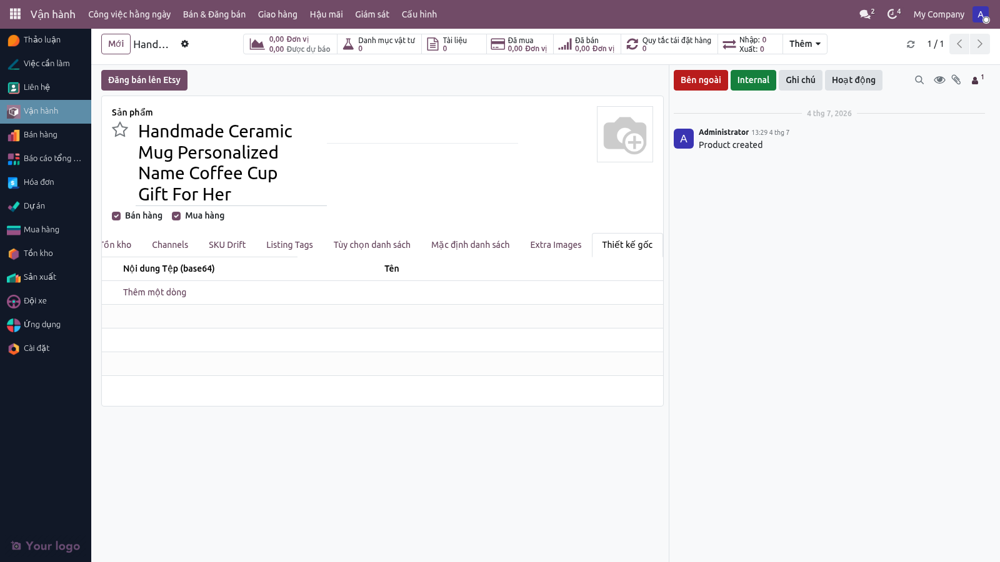

**Vị trí trên form:** trang **Original Design** trong khu vực Channels.

Từ 2026-07, sản phẩm có tab mới **"Original Design"** — dành cho lưu trữ file thiết kế gốc (Adobe Illustrator, Photoshop, PDF, v.v.) riêng biệt khỏi khu vực **Documents** chung. Đây là nơi lưu "bản nháp thiết kế" trước khi bóc tách thành các ảnh hay thông tin đăng Etsy.

**Quy tắc:**
- **Loại file chấp nhận:** AI, PSD, PDF, SVG, SKETCH, XD, v.v. (bất kỳ format thiết kế đồ hoạ).
- **Giới hạn dung lượng:** ≤ 10 MB (một file).
- **Số lượng file:** 1 file gốc (nếu muốn nhiều version, dùng Google Drive link thay vào ô URL).
- **Mục đích:** BA/Marketing tham khảo file gốc khi cần chỉnh sửa hoặc xuất lại; Marketing không phải tải file từ email hay chat riêng.
- **Không ảnh hưởng Etsy:** file thiết kế gốc KHÔNG được gửi lên Etsy — chỉ dùng nội bộ.

---

## 5. Đồng bộ từ Excel

> ⚠️ **Chưa hoạt động hôm nay.** Tính năng đã thiết kế nhưng cron chưa wire. Mô tả dưới đây là kế hoạch.

### 5.1 Đường dẫn upload

Khi BA đặt file Excel danh mục vào thư mục Google Drive đã cấu hình:

```
GDrive: /Hatafax_Catalog/<năm>/<tên_file>.xlsx
```

### 5.2 Cron tự động

- Lịch chạy: mỗi đêm khoảng **02:00 VN**.
- Hệ thống đọc file mới nhất theo timestamp.
- Mỗi dòng = một sản phẩm.

### 5.3 Quy tắc cập nhật

| Tình huống | Hành vi |
|---|---|
| SKU mới (chưa có trong hệ thống) | Tạo sản phẩm mới |
| SKU đã có | **Excel thắng** — cập nhật tên, giá, mô tả theo Excel |
| Sản phẩm cũ có kênh đã chọn | Không xoá — chỉ cập nhật nội dung |
| Dòng Excel lỗi format | Bỏ qua + ghi vào báo cáo |

### 5.4 Báo cáo cron

Mỗi sáng BA Lead nhận email tóm tắt:
- Số sản phẩm thêm mới
- Số sản phẩm cập nhật
- Số dòng bị lỗi (kèm lý do)

---

## 6. Quản lý mã SKU — câu chuyện hai mã

### 6.1 Hai bộ mã song song

| Mã | Khi nào dùng | Ví dụ |
|---|---|---|
| **Mã cũ (legacy)** | SKU BA đã dùng lâu nay; giữ trong "Lưu trữ SKU cũ" | `MUG-001`, `T-SHIRT-XL-RED` |
| **Mã chuẩn (v2)** | Mã hệ thống tự sinh cho sản phẩm mới | `MUG-CR-F11`, `APR-TX-AM` |

### 6.2 Cấu trúc mã chuẩn

`{FAM3}-{MAT2}-{SIZE}[-{VAR2}]`

Ví dụ: `MUG-CR-F11-BK`
- `MUG` = nhóm Mug (Family, 3 ký tự)
- `CR` = chất liệu Ceramic + Chrome (Material, 2 ký tự)
- `F11` = 11 oz fluid (Size — namespace Fluid oz)
- `BK` = màu Black (Variant 2, tuỳ chọn)

Đầy đủ 22 family + 7 material + 5 size namespace: xem [`SKU_GRAMMAR.md`](./SKU_GRAMMAR.md).

### 6.3 Trang SKU Drift

Khi mở sản phẩm có mã legacy → trang **SKU Drift** trên form hiển thị:

```
SKU hiện tại:   MUG-001        [Mã cũ]
SKU gợi ý mới:  MUG-CR-F11

[Giữ mã cũ]    [Chấp nhận mã mới]
```

- **Giữ mã cũ** → hệ thống nhớ quyết định, không hỏi lại.
- **Chấp nhận mã mới** → cập nhật mã trong hệ thống + tự push lên Etsy (nếu sản phẩm đang Etsy "Còn hàng"). Nếu Etsy lỗi → rollback + ghi lỗi.

### 6.4 Xem danh sách SKU drift

**Menu:** Vận hành → Bán & Đăng bán → **SKU Drift Review** → danh sách các sản phẩm có mã chưa khớp định dạng mới. Bấm vào mỗi dòng để giải quyết.

---

## 6.5 Sản phẩm vs Listing — hai lớp riêng biệt

> Từ 2026-06-06 (ADR-015). Để mở đường cho việc bán cùng 1 sản phẩm trên nhiều shop Etsy + Amazon + website với câu chữ marketing khác nhau, hệ thống tách 2 khái niệm:

| Lớp | Menu | Người sở hữu | Chứa gì |
|---|---|---|---|
| **Sản phẩm** (`product.template`) | Sản phẩm → Tất cả Sản phẩm | **BA / PD** | "Sản phẩm là gì": tên kỹ thuật, SKU, kích thước/khối lượng, danh mục nội bộ, giá gốc, biến thể size/màu |
| **Listing** (`multichannel.listing`) | Operations → Listings | **Marketing** | "Ta muốn đăng nó như thế nào, ở đâu": tên rao bán, mô tả marketing, ảnh hero, category Etsy, shipping profile, who_made / when_made, video, ... — riêng cho từng shop |

**Quy tắc đọc của hệ thống khi publish:**

1. Đọc `Listing.<field>` trước (override của Marketing).
2. Nếu trống → fall back vào `Sản phẩm.<field>` (BA nhập).
3. Nếu vẫn trống → fall back vào shop default (Admin cấu hình).
4. Vẫn không có → báo lỗi rõ ràng, KHÔNG gọi Etsy.

**Ví dụ thực tế.** SP "Personalized Leather Tray":
- BA nhập tên kỹ thuật `Personalized Coordinates Leather Tray` ở Sản phẩm.
- Marketing tạo 2 dòng Listing — một cho `JaHandmadeArt` (title rao bán `Custom GPS Coordinates Leather Tray — Anniversary Gift`), một cho `NamcoHome` (title rao bán `Engraved Map Tray for Couples`). Cùng SP, hai shop, hai phong cách marketing.
- Khi publish, hệ thống lấy title của Listing tương ứng từng shop.

**Migration day-1 — không gián đoạn:** sau khi cài bản mới, hệ thống tự tạo 1 dòng Listing rỗng cho mỗi SP đã từng đăng Etsy. Override fields đều null → behaviour publish hệt như trước. Marketing chỉ điền khi nào muốn override.

**Phân quyền:**
- **BA Lead / BA User:** RW trên Sản phẩm, **read-only** trên Listing (BA chỉ xem được Marketing đã nhập gì).
- **Marketing:** RW trên Listing, **read-only** trên Sản phẩm (Marketing không sửa kích thước/SKU).
- **Admin:** RW cả hai.

> Câu hỏi thường gặp: "Tôi nên sửa cái gì ở Sản phẩm, cái gì ở Listing?" → Nếu thay đổi liên quan đến *bản thân sản phẩm* (size, vật liệu, SKU, giá gốc) — sửa ở Sản phẩm. Nếu thay đổi liên quan đến *cách bán nó trên một shop cụ thể* (tên rao bán, mô tả marketing, category Etsy, ảnh đẹp hơn) — sửa ở Listing.

---

## 7. Đăng sản phẩm lên Etsy

### 7.1 Điều kiện trước khi đăng

- [ ] Đã có ít nhất 1 ảnh sản phẩm chính.
- [ ] Tên sản phẩm tiếng Anh không vượt quá 140 ký tự.
- [ ] Giá USD `> 0` (Etsy tự enforce mức $0.20 ở bước push của họ).
- [ ] Shop Etsy nguồn đã có 4 default IDs do Admin cấu hình một lần (Danh mục Etsy / Shipping Profile / Return Policy / Readiness State).
- [ ] (Khuyến nghị) Đã điền các Thông tin bổ sung ở mục 4 nếu cần — tags, cá nhân hoá, ảnh phụ …

### 7.2 Bấm "Publish to Etsy"

Có **hai cách** mở Wizard publish, chọn cách phù hợp:

**Cách 1 — từ form Listing (mới từ v1.3, khuyên dùng cho Marketing):**

1. Mở menu **Vận hành → Bán & Đăng bán → Listings**, mở dòng Listing tương ứng SP × shop.
2. Nhấn nút **"Publish to Etsy"** ở góc trên bên trái header form (cạnh statusbar Draft / Ready / Published).
3. Wizard publish mở ra với **shop đã được tự chọn** theo Listing → bỏ qua bước chọn shop.
4. Khi state của Listing = **Error**, nút đổi tên thành **"Resume Publish"** (chạy lại đoạn còn dang dở).

Nút chỉ hiện khi: kênh của Listing là Etsy + Listing đã có Etsy Shop được phân giải + state chưa phải Published.

**Cách 2 — từ form Sản phẩm (cách cũ, dành cho BA):**

1. Mở form sản phẩm.
2. Nhấn nút **"Publish to Etsy"** ở header form (mọi BA tier đều thấy).
3. Wizard publish mở ra — **BA chọn shop trong Wizard** (vì SP có thể đăng nhiều shop).

**Sau khi Wizard mở (cả 2 cách):**

- **Action: Run Publish (full)** — tạo draft → upload ảnh → push tồn kho → đăng active.
- **Action: Run Publish Draft Only** — dừng ở Draft, không phát sinh phí Etsy $0.20.

Nhấn nút tương ứng.

Hệ thống làm các bước:

1. Gọi Etsy tạo listing Draft.
2. Upload ảnh (chính + phụ, tối đa 10).
3. Đẩy SKU + tồn kho lên Etsy.
4. (Nếu action full) chuyển listing sang trạng thái Active.
5. Cập nhật trạng thái kênh từ Draft → Published (hoặc dừng ở Draft).

### 7.3 Sau khi đăng

- [ ] Mở Etsy Shop Manager → thấy listing mới ở **Drafts** hoặc **Active**.
- [ ] Trên hệ thống, trang **Channels** hiển thị "Etsy — Published" + listing ID.
- [ ] Nếu lỗi → trang **Channels** hiển thị "Etsy — Error" + thông báo lỗi → BA xem rồi bấm **"Resume Publish"** (nút đổi tên khi trạng thái = lỗi).

### 7.4 Lỗi thường gặp khi publish

| Lỗi | Nguyên nhân | Cách xử lý |
|---|---|---|
| `A readiness_state_id is required for physical listings.` | Shop Etsy nguồn chưa cấu hình Readiness State | Admin vào Etsy → Shop Settings → Publisher Defaults |
| `All offerings need readiness state` | Push inventory: từng phiên bản chưa carry Readiness State | Hệ thống đã fix; nếu vẫn lỗi → báo Đội Kỹ thuật |
| `int exceeds XML-RPC limits` | Listing ID > 2.1B chưa cast về dạng chuỗi | Hệ thống đã fix; báo nếu tái phát |
| `Cannot resolve a positive starting price …` | Giá sản phẩm `= 0` VÀ không size nào có "Price Extra" → Etsy sẽ trả `price empty`. Hệ thống chặn trước khi gọi Etsy. | Điền **List Price** trên form sản phẩm HOẶC **Price Extra** trên ít nhất 1 dòng Size/Color ở tab *Attributes & Variants*. |

### 7.4a Chọn Etsy Category (taxonomy) cho listing

> Mới từ 2026-06-06 (P-LIST-CATEGORY). Trước đây Etsy Category chỉ có ở cấp Sản phẩm hoặc shop default. Giờ Marketing chọn được theo từng Listing × shop.

**Đồng bộ taxonomy từ Etsy:**
- Hệ thống tự đồng bộ cây taxonomy Etsy hàng tuần (cron `Etsy: Taxonomy Cache Sync`).
- Admin có thể bấm thủ công nút **Sync Etsy Taxonomy** trên form cửa hàng nếu cần refresh ngay.
- Toàn bộ cây hiển thị ở menu **Vận hành → Cấu hình** (chỉ Admin).

**Cách chọn category cho 1 listing:**
1. Vào **Vận hành → Bán & Đăng bán → Listings**, mở Listing tương ứng SP × shop.
2. Sang tab **Etsy** (mới).
3. Trường **Etsy Category** → gõ tên ngách (vd "Cookware", "Throw Pillows") → autocomplete sẽ hiển thị các taxonomy đầy đủ đường dẫn (`Home & Living / Kitchen / Cookware`).
4. Chọn → Save.

**Thứ tự ưu tiên khi publish (publisher đọc):**
1. **Listing.Etsy Category** (override Marketing nhập)
2. → **Sản phẩm.x_taxonomy_id** (giá trị BA nhập ở Sản phẩm cũ)
3. → **Etsy Shop.Default Taxonomy ID** (Admin set ở shop)
4. → Nếu không có gì cả: Etsy trả 400. Hệ thống sẽ siết thành lỗi rõ ràng ở slice hardening sau này — hiện vẫn fall-through để không gãy fixture cũ.

### 7.4a-ship Chọn Shipping Profile cho listing

> Mới từ 2026-06-06 (P-LIST-SHIPPING). Tương tự Etsy Category nhưng theo từng shop.

**Đồng bộ:**
- Cron `Etsy: Shipping Profile Cache Sync` chạy hàng ngày.
- Admin có thể bấm thủ công nút **Sync Etsy Shipping Profiles** trên form cửa hàng.
- **Vận hành → Cấu hình** (Admin) — xem cache.

**Chọn per-listing:** **Vận hành → Bán & Đăng bán → Listings** → tab Etsy → trường **Etsy Shipping Profile** (autocomplete chỉ hiển thị profile của shop đó).

**Thứ tự ưu tiên:** Listing override → Etsy Shop default → 0 (Etsy 400 — sẽ hardening sau).

### 7.4b-defaults Cài đặt Title / Description / Image mặc định theo từng shop

Nếu Marketing muốn tất cả sản phẩm đăng lên một shop dùng chung tiêu đề / mô tả / hình thương hiệu (brand voice) — ví dụ JaHandmadeArt luôn dùng "Handmade Ceramic by JaHandmadeArt", còn namcohome dùng "Durable Office Ceramic" — không cần sửa từng listing.

- **Vị trí**: vào menu *Vận hành → Cấu hình* (hoặc *Bán & Đăng bán → Channels*), mở shop cần cài đặt → tab **Publisher Defaults** → group **Shop Brand-Voice Defaults**.
- **3 trường mới**:
  - *Default Listing Title* (≤140 ký tự) — tiêu đề mặc định nếu listing không override và sản phẩm không có tên riêng.
  - *Default Listing Description* (text dài) — mô tả mặc định.
  - *Default Listing Image* (upload ảnh) — hình mặc định, dùng khi sản phẩm chưa có ảnh chính.
- **Thứ tự fallback** (hệ thống tự chọn): per-listing override → product canonical → shop default → để trống. Ô shop default chỉ kích hoạt khi cả 2 tầng trên đều rỗng.
- **Khi nào nên dùng**: lập shop mới chưa đủ ảnh/mô tả cho từng sản phẩm, hoặc muốn unify brand voice. Để trống = inherit product canonical (mặc định cũ).
- **Permission**: nhóm Marketing user trở lên có quyền edit (cùng nhóm chỉnh listing).

### 7.4c "How it's made" per-listing (who_made / when_made / is_supply)

> Mới từ 2026-06-06 (P-LIST-HOW-ITS-MADE). 3 trường Etsy bắt buộc giờ có override theo từng listing.

**Operations → Listings → tab Etsy:** 3 trường mới ngay dưới Etsy Category + Shipping Profile:
- **Who made it** — Selection (I did / Someone else / A member of my shop)
- **When made** — Selection (Made to order / 2020-2026 / 1990s / ... / before_1700)
- **Is supply** — Boolean (raw materials, tools)

**Thứ tự ưu tiên publisher đọc:**
1. Listing override (Marketing nhập ở Listing)
2. → Sản phẩm (BA nhập `x_who_made` / `x_when_made`)
3. → Etsy Shop default (Admin set)
4. → Hard-coded `'i_did'` / `'made_to_order'` / `False` (last-resort)

(Lưu ý: `is_supply` không có lớp Sản phẩm — chỉ Listing → Shop. Vì Etsy ít khi override per-product.)

### 7.4e Bulk-action trên list Listings (P-LIST-SHOP-BULK)

> Mới từ 2026-06-06 (Jira ESTY-197).

**Menu Vận hành → Bán & Đăng bán → Listings** giờ:
- Mặc định lọc theo **state ∈ {Draft, Ready}** (= những row còn editable). Filter "Published" / "Error" để xem khác.
- Mặc định nhóm theo **Shop** — Marketing nhanh chóng tách listings của từng shop.

**2 server action mới** (tick N row → Action):
- **Mark Ready for Publish** — flip Draft → Ready để BA review. Row không phải Draft bị bỏ qua, hệ thống báo skipped count.
- **Reset to Draft** — flip Ready/Error → Draft (Published KHÔNG bị reset; Marketing không tự ý gỡ listing đã đăng).

### 7.4d Attribute Mapping per-listing (P-LIST-ATTRIBUTES)

> Mới từ 2026-06-06 (Jira ESTY-192). Khi 1 listing cần ánh xạ thuộc tính (Size / Color / Material) khác với mapping chung của Sản phẩm hoặc Shop, Marketing nhập override theo từng dòng ở đây.

**Vào tab "Shipping & Variations"** (mới — gom shipping profile + taxonomy + attribute mapping vào 1 tab cho đồng bộ với flow đăng listing Etsy).

**Thứ tự ưu tiên publisher đọc** (3 tầng):

1. **Per-listing row** — mỗi dòng có "Product Attribute" + "Etsy Property ID Override" + "Etsy Property Name Override". Marketing nhập ở đây.
2. → **Shop default mapping** (sẽ ship ở slice tiếp theo P-LIST-ATTR-CONFIG).
3. → **Product global** — giá trị mặc định ở `product.attribute.x_etsy_property_id` (Admin set 1 lần cho toàn hệ thống).

**Quy tắc**: để trống cả 2 trường override trong 1 dòng → fall through xuống tầng tiếp theo. KHÔNG cần xoá dòng để fall through.

### 7.4b Upload video cho listing (1 video / shop)

> Mới từ 2026-06-06 (P-LIST-VIDEO). Etsy cho phép tối đa 1 video / listing.

**Cách upload:**
1. Vào **Operations → Listings**, mở Listing tương ứng SP × shop.
2. Sang tab **Video** (tab mới).
3. Bấm vào **Video** → chọn file `.mp4` từ máy (cỡ file < ~100MB; Etsy có giới hạn riêng).
4. Save.
5. Quay lại form **Sản phẩm** (menu **Sản phẩm** → mở SP tương ứng).
6. Bấm nút **Publish to Etsy** ở header form (nút màu vàng, chỉ hiện với BA) → chọn shop → Confirm.
7. Hệ thống tự upload video qua `POST /shops/.../listings/.../videos` sau khi tạo listing + push tồn kho.

**Nguyên tắc:**
- Video nằm ở Listing layer (theo từng shop) — KHÔNG nằm ở Sản phẩm master. Cùng 1 SP nhưng JaHandmadeArt và NamcoHome có thể dùng video khác nhau.
- Nếu upload thất bại (rate-limit Etsy, file lỗi format), listing vẫn được publish — hệ thống chỉ log WARNING. BA xem chatter / log để biết.
- Nếu không upload video, Etsy đăng listing không video — không lỗi.

### 7.5b Xem trước giá quy đổi sang tiền tệ shop

Khi shop Etsy bán bằng VND nhưng Odoo đang để giá USD, listing trên Etsy hiện giá VND cho khách. Trước khi bấm *Publish*, Marketing có thể xem **số VND** mà khách sẽ thực sự thấy — ngay trên form Listing.

- **Vị trí**: Vào **Vận hành → Bán & Đăng bán → Listings**, mở Listing → tab *Shipping & Variations* → group **Shop Currency Preview** ở đầu trang.
- **Hai trường**:
  - *Etsy Shop* (dropdown) — chọn shop sẽ đăng. Hệ thống dùng tiền tệ của shop này để quy đổi.
  - *Price (shop currency)* (chỉ đọc) — giá đã quy đổi theo tỷ giá hôm nay.
- **Khi hiện `0.00`**: có 1 trong 3 lý do — (1) chưa chọn Etsy Shop, (2) shop chưa cấu hình tiền tệ niêm yết (gửi yêu cầu hệ thống set `listing_currency_id`), (3) chưa có tỷ giá hôm nay trong Odoo. Mọi trường hợp đều không crash form; trường vẫn cho lưu bình thường.
- **Cập nhật tỷ giá**: hiện tại tỷ giá `res.currency.rate` nhập tay bởi Kế toán. Cron *Etsy: Refresh Shop Currency Rates* chạy 05:00 UTC hàng ngày nhưng đang ở chế độ skeleton — log WARNING và không ghi gì. Nhà cung cấp tỷ giá tự động (ECB / OpenExchangeRates) sẽ thêm ở slice tiếp theo.
- **Mẹo**: nếu thấy giá hiển thị thấp bất thường (ví dụ 100 VND thay vì 1,000,000 VND), Marketing có thể là tỷ giá Odoo sai. Báo Kế toán cập nhật rồi reload trang.

### 7.5 Sản phẩm có nhiều size / màu (per-variant)

Khi sản phẩm có nhiều biến thể (ví dụ Mug 4" / 6" / 8") với giá khác nhau:

- **Cách thiết lập**: ở tab *Attributes & Variants*, mỗi giá trị Size có ô **Price Extra** — điền chênh lệch giá so với giá gốc. Ví dụ List Price `0` + Price Extra `10 / 20 / 30` → 3 size có giá `10 / 20 / 30` USD.
- **Hình theo size**: vào menu **Sản phẩm** → chọn sản phẩm → tab **Variants** (Biến thể), mở từng variant → upload ảnh ở trường **Variant Image**. Mỗi biến thể có thể có hình riêng; không có cũng được — Etsy dùng hình chính của listing.
- **Khi đăng**: hệ thống tự gửi từng size sang Etsy với SKU + giá + tồn riêng. Listing trên Etsy hiển thị giá "từ XXX ₫" (lấy size rẻ nhất). Người mua chọn size → Etsy đổi sang giá / hình của size đó.
- **Lưu ý SKU**: nếu Variant không có SKU riêng (Default Code), hệ thống tự sinh `{SKU template}-{slug size}` (ví dụ `LT-4IN`, `LT-6IN`, `LT-8IN`). Tối đa 32 ký tự, cắt ở đuôi nếu dài hơn.

---

## 8. Câu hỏi thường gặp

**Q:** _Tôi tạo nhầm sản phẩm. Xoá thế nào?_
A: Chỉ Admin / BA Manager mới xoá được. Liên hệ và cung cấp Mã SKU + lý do. Nếu sản phẩm chưa đăng lên Etsy → xoá an toàn. Nếu đã đăng → phải hạ listing Etsy trước.

**Q:** _Sản phẩm tạo xong nhưng không thấy nút "Publish to Etsy"._
A: Bạn chưa có quyền BA. Liên hệ Admin để cấp quyền (mọi BA tier đều publish được — không cần BA Lead).

**Q:** _Tôi muốn cùng một sản phẩm bán trên Etsy + Amazon._
A: Hôm nay chỉ Etsy hoạt động. Khi Amazon ra mắt, BA chỉ cần tích thêm ☑ Amazon trong phần "Các kênh áp dụng" của sản phẩm.

**Q:** _Mã SKU Gearment có bắt buộc không?_
A: Không. Để trống → sản phẩm chạy theo đường MTO (sản xuất nội bộ). Có giá trị → chạy theo đường Dropship Gearment (chế độ Dropship tự bật).

**Q:** _Sản phẩm Dropship có nhiều biến thể (màu / size) thì khai mã Gearment thế nào?_
A: Mã Gearment của mỗi biến thể là **khác nhau** (mỗi màu-size là một mã riêng bên Gearment). Cách khai:
1. Vẫn điền **Mã SKU Gearment** ở mức sản phẩm (để bật đường Dropship).
2. Mở tab **Mua hàng (Purchase)** của sản phẩm → thêm một dòng nhà cung cấp **Gearment** cho **từng biến thể**: chọn đúng Biến thể ở cột Variant và điền mã Gearment của biến thể đó vào cột **Mã sản phẩm NCC (Vendor Product Code)**.
3. Khi đẩy đơn sang Gearment, hệ thống lấy mã theo đúng biến thể khách đặt. Nếu sản phẩm nhiều biến thể mà thiếu mã của biến thể trong đơn, hệ thống sẽ **chặn đẩy đơn** và báo rõ thiếu ở sản phẩm nào — để tránh in nhầm màu/size.
Sản phẩm chỉ có một biến thể (ví dụ ly sứ một cỡ) thì không cần bước 2 — mã ở mức sản phẩm là đủ.

**Q:** _Listing trên Etsy bán hết số lượng thì có bị tắt không?_
A: Etsy trừ dần số lượng mỗi khi có đơn; về 0 là Etsy tự tắt listing. Hệ thống
có **cron tự bơm lại số lượng** mỗi giờ cho các listing đang bán sắp cạn.
Mặc định tính năng này **tắt** — Admin bật bằng cách đặt tham số hệ thống
`etsy_integration.pod_topup_quantity` = số lượng mục tiêu (ví dụ `50`).

**Q:** _Trước đây có Wizard cũ và SKU Builder — sao bây giờ không thấy nữa?_
A: Từ phiên bản này, **form Sản phẩm chuẩn đã đủ** — hệ thống tự sinh Mã SKU từ Danh mục + Biến thể nên không cần Wizard riêng nữa. Wizard cũ đã được ẩn khỏi menu để tránh nhầm lẫn.

**Q:** _Mã SKU tự sinh có sai không?_
A: Hệ thống dựa trên Danh mục + Biến thể để sinh Mã SKU. Nếu BA chọn đúng Danh mục + Biến thể → Mã SKU sẽ đúng định dạng. BA vẫn có thể sửa tay nếu cần (ví dụ giữ mã legacy cho sản phẩm cũ).

**Q:** _Tôi muốn giữ mã legacy cho sản phẩm cũ — làm sao?_
A: Chỉ cần **gõ tay** mã cũ vào ô Mã SKU → hệ thống giữ nguyên. Lần sau hệ thống không hỏi lại.

**Q:** _Tôi đăng lên Etsy bị lỗi "A readiness_state_id is required for physical listings."_
A: Shop Etsy nguồn chưa cấu hình Readiness State. Liên hệ Admin để cấu hình từ menu **Etsy → Shop Settings → Publisher Defaults**.

**Q:** _Tôi bật chế độ "chặt" cho kiểm tra Mã SKU thì sao?_
A: Admin đổi cấu hình hệ thống từ chế độ "mềm" sang "chặt". Từ lúc đó mọi Mã SKU không khớp định dạng sẽ bị từ chối, không tạo sản phẩm. Khuyến nghị: chỉ bật sau khi đã chuẩn hoá hết catalog legacy.

**Q:** _Tôi điền tags / personalization / weight nhưng Etsy listing không thấy?_
A: Kiểm tra (1) đã bấm **Lưu** chưa, (2) đã chạy "Publish to Etsy" hoặc "Resume Publish" chưa. Etsy listing chỉ cập nhật khi BA bấm publish — không tự đồng bộ.

---

## 9. Checklist kiểm thử UAT

> Người kiểm thử: BA Lead · **Ngày kiểm:** _________ · **Môi trường:** Staging (`https://odoo.hatafax.com`)

### TC-001: Tạo sản phẩm Mug bằng form chuẩn

- [ ] Đăng nhập vai trò BA Lead
- [ ] Mở menu **Sản phẩm** → bấm **Tạo mới**
- [ ] Điền: Tên = "UAT-TAOSP Mug 2026", Danh mục = `Mug`, Biến thể: Chất liệu = "Ceramic + Chrome", Size = "11 oz", Giá USD = 12.99, Kênh = ☑ Etsy
- [ ] **Mong đợi:** Ô Mã SKU tự điền = `MUG-CR-F11`; bấm Lưu thành công
- [ ] **Kết quả thực tế:** _____
- [ ] **Pass / Fail:** _____

### TC-002: Tạo sản phẩm Dropship Gearment

- [ ] Mở form Sản phẩm → Tạo mới
- [ ] Điền tất cả trường bắt buộc + Mã SKU Gearment = "GEAR-UAT-..."
- [ ] **Mong đợi:** Sản phẩm có cờ Dropship; hiển thị huy hiệu "Dropship" trên form
- [ ] **Pass / Fail:** _____

### TC-003: Trang SKU Drift — giữ mã cũ

- [ ] _**Yêu cầu seed**: cần 1 sản phẩm có mã legacy trên staging_
- [ ] Mở sản phẩm có Mã SKU legacy (ví dụ `MUG-001`)
- [ ] Mở trang "SKU Drift"
- [ ] Bấm "Keep Legacy"
- [ ] **Mong đợi:** Mã giữ nguyên; sản phẩm không xuất hiện trong danh sách SKU Drift nữa
- [ ] **Pass / Fail:** _____

### TC-004: Trang SKU Drift — chấp nhận mã mới (sản phẩm đã đăng Etsy)

- [ ] _**Yêu cầu seed**: cần 1 SP đã publish Etsy + có mã legacy_
- [ ] Mở SP đã đăng Etsy + có mã legacy
- [ ] Bấm "Accept Canonical"
- [ ] **Mong đợi:** Mã SKU đổi sang định dạng mới; trang Channels hiển thị "Inventory push pending" → "pushed"; Etsy Shop Manager phản ánh Mã SKU mới
- [ ] **Pass / Fail:** _____

### TC-005: Đăng SP lên Etsy (Draft mode)

- [ ] _**Yêu cầu**: owner pre-approved_
- [ ] Mở SP UAT vừa tạo (có ít nhất 1 ảnh)
- [ ] Bấm "Publish to Etsy" → **Action: Run Publish Draft Only**
- [ ] **Mong đợi:** Etsy Shop Manager → listing mới ở Drafts; trang Channels: "Etsy — Published (draft)" + listing ID
- [ ] **Pass / Fail:** _____

### TC-006: Phân quyền — BA User vẫn thấy nút "Publish to Etsy"

- [ ] Đăng nhập tài khoản BA User
- [ ] Mở sản phẩm bất kỳ
- [ ] **Mong đợi:** Nút "Publish to Etsy" **hiện** trên header form; có thể bấm và chạy được wizard publish
- [ ] **Pass / Fail:** _____

### TC-007: Validator giá — Listing Price phải `> 0`

- [ ] Mở form Sản phẩm → Tạo mới, điền giá USD = 0
- [ ] Bấm Lưu
- [ ] **Mong đợi:** Modal lỗi "Listing Price must be greater than 0."
- [ ] **Pass / Fail:** _____

### TC-008: Tags — happy path + giới hạn 13

- [ ] Tạo sản phẩm mới, mở trang **Listing Tags**
- [ ] Thêm 13 tag hợp lệ (ví dụ `mug, ceramic, gift, ...`)
- [ ] **Mong đợi:** Lưu thành công, đếm = 13
- [ ] Thử thêm tag thứ 14
- [ ] **Mong đợi:** Lỗi "≤ 13 tags"
- [ ] Thử thêm tag dài 21 ký tự
- [ ] **Mong đợi:** Lỗi "≤ 20 chars"
- [ ] **Pass / Fail:** _____

### TC-009: Cá nhân hoá — bật + bắt buộc + 256 ký tự

- [ ] Tạo sản phẩm, mở trang **Listing Options**
- [ ] Tick "Cho phép cá nhân hoá", tick "Bắt buộc khách điền", char count = 256, hướng dẫn = "Khắc tên lên cốc"
- [ ] Bấm Lưu, sau đó Publish Draft to Etsy
- [ ] **Mong đợi:** Etsy listing có 4 trường personalization hiện đúng giá trị
- [ ] **Pass / Fail:** _____

### TC-010: Cá nhân hoá — char count ngoài dải

- [ ] Tick "Cho phép cá nhân hoá", char count = 0 → bấm Lưu
- [ ] **Mong đợi:** Lỗi "1 ≤ char count ≤ 1024"
- [ ] Đổi char count = 1025 → Lưu
- [ ] **Mong đợi:** Lỗi như trên
- [ ] **Pass / Fail:** _____

### TC-011: Vật liệu auto từ biến thể

- [ ] Tạo SP với Biến thể: Chất liệu = "Ceramic + Chrome"
- [ ] Publish Draft to Etsy
- [ ] **Mong đợi:** Etsy listing có Materials = `["Ceramic", "Chrome"]` (hoặc tương đương sau khi làm sạch ký tự)
- [ ] **Pass / Fail:** _____

### TC-012: Ảnh phụ — upload 3 ảnh + thứ tự

- [ ] Tạo SP, mở trang **Extra Images**
- [ ] Upload 3 ảnh, đặt sequence = 10 / 20 / 30
- [ ] Publish Draft to Etsy
- [ ] **Mong đợi:** Etsy listing nhận 4 ảnh (ảnh chính + 3 ảnh phụ) đúng thứ tự
- [ ] **Pass / Fail:** _____

### TC-013: Override Etsy theo sản phẩm — taxonomy_id

- [ ] Cấu hình shop: default Danh mục Etsy = `1234567890`
- [ ] Tạo SP, mở trang **Listing Defaults**, điền Danh mục Etsy = `9999999999`
- [ ] Publish Draft to Etsy
- [ ] **Mong đợi:** Etsy listing dùng `9999999999`, không phải shop default
- [ ] **Pass / Fail:** _____

### TC-014: Cân nặng + Kích thước

- [ ] Tạo SP Doormat với Weight = 0.35 kg, Biến thể Size = "R30X18"
- [ ] Publish Draft to Etsy
- [ ] **Mong đợi (shop weight_unit_pref=oz, dimensions_unit_pref=cm):**
  - Etsy listing: item_weight = `12.35` oz, item_length = `30`, item_width = `18`, item_dimensions_unit = `cm`
- [ ] Tạo SP Mug với Weight = 0.4 kg, Biến thể Size = "11 oz"
- [ ] Publish Draft to Etsy
- [ ] **Mong đợi:** item_weight = `14.11` oz; **không có** item_length/item_width (Mug không có kích thước hình học)
- [ ] **Pass / Fail:** _____

### TC-015: Thuộc tính biến thể (variant property_values)

- [ ] Tạo SP với 2 biến thể (Material=Ceramic, Color=Black) và (Material=Ceramic, Color=White)
- [ ] Publish Draft to Etsy
- [ ] **Mong đợi:** Mỗi offering trên Etsy listing có 2 property_values: Material=Ceramic, Color=Black hoặc White
- [ ] **Pass / Fail:** _____

### Tổng kết UAT

- [ ] 15/15 test cases Pass → **Approve**
- [ ] Có Fail → ghi cụ thể vào `docs/owner/UAT_FINDINGS_<date>.md` + tạo Jira sub-task

---

## 10. Báo lỗi cho ai

| Loại lỗi | Liên hệ |
|---|---|
| Form sản phẩm không mở / lỗi UI | Đội Kỹ thuật |
| Mã SKU bị nghi sai | BA Manager |
| Etsy báo lỗi khi đăng | BA Lead → Đội Kỹ thuật (kèm screenshot + listing ID) |
| Cron Excel không chạy | Đội Kỹ thuật (khi cron đi vào hoạt động) |
| Quyền truy cập / role | Admin |
| Mã SKU validator báo lỗi | BA Manager (quyết định chế độ mềm/chặt) |
| Cài đặt mặc định shop Etsy (taxonomy / readiness / shipping / return) | Admin |

---

## Phụ lục A — Từ điển các ô nhập trong chức năng Listing

> **Mục đích:** Trả lời đúng một câu hỏi — *"Ô này là gì, tôi điền gì vào đây?"*. Phần này liệt kê **từng ô** Anh/Chị nhìn thấy khi tạo và đăng một listing, kèm **ảnh chụp màn hình thật** từ hệ thống (shop JaHandmadeArt). Đọc một lần để hiểu, sau đó dùng như tra từ điển.

### A.0 Nguyên tắc 3 lớp — hiểu cái này trước, mọi thứ sau dễ hết

Một listing lấy thông tin từ **3 lớp**, ưu tiên từ trên xuống. Lớp nào có giá trị thì hệ thống dùng lớp đó; lớp đó để trống thì rớt xuống lớp dưới:

1. **Lớp Listing** (cụ thể nhất) — giá trị Anh/Chị điền ngay trên form Listing, chỉ áp cho **đúng listing này, đúng shop này**.
2. **Lớp Sản phẩm** — giá trị trên form Sản phẩm, áp cho **mọi listing của sản phẩm đó** (mọi shop).
3. **Lớp Shop** (mặc định chung) — Admin cài một lần trong **Cài đặt Shop Etsy → Publisher Defaults**, áp cho **mọi listing của shop** khi 2 lớp trên đều trống.

> **Vì sao nhiều ô để trống mà vẫn đăng được?** Vì ô trống nghĩa là "dùng giá trị của lớp dưới". Để trống KHÔNG phải là thiếu thông tin — đó là cách nói "lấy mặc định". Anh/Chị chỉ điền khi muốn listing này KHÁC với mặc định.

---

### A.1 Form LISTING — màn hình chính (Operations → Listings)

Đây là màn hình Marketing dùng nhiều nhất. Mở: menu **Operations → Listings → chọn 1 listing**.

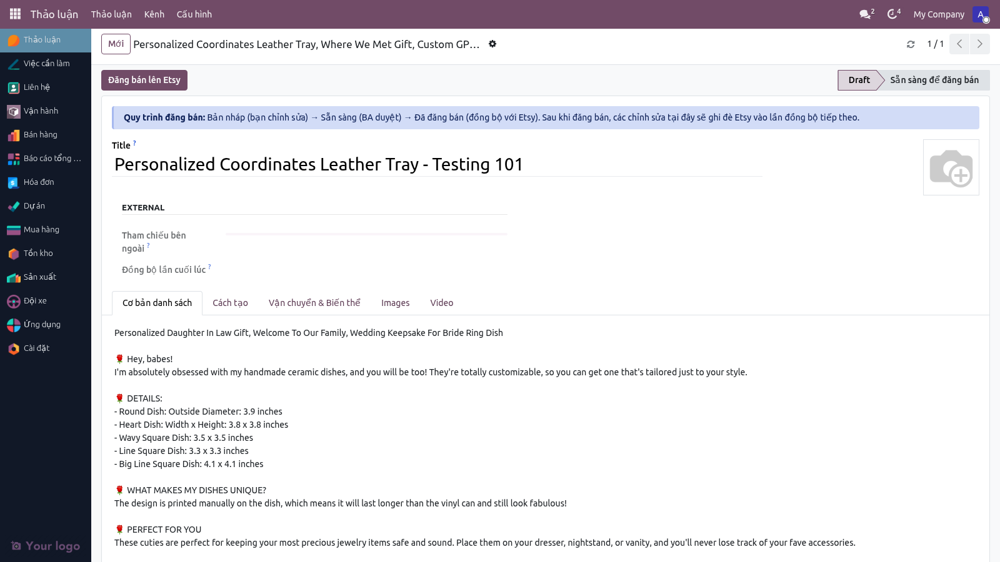

**Phần đầu form (luôn hiện):**

| Ô trên màn hình | Là gì | Điền gì / Ý nghĩa | Nếu để trống |
|---|---|---|---|
| Thanh trạng thái **Draft → Ready for Publish** | Vòng đời của listing | Bấm để chuyển **Draft** (đang soạn, sửa được) ↔ **Ready** (chốt, BA duyệt). Sau khi đăng, hệ thống tự đặt **Published** | — |
| Nút **Publish to Etsy** | Đăng listing này lên Etsy | Bấm để mở Wizard đăng (xem A.4). Hệ thống tự chọn shop của listing | — |
| **Title** (tiêu đề lớn) | Tên hiển thị trên Etsy của riêng listing này | Gõ tiêu đề bán hàng cho listing | Lấy tên Sản phẩm → rồi tới tiêu đề mặc định của Shop |
| **Ảnh đại diện** (góc phải) | Ảnh chính (ảnh đầu tiên) của listing | Upload ảnh hero riêng cho listing | Lấy ảnh chính của Sản phẩm → rồi ảnh mặc định của Shop |
| **External Reference** | Mã listing bên Etsy, hệ thống tự ghi sau khi đăng thành công | Chỉ đọc — không gõ tay | Trống = chưa từng đăng |
| **Last Synced At** | Lần cuối đồng bộ/đăng thành công | Chỉ đọc | Trống = chưa đồng bộ |

#### Thẻ "Listing Basics" — nội dung bán hàng

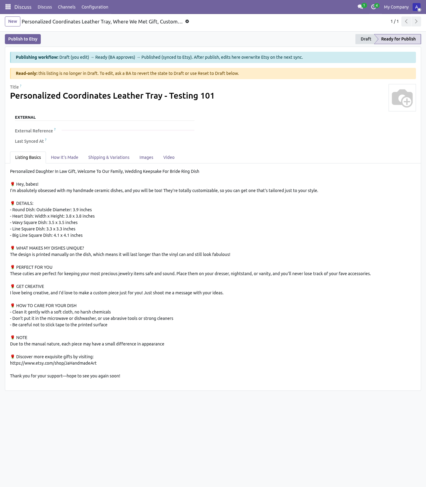

| Ô | Là gì | Điền gì | Nếu để trống |
|---|---|---|---|
| **Title** | Tiêu đề listing (giống ô tiêu đề lớn ở đầu form) | Tiêu đề bán hàng | Tên Sản phẩm → tiêu đề mặc định Shop |
| **Description** | Mô tả listing trên Etsy | Đoạn mô tả bán hàng cho riêng listing | Mô tả bán hàng của Sản phẩm → mô tả mặc định Shop |

#### Thẻ "How It's Made" — Etsy bắt buộc 3 ô này

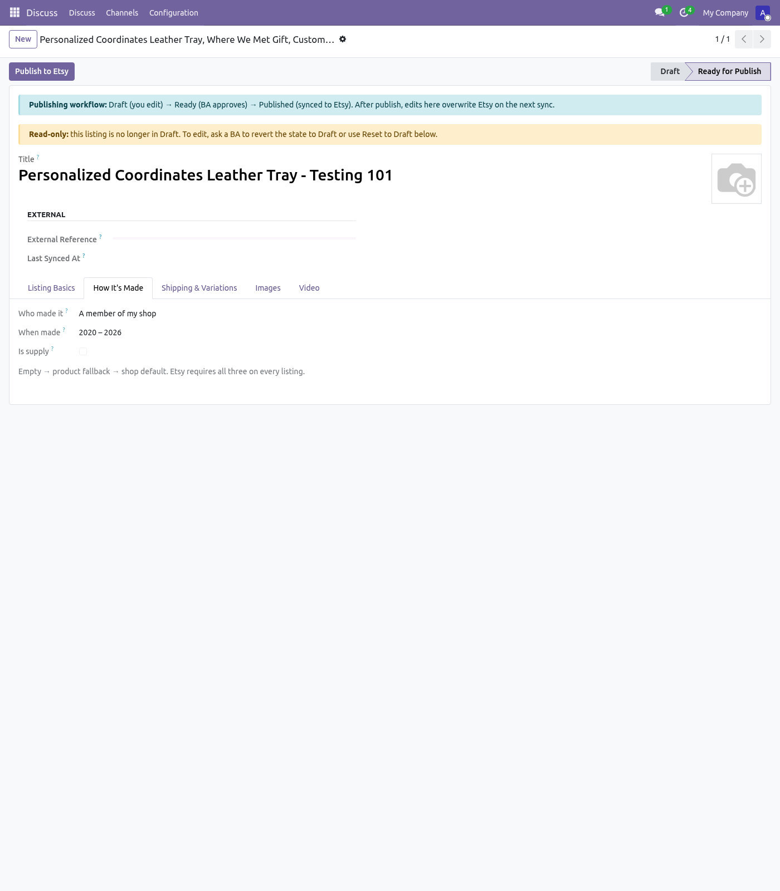

Etsy **bắt buộc** mọi listing phải khai 3 thông tin: ai làm, làm khi nào, có phải nguyên vật liệu không.

| Ô | Là gì | Chọn gì | Nếu để trống |
|---|---|---|---|
| **Who made it** | Ai làm ra sản phẩm | *I did* (tôi tự làm) / *Someone else* (người khác) / *A member of my shop* (thành viên shop) | Lấy của Sản phẩm → mặc định Shop |
| **When made** | Làm vào thời điểm nào | Ví dụ *Made to order* (làm theo đơn), *2020–2026*, hoặc mốc năm cũ hơn | Lấy của Sản phẩm → mặc định Shop |
| **Is supply** | Đây có phải nguyên vật liệu / dụng cụ không | Tích nếu bán nguyên liệu thô (chỉ, vải, hạt...); để trống nếu là thành phẩm | Dùng mặc định Shop |

#### Thẻ "Shipping & Variations" — vận chuyển, giá quy đổi, danh mục, thuộc tính

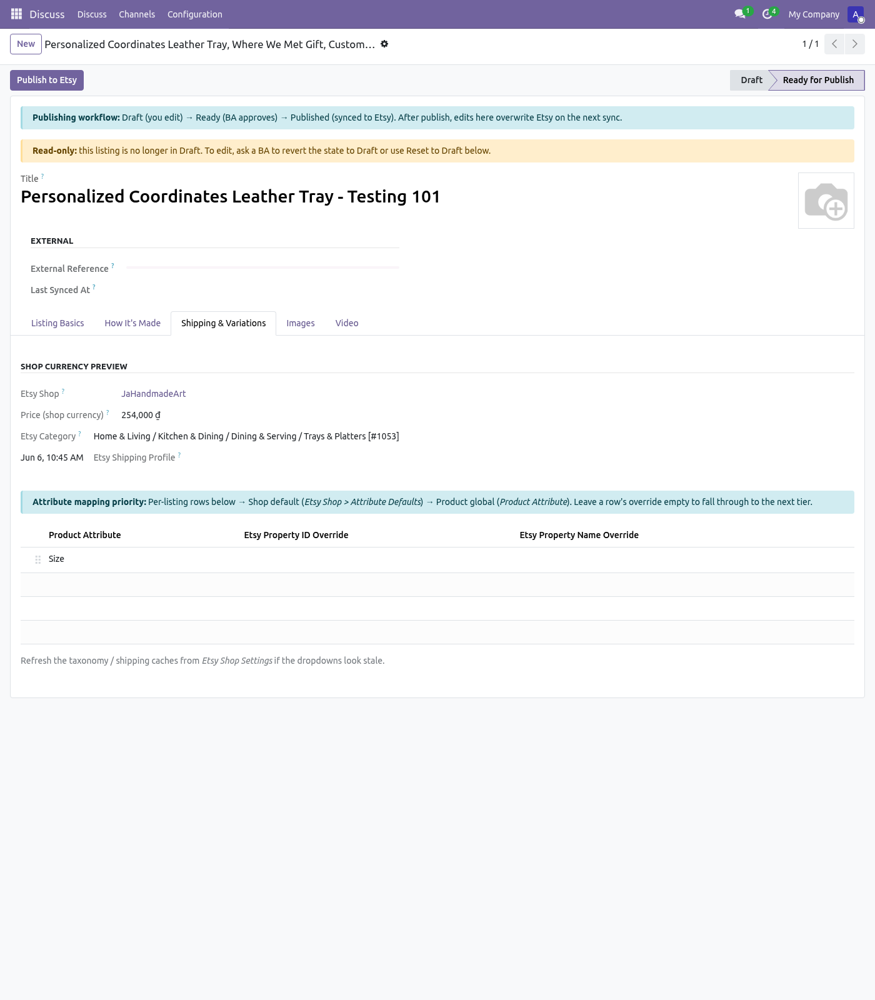

Đây là thẻ gom 3 tính năng listing mới (thời gian xử lý/phí ship, giá quy đổi, ánh xạ thuộc tính).

**Nhóm "Shop Currency Preview" (xem trước giá theo tiền tệ shop):**

| Ô | Là gì | Ý nghĩa |
|---|---|---|
| **Etsy Shop** | Shop mà listing này sẽ đăng lên | Chọn shop. Ô này quyết định tiền tệ hiển thị và các giá trị mặc định theo shop |
| **Price (shop currency)** | Giá listing **đã quy đổi** sang tiền tệ của shop (ví dụ **254.000 ₫**) | Chỉ xem. Hệ thống lấy giá gốc của sản phẩm × tỷ giá hôm nay. Bằng 0 nghĩa là chưa cài shop/tiền tệ/tỷ giá. *(Đây là tính năng ESTY-195: tỷ giá USD/EUR/CAD/VND tự quy đổi theo đơn vị của shop Etsy.)* |
| **Etsy Category** | Danh mục Etsy của listing (ví dụ *Home & Living / Kitchen & Dining / Trays & Platters*) | Chọn danh mục Etsy. Để trống → lấy của Sản phẩm → mặc định Shop |
| **Etsy Shipping Profile** | Hồ sơ vận chuyển Etsy — **chứa thời gian xử lý, thời gian giao và phí ship** | Chọn 1 hồ sơ đã đồng bộ từ Etsy. Để trống → dùng hồ sơ mặc định của Shop. *(Đây là tính năng ESTY-191: nơi đặt processing time / shipping time / giá ship — Etsy quản các giá trị này theo "Shipping Profile" chứ không nhập rời từng ô.)* |

> **Lưu ý ESTY-191:** Processing time, shipping time và phí ship trên Etsy **không** là 3 ô rời — Etsy gom chúng vào một **Shipping Profile**. Anh/Chị tạo/sửa hồ sơ này một lần bên Etsy (hoặc trong **Cài đặt Shop → Default Etsy Shipping Profile ID**), rồi chỉ việc **chọn** hồ sơ ở ô này. Đổi phí ship = đổi hồ sơ, không sửa từng listing.

**Nhóm "Attribute mapping overrides" (ánh xạ thuộc tính — Matching Attribute):**

Bảng này map thuộc tính Odoo (Size, Color, Material...) sang **property** tương ứng bên Etsy, để Etsy hiểu "ô Size của tôi = ô Size của Etsy".

| Cột | Là gì | Điền gì | Nếu để trống |
|---|---|---|---|
| **Product Attribute** | Thuộc tính Odoo (ví dụ *Size*) | Chọn thuộc tính cần ánh xạ | — |
| **Etsy Property ID Override** | Số ID property bên Etsy cho riêng listing này | Gõ ID property Etsy (số) nếu muốn ép cho listing này | Rớt xuống mặc định Shop → rồi giá trị toàn cục trên Product Attribute |
| **Etsy Property Name Override** | Tên property Etsy (chuỗi chữ) | Gõ tên nếu muốn ghi đè nhãn | Lấy tên toàn cục của Product Attribute |

> **Lưu ý ESTY-192 (Matching Attribute):** Để một dòng trống (chỉ chọn Product Attribute, không điền override) nghĩa là *"tôi đã cân nhắc, dùng mặc định"* — hệ thống tự lấy ID Etsy ở lớp Shop hoặc toàn cục. Anh/Chị **chỉ** điền override khi muốn listing này ánh xạ khác mặc định.

#### Thẻ "Images" — ảnh phụ (gallery)

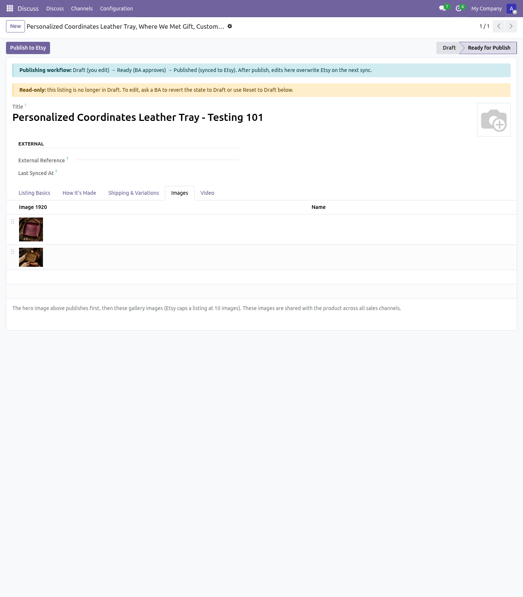

| Ô | Là gì | Ghi chú |
|---|---|---|
| **Extra Images** | Bộ ảnh phụ ngoài ảnh chính | Etsy đăng ảnh chính trước, rồi tới các ảnh này, **tối đa 10 ảnh**. Kéo thả tay nắm để sắp thứ tự. Ảnh dùng chung với Sản phẩm trên mọi kênh bán |

#### Thẻ "Video" — 1 video / listing

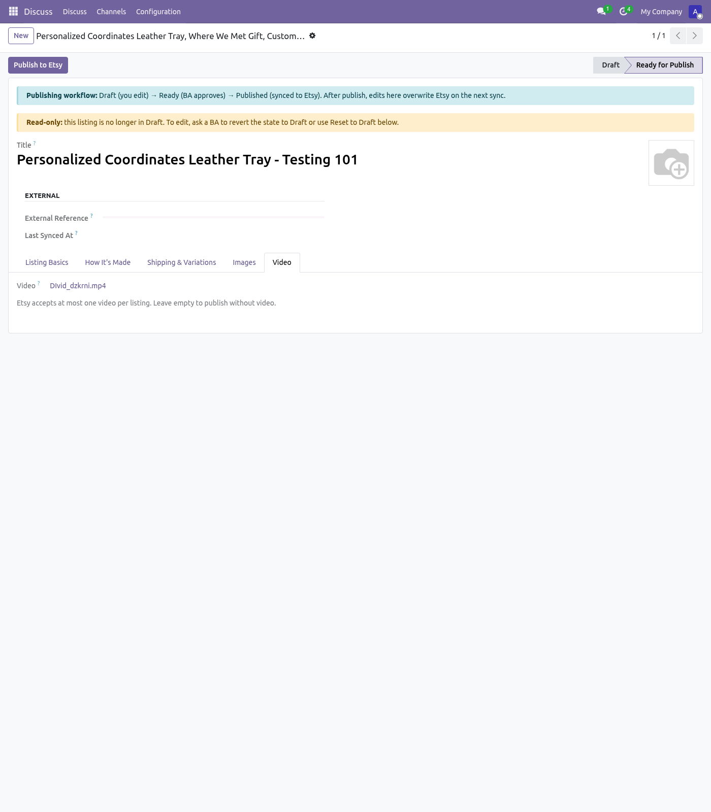

| Ô | Là gì | Ghi chú |
|---|---|---|
| **Video** | Tệp video của listing | Etsy cho **tối đa 1 video** mỗi listing. Để trống = đăng không kèm video |

---

### A.2 Form SẢN PHẨM — các thẻ liên quan listing (lớp mặc định cấp Sản phẩm)

Các ô dưới đây nằm trên **form Sản phẩm** và đóng vai trò **lớp 2** (mặc định khi form Listing để trống). Mở: **Sản phẩm → chọn 1 sản phẩm**.

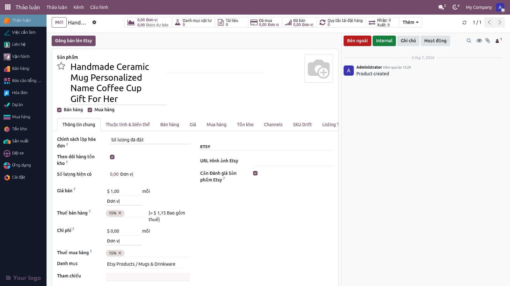

Nút **Publish to Etsy** ở đầu form Sản phẩm dành cho BA đăng trực tiếp từ sản phẩm (mở cùng Wizard ở A.4).

#### Thẻ "Listing Defaults"

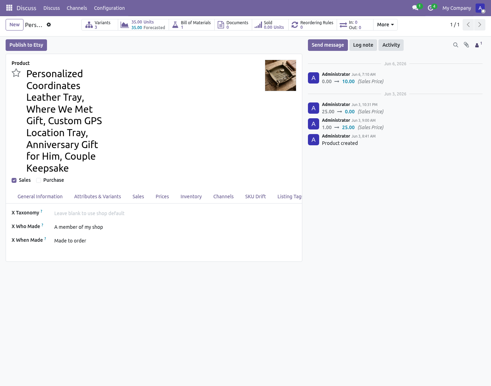

| Ô | Là gì | Điền gì | Nếu để trống |
|---|---|---|---|
| **Etsy Taxonomy ID** | Danh mục Etsy mặc định của sản phẩm | Để trống để dùng mặc định Shop, hoặc gõ ID danh mục | Dùng mặc định Shop |
| **Who made it** | "Ai làm" mặc định cho sản phẩm | Như ô cùng tên ở Listing | Dùng mặc định Shop |
| **When was it made** | "Làm khi nào" mặc định cho sản phẩm | Như ô cùng tên ở Listing | Dùng mặc định Shop |

#### Thẻ "Listing Options" — cá nhân hoá

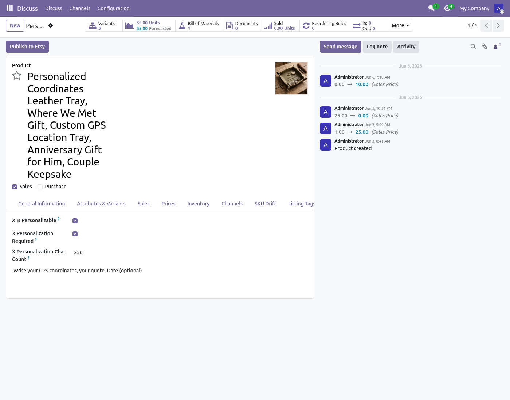

| Ô | Là gì | Ghi chú |
|---|---|---|
| **Is personalizable** | Cho phép khách cá nhân hoá (khắc tên...) | Tích để bật các ô bên dưới |
| **Personalization required** | Bắt buộc khách nhập nội dung cá nhân hoá | Chỉ có nghĩa khi đã bật cá nhân hoá |
| **Personalization char count** | Số ký tự tối đa khách được nhập | Dải hợp lệ 1–1024 (mặc định 256) |
| **Personalization instructions** | Hướng dẫn cho khách (ví dụ "Nhập tên cần khắc") | Văn bản tự do |

> **Lưu ý:** Etsy đã đổi cách nhận thông tin cá nhân hoá (2026). Các ô này hiện được **lưu** trong hệ thống nhưng tạm thời chưa gửi thẳng lên Etsy — chờ phần kết nối endpoint cá nhân hoá riêng. Cứ điền đầy đủ để dữ liệu sẵn sàng.

#### Thẻ "Listing Tags" — từ khoá tìm kiếm

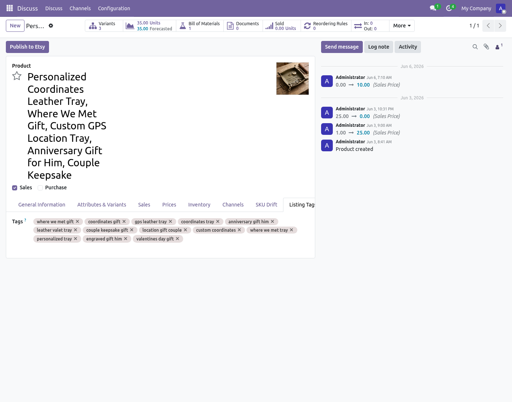

| Ô | Là gì | Quy tắc |
|---|---|---|
| **Listing Tags** | Từ khoá giúp khách tìm thấy sản phẩm trên Etsy | **Tối đa 13 tag**, mỗi tag **≤ 20 ký tự**, chỉ chữ/số/khoảng trắng/gạch nối/dấu nháy |

Ngoài ra thẻ **Extra Images** trên form Sản phẩm chứa bộ ảnh phụ dùng chung (Listing kế thừa bộ này).

---

### A.3 Cài đặt SHOP ETSY — Publisher Defaults (lớp mặc định chung)

Admin cài **một lần** cho mỗi shop. Đây là **lớp 3** — giá trị áp cho mọi listing của shop khi 2 lớp trên trống. Mở: **Etsy → Shops → chọn shop → thẻ Publisher Defaults**.

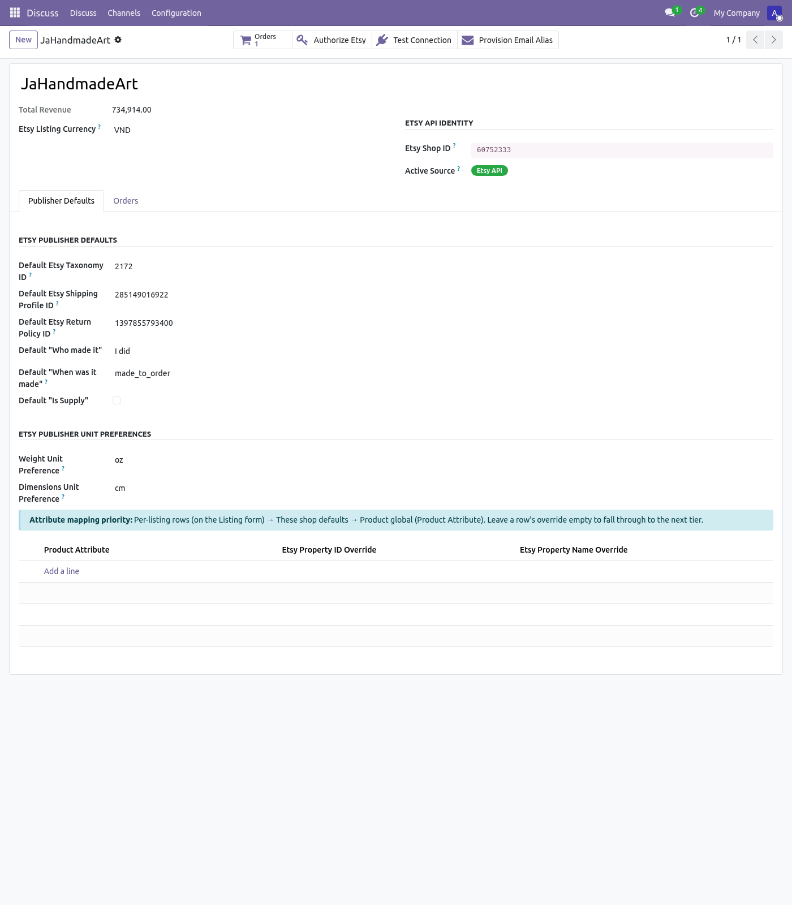

**Định danh shop (đầu form):**

| Ô | Là gì | Ghi chú |
|---|---|---|
| **Etsy Listing Currency** | Tiền tệ niêm yết của shop trên Etsy (ví dụ **VND**) | Hệ thống dùng để quy đổi giá khi đăng. Thiếu ô này → Etsy báo lỗi "giá quá thấp" khi tiền tệ công ty khác tiền tệ shop *(nền tảng của ESTY-195)* |
| **Etsy Shop ID** | Số shop_id do Etsy cấp (ví dụ 60752333) | Phải có trước khi bật nguồn "Etsy API" |
| **Active Source** | Nguồn dữ liệu đang dùng (Etsy API / Email) | Chỉ Admin đổi |

**Nhóm "Etsy Publisher Defaults":**

| Ô | Là gì |
|---|---|
| **Default Etsy Taxonomy ID** | Danh mục Etsy mặc định khi tạo listing nháp |
| **Default Etsy Shipping Profile ID** | Hồ sơ vận chuyển mặc định (thời gian xử lý + phí ship) — *gốc của ESTY-191* |
| **Default Etsy Return Policy ID** | Chính sách đổi trả mặc định |
| **Default Etsy Readiness State ID** | Hồ sơ thời gian xử lý Etsy bắt buộc cho hàng vật lý |
| **Default "Who made it" / "When was it made" / "Is Supply"** | 3 mặc định cho thẻ How It's Made |
| **Weight Unit Preference** | Đơn vị cân nặng gửi Etsy (oz hoặc g) |
| **Dimensions Unit Preference** | Đơn vị kích thước (cm hoặc in) |

**Nhóm "Shop Brand-Voice Defaults" (Marketing sở hữu):**

| Ô | Là gì |
|---|---|
| **Default Listing Title / Description / Image** | Tiêu đề / mô tả / ảnh mặc định theo "giọng thương hiệu" của shop, dùng khi cả Listing lẫn Sản phẩm đều để trống |

**Nhóm "Attribute Mapping Defaults":** bảng ánh xạ thuộc tính mặc định cho toàn shop (lớp giữa của ESTY-192).

---

### A.4 Wizard "Publish to Etsy" — hộp thoại khi bấm đăng

Hiện ra khi bấm **Publish to Etsy** (trên form Listing hoặc form Sản phẩm).

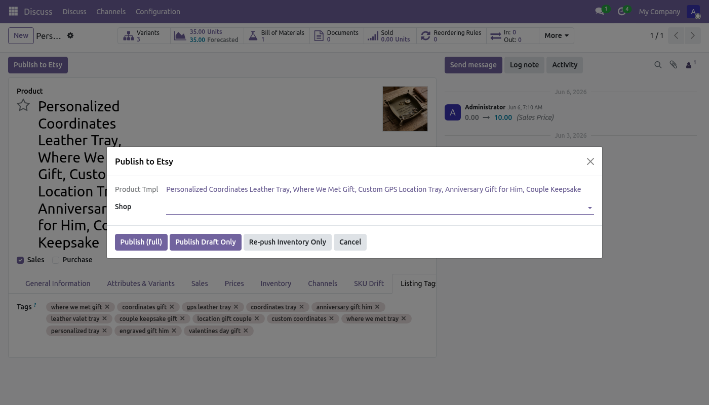

| Thành phần | Là gì |
|---|---|
| **Product Tmpl** | Sản phẩm sẽ đăng (đã điền sẵn) |
| **Shop** | Shop đích (tự điền nếu mở từ Listing) |
| Nút **Publish (full)** | Đăng đầy đủ: tạo listing + đẩy tồn kho/biến thể + xuất bản |
| Nút **Publish Draft Only** | Chỉ tạo bản nháp trên Etsy (chưa public) |
| Nút **Re-push Inventory Only** | Chỉ đẩy lại tồn kho/giá/biến thể cho listing đã có |
| Nút **Cancel** | Đóng, không đăng |

> Chỉ **BA** mới bấm được 3 nút đăng (phân quyền). Người không phải BA mở wizard sẽ bị chặn ở bước bấm đăng.

---

### A.5 Bảng tra cứu nhanh — lớp nào thắng lớp nào

| Thông tin gửi Etsy | Lớp 1 (Listing) | Lớp 2 (Sản phẩm) | Lớp 3 (Shop) |
|---|---|---|---|
| Danh mục (taxonomy) | Etsy Category trên Listing | Etsy Taxonomy ID của SP | Default Etsy Taxonomy ID |
| Hồ sơ vận chuyển (ESTY-191) | Etsy Shipping Profile trên Listing | — | Default Etsy Shipping Profile ID |
| Who made / When made | trên Listing | trên SP | Default tương ứng |
| Is supply | trên Listing | — | Default "Is Supply" |
| Tiêu đề | Title trên Listing | Tên SP | Default Listing Title |
| Mô tả | Description trên Listing | Mô tả bán hàng SP | Default Listing Description |
| Ảnh chính | Ảnh đại diện Listing | Ảnh chính SP | Default Listing Image |
| Tags | — | Listing Tags trên SP | — |
| Ánh xạ thuộc tính (ESTY-192) | dòng trên Listing | toàn cục Product Attribute | Attribute Mapping Defaults của Shop |
| Giá quy đổi tiền tệ (ESTY-195) | tự tính từ giá SP × tỷ giá → theo Etsy Listing Currency của Shop | | |

> **Quy tắc vàng:** điền ở lớp càng cao (Listing) thì càng cụ thể và thắng. Để trống = nhường cho lớp dưới. Không có gì "bắt buộc phải điền" ở Listing nếu Shop đã cài mặc định đầy đủ.

---

> **Tài liệu liên quan:**
> - Tổng quan nghiệp vụ: [`FLOW_TAO_SAN_PHAM_VN.md`](./FLOW_TAO_SAN_PHAM_VN.md)
> - Walkthrough UAT click-by-click: [`UAT_WALKTHROUGH_TAO_SAN_PHAM_VN.md`](./UAT_WALKTHROUGH_TAO_SAN_PHAM_VN.md)
> - Định dạng Mã SKU chi tiết: [`SKU_GRAMMAR.md`](./SKU_GRAMMAR.md)
> - Báo cáo sẵn sàng đăng Etsy: [`ETSY_PUBLISH_READINESS_ASSESSMENT_VN.md`](./ETSY_PUBLISH_READINESS_ASSESSMENT_VN.md)
> - BRD: `docs/owner/BRD_VN.md` (Epic 7)
