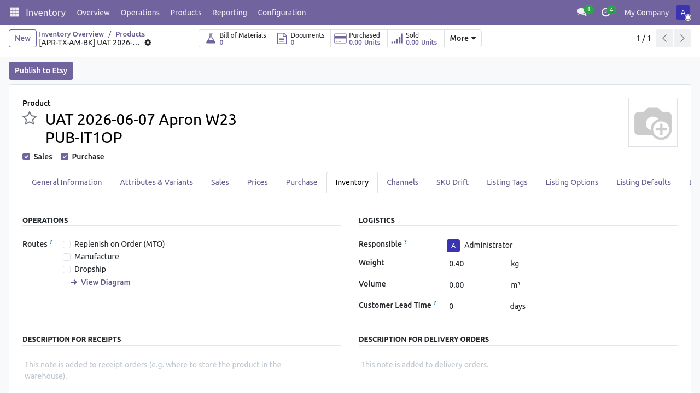
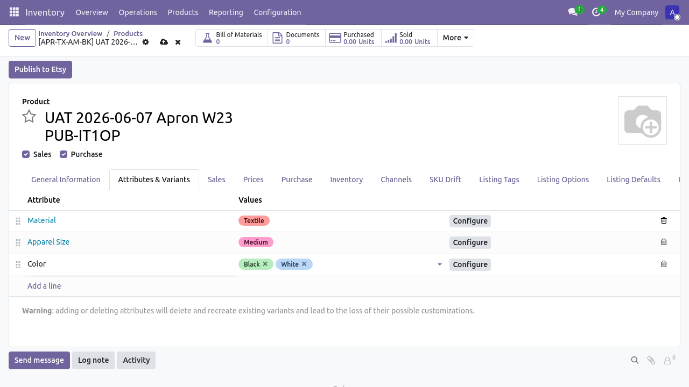
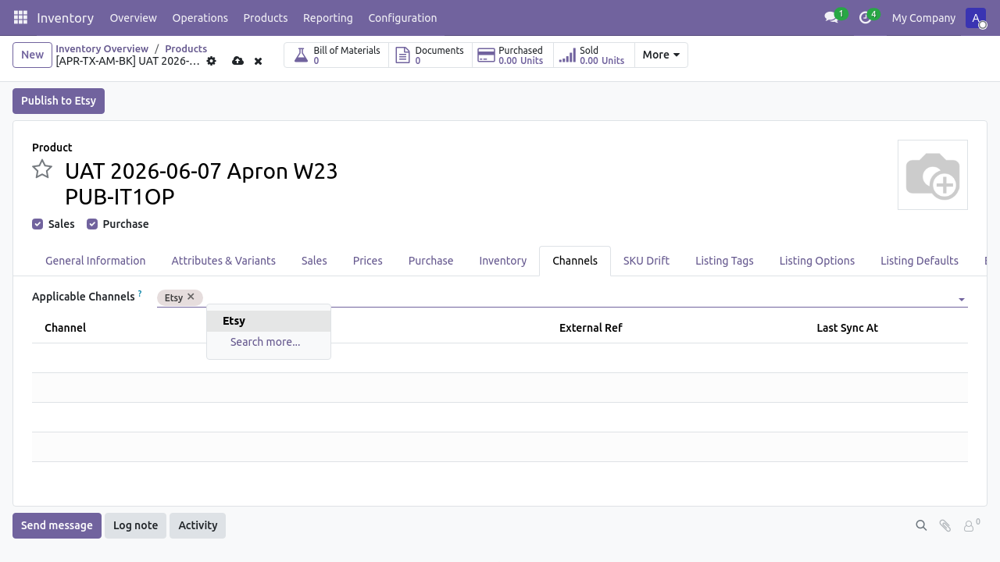
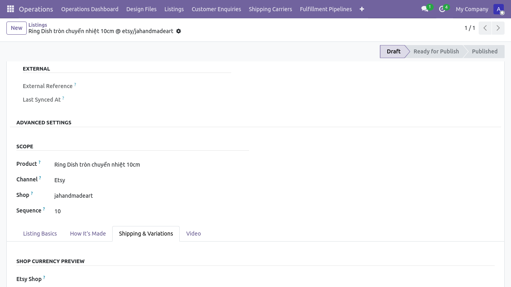
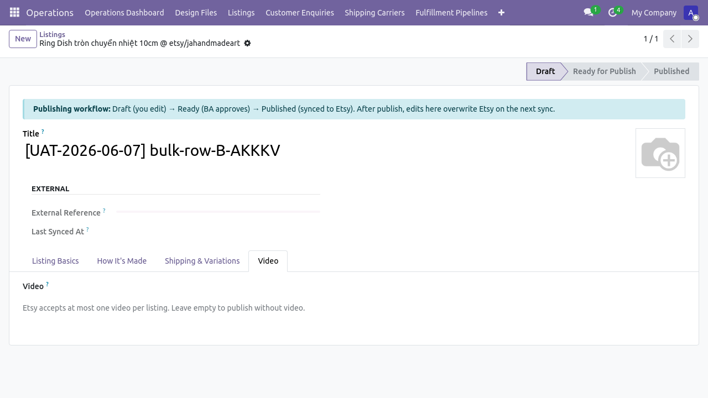
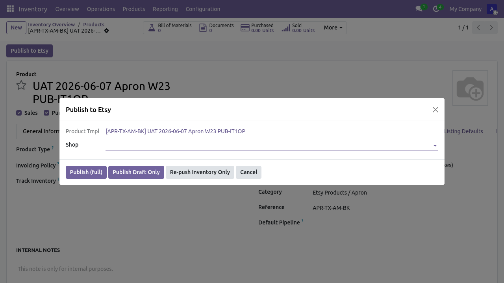
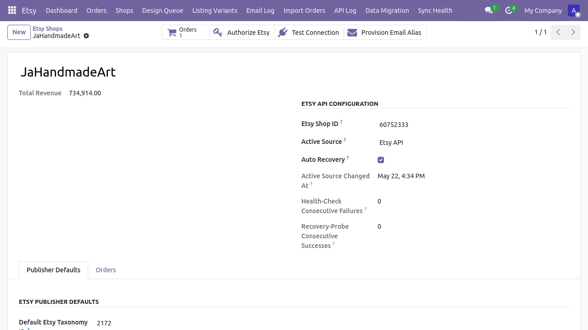

# Flow 1 — Tạo sản phẩm và publish lên Etsy

**Phiên bản:** 1.0 · **Ngày:** 2026-06-07 · **Mã luồng:** flow-1
**Sơ đồ kiến trúc:** [`flow-1-tao-san-pham.html`](./flow-1-tao-san-pham.html)
**Hướng dẫn chi tiết:** [`../HUONG_DAN_TAO_SAN_PHAM_VN.md`](../HUONG_DAN_TAO_SAN_PHAM_VN.md)
**Kịch bản UAT:** [`../UAT_WALKTHROUGH_TAO_SAN_PHAM_VN_v1.2.md`](../UAT_WALKTHROUGH_TAO_SAN_PHAM_VN_v1.2.md)
**Test tự động:** `tests/e2e/tests/uat_wave_2_3_listing.spec.ts`

> Luồng 1 mô tả chuỗi thao tác từ lúc BA Lead tạo sản phẩm mới trong Odoo
> đến lúc draft listing xuất hiện trên Etsy Shop Manager. Bao gồm các tính
> năng Wave-2/3 mới (taxonomy, shipping profile, who/when made, video,
> per-channel overrides, FX conversion).

---

## Sơ đồ tóm tắt (swimlane)

Mở [`flow-1-tao-san-pham.html`](./flow-1-tao-san-pham.html) trong trình
duyệt để xem sơ đồ swimlane đầy đủ.

```
BA Lead          Odoo Standard Form          Etsy API
  │                     │                       │
  │── Tạo sản phẩm ────▶│                       │
  │   + chọn category   │                       │
  │   + thuộc tính       │                       │
  │   + ảnh + giá        │                       │
  │                     │                       │
  │── Publish Draft ───▶│── createListing ─────▶│
  │                     │   + uploadImage(s)    │
  │                     │   + push_video (op)   │
  │                     │◀── listing_id ────────│
  │◀── Listing trên ────│                       │
  │   Etsy (state=draft) │                       │
```

---

## Giai đoạn 1 — Tạo sản phẩm

**Vị trí:** Menu `Inventory > Products > New`
**Vai trò:** BA Lead (`multichannel_hub_core.group_ba_lead` hoặc cao hơn)

Người dùng điền các trường cơ bản:

- **Tên sản phẩm** (`name`)
- **Category** (`categ_id`) — tự động sinh SKU theo grammar
- **Thuộc tính biến thể** (Tab Attributes & Variants):
  Material, Apparel Size, Color, …

> 

> 

**Wave-2 ESTY-192:** Thuộc tính được map sang Etsy property_id qua bảng
`etsy.shop.attribute.mapping` (Tier 2) hoặc `product.attribute.x_etsy_property_id`
(Tier 3). Bảng map xem ở `Etsy > Shops > [shop] > Publisher Defaults`.

---

## Giai đoạn 2 — Cấu hình kênh và giá

**Tab Channels:** thêm Etsy vào `x_channel_applicability_ids`.
**Trường giá:** `list_price` (đơn vị: VND cho JaHandmadeArt).

> 

**Wave-3 ESTY-195:** Sau khi publish, hệ thống tự động convert giá VND
sang đơn vị tiền tệ của shop (`etsy.shop.listing_currency_id`) qua
`res.currency._convert()`. Xem ô preview `display_price_in_shop_currency`
trên form `multichannel.listing`.

<!-- TODO P-UAT-SCREENSHOTS-WAVE-2-3: ảnh chưa thu được. Current Wave-2/3 spec
     chỉ RPC-read multichannel.listing, không mở form. Cần slice riêng
     P-UAT-FLOW-1-LISTING-FORM-TOUR để mở form và chụp tab Shipping & Variations. -->
> 

---

## Giai đoạn 3 — Cấu hình Etsy-specific

**Wave-2 ESTY-189 / 191 / 193:** Các trường sau **không cần điền thủ công**;
hệ thống dùng default từ `etsy.shop`:

| Trường | Nguồn fallback (3-tier) | Field |
|---|---|---|
| Taxonomy | Per-listing → product → **shop default** | `etsy_taxonomy_id` |
| Shipping profile | Per-listing → product → **shop default** | `etsy_shipping_profile_id` |
| Who made / When made / Is supply | Per-listing → product → **shop default** | `etsy_who_made` etc. |

Nếu cần override per-listing (sau publish), mở form `multichannel.listing`,
tab "Shipping & Variations" hoặc "How It's Made".

<!-- TODO P-UAT-SCREENSHOTS-WAVE-2-3: ảnh chưa thu được. Cần slice
     P-UAT-FLOW-1-LISTING-FORM-TOUR mở form multichannel.listing trên tab
     Shipping & Variations để chụp. -->
> 

---

## Giai đoạn 4 — Video (tuỳ chọn)

**Wave-2 ESTY-199:** Mỗi listing Etsy hỗ trợ tối đa 1 video.

**Vị trí:** Form `multichannel.listing` → Tab "Video"
**Field:** `video_attachment_id` (Many2one tới `ir.attachment`)

Tải video lên `ir.attachment` (qua nút Upload trên form), chọn từ dropdown.
Publisher gọi `POST /shops/{id}/listings/{id}/videos` (multipart) khi publish.

<!-- TODO P-UAT-SCREENSHOTS-WAVE-2-3: ảnh chưa thu được. Cần slice
     P-UAT-FLOW-1-LISTING-FORM-TOUR mở form multichannel.listing trên tab Video. -->
> 

---

## Giai đoạn 5 — Publish Draft

**Nút:** Header form sản phẩm → "Publish to Etsy" → wizard hiện ra
→ chọn shop → "Run Publish Draft Only"

> 

**Wave-3 ESTY-190:** Title / Description / Image trên Etsy lấy theo
fallback chain:

1. **Per-listing override** trên `multichannel.listing.title` / `.description` / `.image_1920`
2. **Per-product** trên `product.template.name` / `description_sale`
3. **Shop default** trên `etsy.shop.default_title` / `.default_description` / `.default_image_1920`

Để override mặc định ở cấp shop, mở `Etsy > Shops > [shop] > Publisher
Defaults > Shop Brand-Voice Defaults`.

> 

---

## Giai đoạn 6 — Xác nhận trên Etsy

Sau khi publish thành công:

- `product.channel.status.external_ref` = listing_id của Etsy
- `multichannel.listing.state` = `published`
- Etsy Shop Manager: https://www.etsy.com/your/shops/jahandmadeart/tools/listings/drafts

<!-- TODO P-UAT-SCREENSHOTS-WAVE-2-3: ảnh không tự chụp được từ Playwright
     (Etsy Shop Manager là UI public của Etsy). Owner chụp tay từ
     https://www.etsy.com/your/shops/jahandmadeart/tools/listings/drafts -->
> 

---

## Kiểm thử

Test tự động cho luồng này:

```bash
cd tests/e2e
# Form-only (không gọi Etsy):
npm run test:wave-2-3:cfg          # ESTY-194 shop config sanity
npm run test:wave-2-3:bulk         # ESTY-197 bulk action
# Live publish (tạo draft thật trên JaHandmadeArt):
RUN_ETSY_PUBLISH=1 E2E_LISTING_PRICE=250000 npm run test:wave-2-3:publish
# Dọn draft test sau khi chạy:
python3 ../../scripts/cleanup_uat_etsy_drafts.py --apply
```

UAT walkthrough thủ công: [`../UAT_WALKTHROUGH_TAO_SAN_PHAM_VN_v1.2.md`](../UAT_WALKTHROUGH_TAO_SAN_PHAM_VN_v1.2.md)

---

## Báo lỗi

| Triệu chứng | Hành động |
|---|---|
| Publish 400 "price too low" | Kiểm tra `list_price` ≥ giá tối thiểu của Etsy cho shop (JaHandmadeArt = 250,000 VND) |
| `external_ref` không update | Chờ 20s rồi refresh; nếu vẫn trống, xem log `_logger.warning('publish failed')` |
| Taxonomy / shipping profile trống | Refresh cache: `Etsy Shop > nút "Sync Taxonomy" / "Sync Shipping Profiles"` |
| Brand-voice không áp dụng | Xác nhận field `default_title` etc. đã set; kiểm tra fallback chain ở `services/etsy_listing_publisher.py:420-494` |
