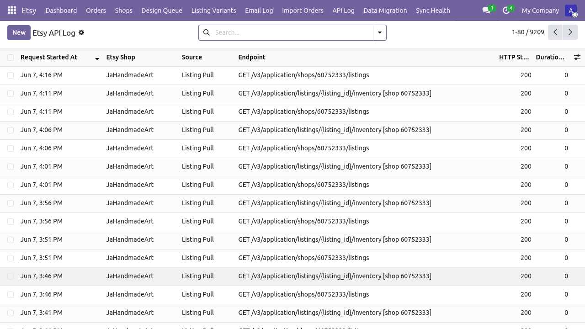
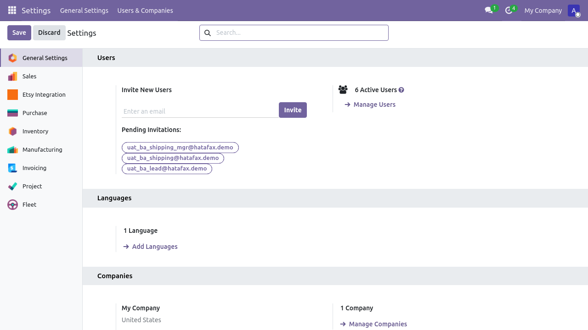
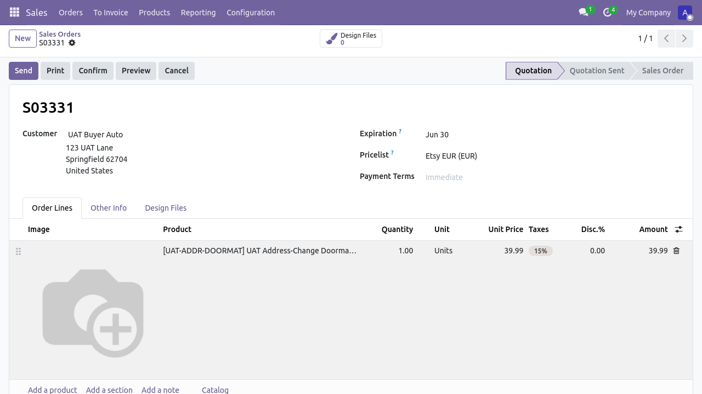

# Flow 2 — Tiếp nhận đơn hàng từ Etsy

**Phiên bản:** 1.0 · **Ngày:** 2026-06-07 · **Mã luồng:** flow-2
**Sơ đồ kiến trúc:** [`flow-2-nhan-don-hang-etsy.html`](./flow-2-nhan-don-hang-etsy.html)
**Hướng dẫn chi tiết:** [`../HUONG_DAN_DON_HANG_ETSY_VN.md`](../HUONG_DAN_DON_HANG_ETSY_VN.md)
**Tài liệu nghiệp vụ:** [`../FLOW_DON_HANG_ETSY_VN.md`](../FLOW_DON_HANG_ETSY_VN.md)
**Test tự động:** `tests/e2e/tests/uat_huong_dan_don_hang_etsy.spec.ts`

> Luồng 2 mô tả 2 đường nhận đơn:
> **(a)** API (mới, mặc định) — Etsy gọi webhook → Odoo tạo `sale.order`
> **(b)** Email (cũ, dự phòng) — Gmail fetch → parser → `sale.order`

---

## Sơ đồ tóm tắt

```
Etsy / Buyer       Odoo etsy_integration       BA User
     │                      │                       │
     │── Order placed ──────▶│                       │
     │   (webhook v3)        │── parse + dedupe     │
     │                      │── create sale.order   │
     │                      │── attach customer     │
     │                      │── attach photos      │
     │                      │                       │
     │                      │── notify ───────────▶│ "Đơn mới"
     │                      │                       │── Mở xem
     │                      │                       │── Confirm
```

---

## Giai đoạn 1 — Đường API (mặc định)

**Trigger:** webhook từ Etsy (POST `/api/v3/...`) hoặc cron poll `GET /shops/{id}/receipts`
**Endpoint controller:** `etsy_integration/controllers/etsy_webhook.py`
**Dedup model:** `etsy.message.dedupe`

> 

> 

---

## Giai đoạn 2 — Đường Email (dự phòng)

**Trigger:** cron poll Gmail 10 phút/lần
**Parser:** `etsy_integration/services/email_parser.py` (regex-only, ORM-free)
**Dedup:** `etsy.email.log.message_id`

> 

---

## Giai đoạn 3 — BA xử lý đơn

Đơn mới xuất hiện trong **Sales > Quotations** với:
- Customer name + Etsy ID
- Listing thumbnail + variant info
- Personalization (nếu có)

> 

BA confirm để chuyển trạng thái sang `sale` (xác nhận); chuyển tiếp sang [Flow 3a hoặc 3b](./flow-3a-giao-hang-in-noi-bo.md) cho khâu giao hàng.

---

## Kiểm thử

```bash
cd tests/e2e
npm run test:don-hang-etsy
```

---

## Báo lỗi

| Triệu chứng | Hành động |
|---|---|
| Webhook không nhận | Kiểm tra `etsy.shop.webhook_url` + Etsy Dev Portal callback URL |
| Đơn duplicate | Xem `etsy.message.dedupe` — `receipt_id` unique constraint |
| Email parser fail | Xem `etsy.email.log.parse_error_msg` |
