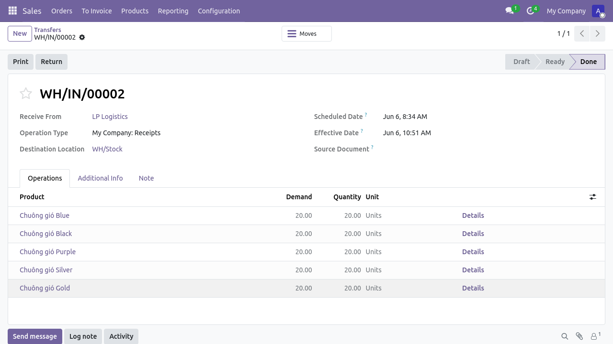
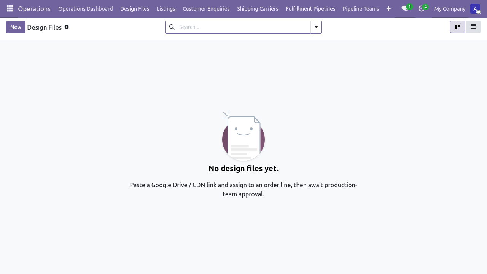
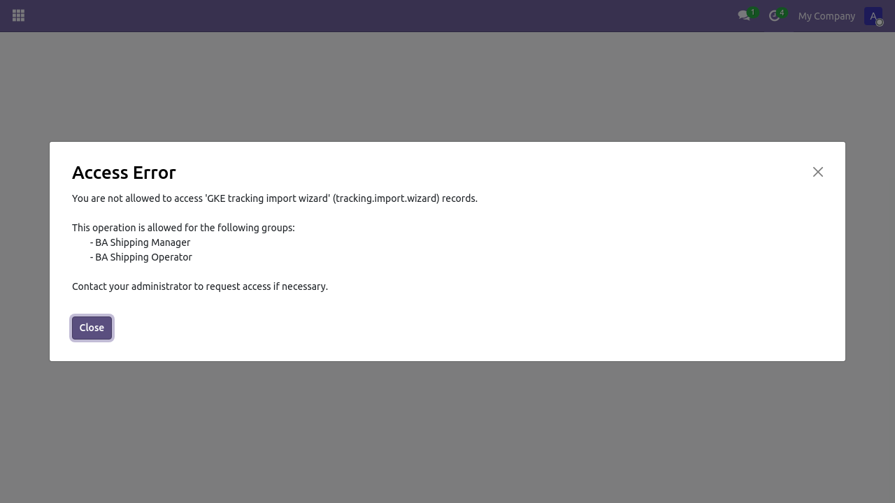

# Flow 3a — Giao hàng (In nội bộ)

**Phiên bản:** 1.0 · **Ngày:** 2026-06-07 · **Mã luồng:** flow-3a
**Sơ đồ kiến trúc:** [`flow-3a-giao-hang-in-noi-bo.html`](./flow-3a-giao-hang-in-noi-bo.html)
**Hướng dẫn chi tiết:** [`../HUONG_DAN_GIAO_HANG_VN.md`](../HUONG_DAN_GIAO_HANG_VN.md)
**Tài liệu nghiệp vụ:** [`../FLOW_GIAO_HANG_VN.md`](../FLOW_GIAO_HANG_VN.md)
**Test tự động:** `tests/e2e/tests/uat_huong_dan_giao_hang.spec.ts`

> **TODO ảnh chụp:** Các `![placeholder: ...]` bên dưới sẽ được thay bằng ảnh
> thật khi luồng có spec UAT riêng (ngoài phạm vi P-UAT-SCREENSHOTS-WAVE-2-3).
> Slice kế tiếp đề xuất: `P-UAT-FLOW-3A-SCREENSHOTS`.

> Luồng 3a — sản phẩm in tại xưởng nội bộ, vận chuyển bằng USPS/UniUni/YunExpress.

---

## Sơ đồ tóm tắt

```
BA Lead         Warehouse              Carrier         Customer
   │                │                      │                │
   │── Confirm ───▶│                      │                │
   │   sale.order  │── Pick + Pack       │                │
   │                │── In sản phẩm        │                │
   │                │── Upload tracking ──▶│                │
   │                │                      │── Ship ───────▶│
   │                │                      │── Update ─────▶│
   │                │                      │    status      │
```

---

## Giai đoạn 1 — Confirm + Pick

**Trigger:** BA confirm sale.order → tự sinh `stock.picking` (kho → khách)
**Vai trò:** BA Shipping

> 

---

## Giai đoạn 2 — In nội bộ + Pack

Sản phẩm in tại xưởng dựa trên SKU + design file (xem `design_file` model).

> 

---

## Giai đoạn 3 — Upload tracking + Push lên Etsy

**Vị trí:** Form sale.order → header → "Upload Tracking" → wizard hiện ra
**Field bắt buộc:** carrier_name + tracking_number

> 

Wizard gọi `EtsyTrackingPusher.push_tracking()` → Etsy
`POST /v3/.../receipts/{receipt_id}/tracking` → trạng thái Etsy chuyển sang "Shipped".

> 

---

## Kiểm thử

```bash
cd tests/e2e
npm run test:giao-hang
```

---

## Báo lỗi

| Triệu chứng | Hành động |
|---|---|
| Tracking push 400 | Kiểm tra `carrier_name` phải khớp Etsy carrier list (USPS, UniUni, etc.) |
| Design file thiếu | Cảnh báo BA — không in được khi `sale.order.line.design_file_id` rỗng |
