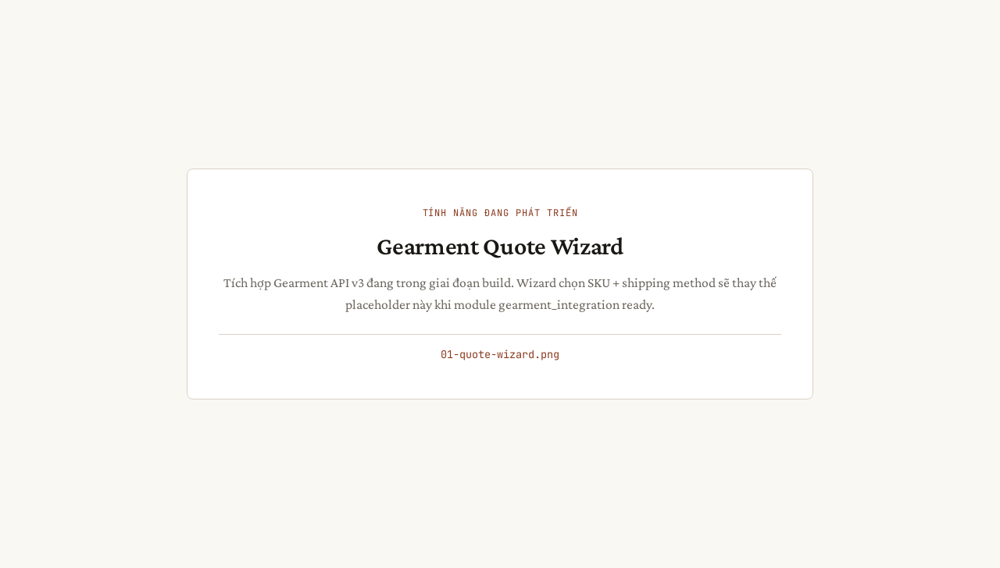
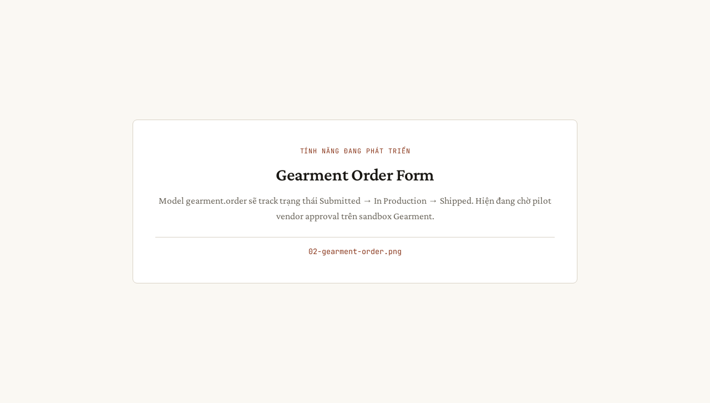
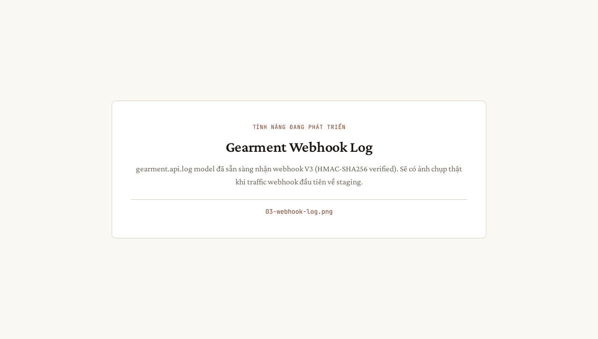

# Flow 3b — Giao hàng (Gearment dropship)

**Phiên bản:** 1.0 · **Ngày:** 2026-06-07 · **Mã luồng:** flow-3b
**Sơ đồ kiến trúc:** [`flow-3b-giao-hang-gearment-dropship.html`](./flow-3b-giao-hang-gearment-dropship.html)
**Hướng dẫn chi tiết:** [`../HUONG_DAN_GIAO_HANG_VN.md`](../HUONG_DAN_GIAO_HANG_VN.md) (mục Gearment)
**API reference:** [`../../GEARMENT_API_REFERENCE.md`](../../GEARMENT_API_REFERENCE.md)

> **TODO ảnh chụp:** Các `![placeholder: ...]` bên dưới sẽ được thay bằng ảnh
> thật khi luồng có spec UAT riêng (ngoài phạm vi P-UAT-SCREENSHOTS-WAVE-2-3).
> Slice kế tiếp đề xuất: `P-UAT-FLOW-3B-SCREENSHOTS`.

> Luồng 3b — sản phẩm in + ship bởi Gearment (đối tác dropship POD).
> Tự động hoá qua Gearment API v3 + webhook.

---

## Sơ đồ tóm tắt

```
BA Lead         Odoo               Gearment            Customer
   │                │                      │                │
   │── Confirm ───▶│                      │                │
   │   sale.order  │── createOrder ──────▶│                │
   │                │                      │── Produce      │
   │                │                      │── Ship ───────▶│
   │                │◀── webhook ──────────│                │
   │                │   (tracking)         │                │
   │                │── push tracking ────▶ Etsy           │
```

---

## Giai đoạn 1 — Confirm + Quote

**Trigger:** BA mở `sale.order` → header → "Get Gearment Quote" → wizard
**Wizard:** `gearment_quote_wizard.ts` (POM)

> 

Wizard gọi `POST /v3/orders/quote` → trả về `quote_id` + giá ship + ETA.

---

## Giai đoạn 2 — Create order qua Gearment API

**Trigger:** sau quote, BA click "Send to Gearment" → tạo `gearment.order`
**Service:** `etsy_integration/services/gearment_client.py`

> 

---

## Giai đoạn 3 — Webhook tracking

**Trigger:** Gearment ship hàng → POST webhook về Odoo
**Endpoint:** `etsy_integration/controllers/gearment_webhook.py`
**HMAC verify:** SHA256(secret, path+nonce+timestamp+base64url(body))
**Header:** `X-Connect-Signature`

> 

Khi webhook nhận tracking, Odoo tự động push lên Etsy (giống Flow 3a giai đoạn 3).

---

## Kiểm thử

```bash
cd tests/e2e
npm run test:giao-hang
# Webhook simulation:
python3 fixtures/gearment_webhook_post.py
```

---

## Báo lỗi

| Triệu chứng | Hành động |
|---|---|
| Quote 400 "missing SKU" | Kiểm tra `gearment_sku` trên product.template (auto-derive từ category) |
| Webhook 401 invalid signature | Re-check `GEARMENT_API_SECRET` trong .env match Gearment dashboard |
| Tracking không push tiếp lên Etsy | Xem `etsy.tracking.audit_log.error_msg` |
