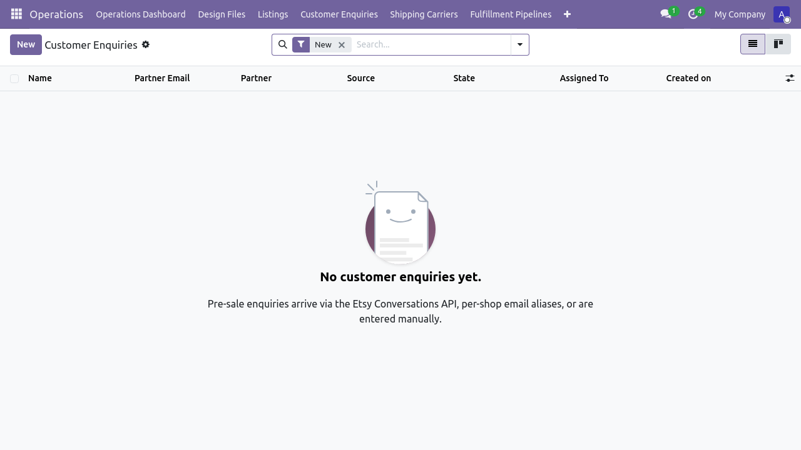
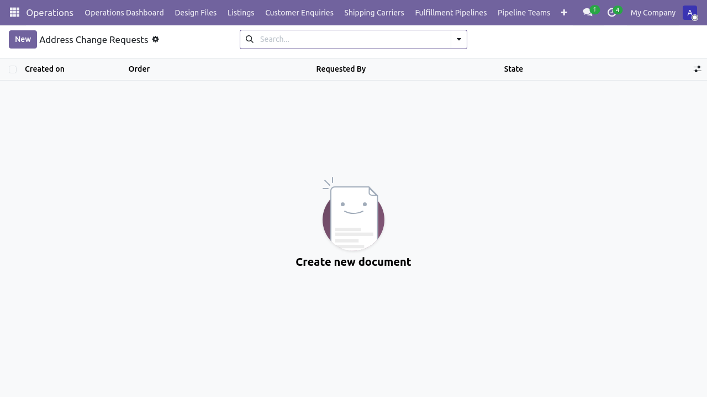
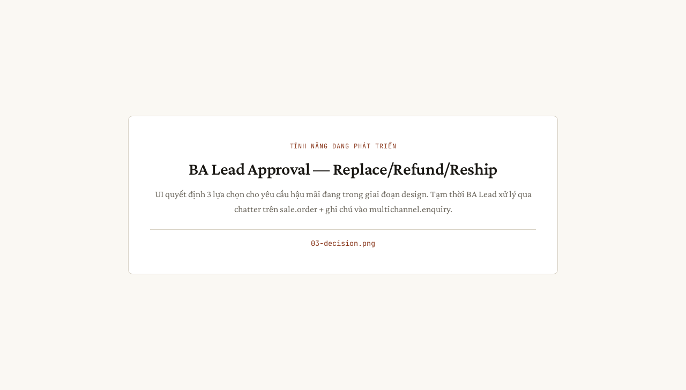

# Flow 4 — Hậu mãi (đổi, trả, refund)

**Phiên bản:** 1.0 · **Ngày:** 2026-06-07 · **Mã luồng:** flow-4
**Sơ đồ kiến trúc:** [`flow-4-hau-mai.html`](./flow-4-hau-mai.html)
**Hướng dẫn chi tiết:** [`../HUONG_DAN_HAU_MAI_VN.md`](../HUONG_DAN_HAU_MAI_VN.md)
**Tài liệu nghiệp vụ:** [`../FLOW_HAU_MAI_VN.md`](../FLOW_HAU_MAI_VN.md)
**Test tự động:** `tests/e2e/tests/uat_huong_dan_hau_mai.spec.ts` (TBD)

> Luồng 4 — xử lý các yêu cầu sau bán: đổi hàng, trả hàng, refund, change-of-address.

---

## Sơ đồ tóm tắt

```
Buyer           Etsy                 Odoo                  Operator
   │                │                      │                      │
   │── Message ───▶│                      │                      │
   │   "broken"    │── Conversation ─────▶│                      │
   │                │                      │── address.change ───▶│
   │                │                      │   .request           │
   │                │                      │                      │── Decide
   │                │                      │                      │   (replace/refund)
   │                │                      │── Refund ────────────│
   │                │◀── Refund ───────────│                      │
   │◀── Refund ────│                      │                      │
```

---

## Giai đoạn 1 — Yêu cầu từ buyer

**Trigger:** Etsy buyer message hoặc Etsy form "Return/Refund"
**Ingest:** `etsy.conversation.message` (qua `conversations_r` scope — đang chờ approval)

> 

---

## Giai đoạn 2 — Address change request (riêng)

**Vị trí:** Form sale.order → header → "Address Change Request"
**Model:** `etsy.address.change.request`
**POM:** `tests/e2e/page-objects/address_change_request_form.ts`

> 

---

## Giai đoạn 3 — Quyết định (Replace / Refund / Reship)

**Vai trò:** BA Lead duyệt
**Action:** server action chuyển trạng thái `pending` → `approved` / `rejected`

> 

---

## Giai đoạn 4 — Thực thi refund

**Nếu Refund:**
1. Tạo `account.move` (Credit Note) link với sale.order
2. Gọi `POST /v3/.../receipts/{id}/transactions/{id}/refunds` lên Etsy
3. Trạng thái Etsy chuyển sang "Refunded"

> 

---

## Kiểm thử

```bash
cd tests/e2e
# Spec đang phát triển:
npm run test:hau-mai
```

---

## Báo lỗi

| Triệu chứng | Hành động |
|---|---|
| Conversation không vào Odoo | `conversations_r` scope chưa được Etsy approve (xem P1-MSG-SCOPE slice) |
| Refund 400 "amount exceeds" | Kiểm tra `refund_amount` ≤ tổng `transaction_amount` |
| Address change không sync lên Etsy | Address mutation API chưa hỗ trợ — operator phải sửa thủ công trên Shop Manager |
