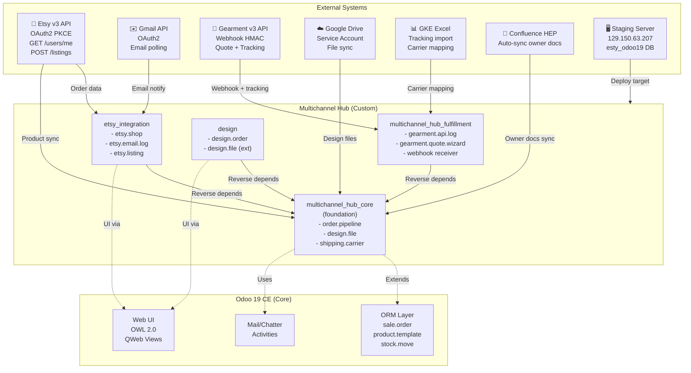
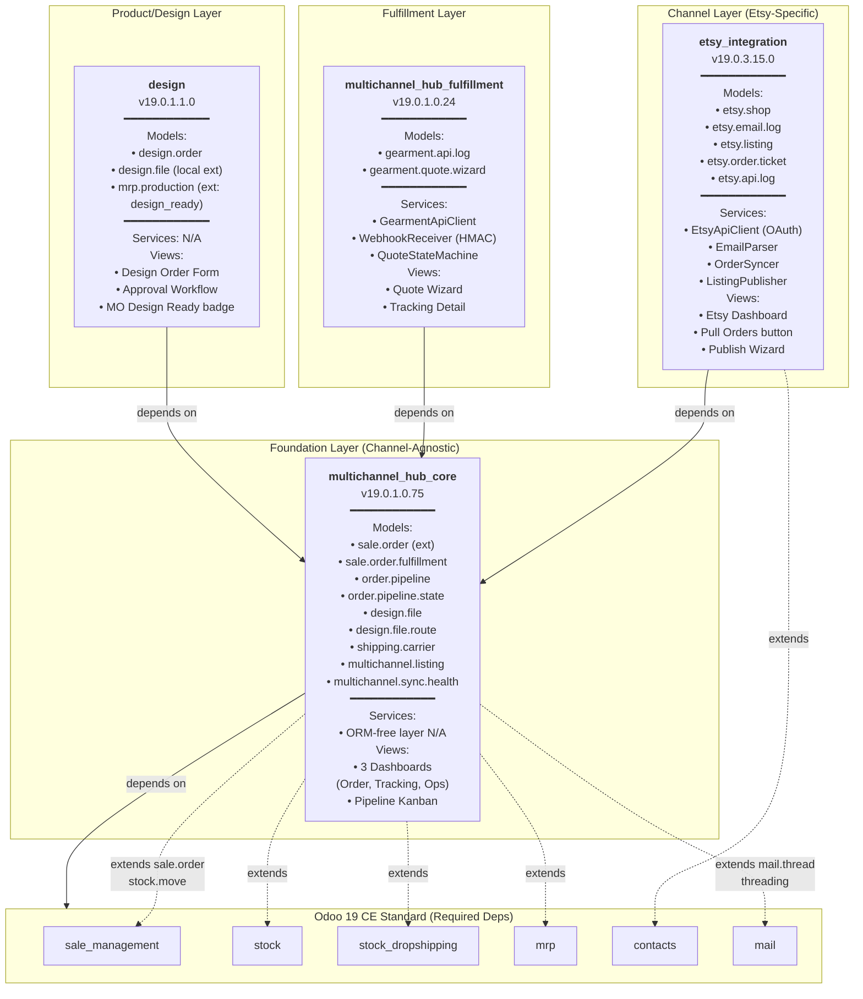
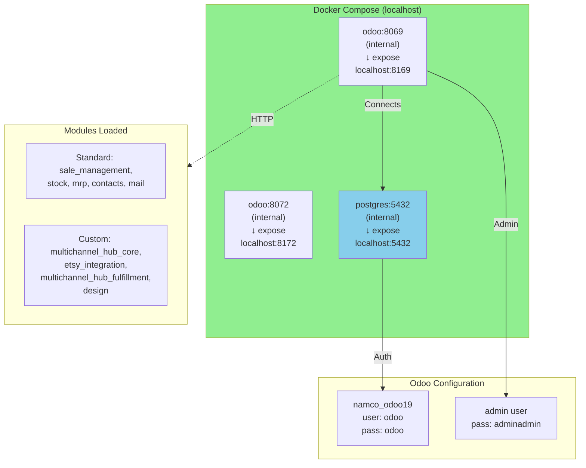
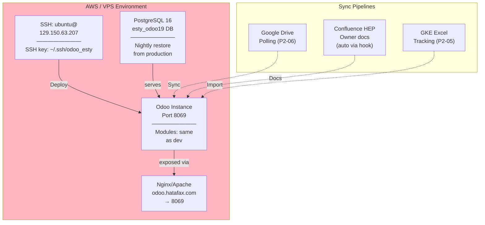

# Part 1: System Architecture

**Title**: odoo19_esty System Context, Module Topology, and Deployment  
**Date**: 2026-07-03  
**Status**: Draft-for-owner-review  
**Version**: 1.0  
**Source of Truth**: Master Plan 006 tracking, .claude/plans/, custom_addons/ manifest files, deployment/ docker-compose  

---

## (a) System Context Diagram

The system orchestrates order ingest from Etsy, product design workflows, fulfillment coordination across Gearment (POD dropship) and internal VN production, and product catalog management (Phase 3).



**External Dependencies** (marked by status):
- **Etsy v3 API** — ✅ Approved OAuth scopes (E1): `transactions_r/w`, `listings_r/w`, `shops_r`, `email_r`
- **Gmail API** — ✅ Legacy email fallback (Phase 2 cutover pending P2-07)
- **Gearment v3 API** — 🟨 Sandbox keys obtained; production credentials pending
- **Google Drive** — ✅ Service account JSON in `secrets/`
- **GKE Excel** — ✅ Nightly import via xlsx wizard (P2-05)
- **Confluence HEP** — ✅ Auto-synced via `.githooks/post-commit`
- **Staging Server** — ✅ Live (129.150.63.207, nightly DB restore)

---

## (b) Module Topology Diagram

Four custom modules arranged in layers: foundation (multichannel_hub_core) → channel-specific (etsy_integration, design) + fulfillment (multichannel_hub_fulfillment) → consumers.



**Dependency Flow** (one-directional, acyclic):
- multichannel_hub_core → Standard Odoo modules (foundation depends on stdlib)
- etsy_integration → multichannel_hub_core (channel-specific depends on foundation)
- multichannel_hub_fulfillment → multichannel_hub_core (fulfillment depends on foundation)
- design → multichannel_hub_core (product/order design depends on foundation)

**Why this structure?** (ADR-003)
- Isolate channel-agnostic models (pipeline, fulfillment, carrier) in _core
- Keep Etsy-specific logic (API, email parsing, OAuth) in etsy_integration
- Reserve future channels (amazon_integration, website_channel) to inherit from _core + MHF
- Design module optional; can be disabled if order design workflows not needed

---

## (c) Per-Module Responsibility Matrix

| Module | Ownership | Key Responsibility | Critical Models | Test Coverage | Status |
|--------|-----------|-------------------|-----------------|---|--------|
| **multichannel_hub_core** | Architect + BA | Order pipeline routing, design file management, unified dashboards, product catalog hub (Phase 3) | `sale.order.fulfillment`, `order.pipeline*`, `design.file`, `shipping.carrier`, `multichannel.listing`, `multichannel.sync.health` | 80%+ (Phase 1 complete) | ✅ Phase 1 live |
| **etsy_integration** | Etsy specialist + integrator | Etsy shop OAuth, email ingest (legacy), listing fetch, order creation, publish flow (Phase 3) | `etsy.shop`, `etsy.email.log`, `etsy.listing`, `etsy.api.log` | 80%+ (Phase 0/1 regression green) | ✅ P1 cutover ready |
| **multichannel_hub_fulfillment** | Fulfillment + Gearment specialist | Gearment API wrapper, webhook receiver, quote state machine, tracking sync | `gearment.api.log`, `gearment.quote.wizard`, webhook models (transient) | 80%+ (P4-01 complete) | ✅ P4-01 E2E pass |
| **design** | Product/production team | Design order document, approval workflow, file attachment, production routing, MO Design-Ready badge | `design.order`, `design.file` (extends _core), `mrp.production` (ext) | 80%+ (P0 spec, ESTY-244 + ESTY-249) | ✅ ESTY-244 + ESTY-249 live |

---

## (d) Layering Conventions: ORM-Free Service Layer

**Pattern**: Business logic lives in _core as ORM-free service classes; models in multichannel_hub_core provide ORM glue.

### Service Layer Structure

```
custom_addons/
├── multichannel_hub_core/
│   ├── models/              # ORM models (sale_order.py, design_file.py, order_pipeline.py)
│   └── services/            # ORM-free business logic (order_pipeline_service.py, design_file_service.py)
├── etsy_integration/
│   ├── models/              # etsy.shop, etsy.email.log, etsy.listing
│   └── services/            # EtsyApiClient, EmailParser, OrderSyncer (ORM-free)
└── multichannel_hub_fulfillment/
    ├── models/              # gearment.api.log, gearment.quote.wizard
    └── services/            # GearmentApiClient, WebhookReceiver, QuoteStateMachine (ORM-free)
```

### Rationale

1. **Testability**: Service methods can be unit-tested without Odoo ORM; no TransactionCase needed for parsing/crypto/API logic
2. **Reusability**: Services callable from wizards, crons, webhooks, browser-side JS (if APIs exposed)
3. **Encapsulation**: Models call services; services never call back to models (except constructor injection)
4. **Clarity**: ORM side effects (create, write, unlink) happen in model methods; logic-only methods in services

### Example: OrderSyncer

```python
# services/order_syncer.py (ORM-free)
class OrderSyncer:
    def __init__(self, partner_repo, order_repo, dedup_service):
        self.partner_repo = partner_repo
        self.order_repo = order_repo
        self.dedup_service = dedup_service

    def sync_order(self, etsy_receipt_dict) -> dict:
        """Returns {order_dict, partner_dict, conflicts} — NO ORM calls."""
        partner = self.dedup_service.resolve_or_new(etsy_receipt_dict)
        order = self._build_order_dict(etsy_receipt_dict, partner)
        return {'order': order, 'partner': partner, 'conflicts': []}

# models/order_syncer_adapter.py (ORM model wrapper)
class OrderSyncerAdapter(models.TransientModel):
    _name = 'order.syncer.adapter'
    
    def sync_etsy_receipt(self, etsy_receipt_dict):
        """ORM wrapper calling ORM-free service."""
        service = OrderSyncer(
            partner_repo=PartnerRepository(self.env),
            order_repo=OrderRepository(self.env),
            dedup_service=PartnerDeduplicationService()
        )
        result = service.sync_order(etsy_receipt_dict)
        # ORM-side: create/write/link
        partner = self.env['res.partner'].create(result['partner'])
        order = self.env['sale.order'].create({**result['order'], 'partner_id': partner.id})
        return order
```

**Applies to**:
- Etsy API client (API calls, data mapping)
- Email parser (regex parsing, deduplication)
- Gearment webhook receiver (HMAC validation, state machine)
- Catalog import (Excel parsing, SKU derivation)

---

## (e) Deployment View

### Development Environment (Docker)



**Quick Start**:
```bash
cd /home/odoo/odoo_dev/other_projects/odoo19_esty
docker compose build
docker compose up -d
# Wait 10-15s for Odoo startup
curl http://localhost:8169
```

**Key Ports**:
- **8169** — HTTP web interface (Odoo)
- **8172** — WebSocket (real-time dashboards)
- **5432** — PostgreSQL (direct client connections, testing)

**Environment**: See `odoo.conf` for settings (db_name, db_user, addons_path, etc.)

### Staging Environment (VPS)



**Deployment Process** (per `.claude/plans/006-implementation-playbook.md` Phase 5):
1. **Push to feature branch**: `feature/006-master-plan-coding`
2. **Local test**: Docker green (all tests pass, ruff clean)
3. **SSH to staging**: `ssh ubuntu@129.150.63.207`
4. **rsync modules**: `rsync -av --exclude=__pycache__ custom_addons/ ubuntu@129.150.63.207:/opt/odoo/custom_addons/` (per-module, never `--delete`)
5. **Upgrade module**: `docker exec namco_odoo19 odoo -d esty_odoo19 -u multichannel_hub_core --stop-after-init` (or per-module)
6. **Verify**: Browser test at `odoo.hatafax.com`, run E2E script `scripts/e2e_demo_drop_ship_ordertest2.py`
7. **Merge to main** (after E2E green and owner sign-off)

**Database**: 
- Dev: `namco_odoo19` (docker-local, ephemeral if `docker compose down -v`)
- Staging: `esty_odoo19` (VPS, nightly restore from prod snapshot 2026-07-03)

**Secrets** (never in git):
- `.env` file on staging (GEARMENT_API_KEY, GEARMENT_WEBHOOK_HMAC_SECRET, ETSY_OAUTH_CLIENT_*) — mount via Docker secret or chown root:101
- `secrets/` directory (Google Drive service account JSON) — git-ignored

**Logs**:
- Dev: `docker logs -f namco_odoo19`
- Staging: SSH to VPS, `tail -f /var/log/odoo/namco_odoo19.log` (or docker logs if containerized)

### Deployment Directory Structure

```
deployment/
├── docker-compose.yml        # Dev orchestration (3 services: odoo, postgres, redis if async)
├── Dockerfile                # Odoo container layer (built on odoo19-ce-base)
├── Dockerfile.base           # Base image (Odoo 19 CE + system deps)
├── odoo.conf                 # Odoo server config (db_name, addons_path, log_level)
├── entrypoint.sh             # Container init script (db init, module install)
├── requirements.txt          # Python deps (openpyxl, requests, etc. — bundled in Odoo)
└── secrets/
    ├── .env.example          # Template (never commit actual .env)
    └── gearment_webhook_secret  # HMAC secret (git-ignored)
```

---

## (f) Key Architectural Decision Records (ADR Digest)

Detailed ADRs live in `specs/006-master-plan/adrs/`. Quick reference table below.

| ID | Title | Decision One-Liner | Consequences | Status |
|----|-------|------|---|---|
| **ADR-001** | Odoo 19 CE Base | Use Odoo 19 CE (no Enterprise modules) | All code must run on CE; no mrp_workorder Enterprise dep; use standard Dropship/MTO | ✅ Decided 2026-04-01 |
| **ADR-003** | Four-Module Decomposition | Split etsy_integration → multichannel_hub_core + etsy_integration + multichannel_hub_fulfillment + design | Channel-agnostic _core allows future amazon_channel, website_channel without code duplication; clear deps (one-way) | ✅ Decided 2026-04-15 |
| **ADR-004** | No Enterprise Modules | No `enterprise_*`, no features gated to Enterprise tier | Rely on Dropship/MTO/quality/web_studio from CE; no timeline-gating on Enterprise features | ✅ Decided 2026-04-15 |
| **ADR-005** | Unified Carrier Model | Single `shipping.carrier` master; per-channel carriers inherit/extend | No redundant carrier seed per channel; tracking unified in sale.order.fulfillment | ✅ Decided 2026-05-02 |
| **ADR-006** | GDrive Primary | Design files + mockups + product images primary → GDrive API; ir.attachment (filestore) ≤2MB fallback | Large filestore writes (>2MB) routed to GDrive; images ≤2MB cached locally for speed | ✅ Decided 2026-05-06 |
| **ADR-007** | Fulfillment Delegation | `sale.order.fulfillment` (reverse-delegated Many2one from sale.order) unifies tracking/label/production state | Single dashboard source; label_status (Selection → Many2one); tracking_number indexed; bus.bus live updates | ✅ Decided 2026-05-07 |
| **ADR-010** | Hybrid Dropship+MTO | Product category field switches pipeline between Gearment dropship and Internal MTO | Shared order.pipeline; distinct states per route; no per-order toggle (category-driven) | ✅ Decided 2026-05-12 |
| **ADR-014** | Central Product Hub (Phase 3) | Odoo as catalog source of truth; Excel bidirectional sync + Etsy API publish chain | Phase 3 new scope; revises Phase 2 mindset (Etsy→Odoo ingest only) to (Odoo↔Etsy bidirectional) | ✅ Decided 2026-05-23 |
| **ADR-015** | Standard-Odoo-First | Before custom field/model, grep standard Odoo addons; if standard exists and fits, use it (owner approval required for custom) | Reduces custom code; leverages CE features; owner veto = work stalls until approval | ✅ Decided 2026-05-27 |
| **ADR-016** | Shop Brand Voice 3-Tier | Listing title/description/image fallback: (1) etsy.listing override, (2) product.template, (3) etsy.shop brand defaults | Reduces per-listing manual overrides; consistent brand across Etsy shop | ✅ Implemented P-ENH-ESTY-190 |
| **ADR-017** | Listing Currency Display | Per-listing currency widget + nightly exchange-rate cron (OpenExchangeRates API) | Displays Etsy-reported currency independent of Odoo company; audit-friendly | ✅ Implemented P-ENH-ESTY-195 |
| **ADR-018a** | Webhook HMAC v2 (Gearment) | Webhooks signed HMAC-SHA256(secret, url_path+nonce+timestamp+base64url(body)); verify before processing | Prevents replay attacks; header format: `X-Connect-Signature: algo=sha256 sig=<hex>` | ✅ Implemented P4-01 |
| **ADR-018b** | OAuth2 PKCE (Etsy) | Etsy OAuth grant via /users/me + PKCE state code; stateless client refresh; per-user shop scope ACL | No server-side session store; shop-level ACL enforced at model level (res.users.etsy_shop_ids M2M) | ✅ Implemented P1-10/P1-11 |

**Note**: **ADR-018 collision** — both HMAC (Gearment) and OAuth (Etsy) numbered 018. Both documented here; Specs/015 consolidation to rename one variant (e.g., ADR-018-gearment-hmac, ADR-018-etsy-oauth).

---

## Summary

The odoo19_esty system is built on Odoo 19 CE with four-module architecture (foundation + channel + fulfillment + design). Order ingest from Etsy flows through email parser (legacy, Phase 2 deprecates) and API polling (OAuth2 PKCE). Fulfillment routes orders to Gearment dropship (state machine + HMAC webhooks) or Internal MTO (standard Dropship route). Phase 3 adds central product hub (Odoo → Etsy publish via API). All deployments (dev docker, staging VPS) share codebase; secrets in env vars or secrets/ (git-ignored). Minimum test coverage 80%; two-phase contract (DB schema + ORM unit). No hardcoded secrets, no Enterprise deps, no debug statements.

**Next**: See [Part 2 (Data Model)](./02-data-model.md) for entity-relationship details and field inventory.

---

*Part 1 authored 2026-07-03. Mermaid diagrams render in most markdown viewers (GitHub, Confluence, Obsidian). For PDF export, render via https://mermaid.live/ and save as PNG/SVG.*
