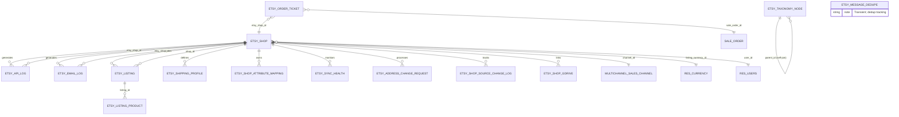
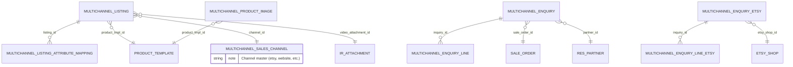
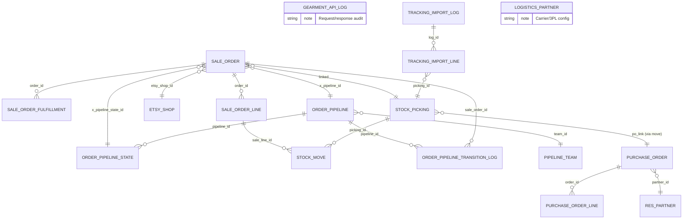

# System Design Specification 02a: Entity-Relationship Data Model (Clusters 1-3)

This document provides ER (Entity-Relationship) diagrams and field inventories for all custom Odoo 19 CE models across the four custom modules. Split into two parts: **02a covers Clusters 1-3** (Etsy channel, Listings, Orders+fulfillment); **02b covers Clusters 4-5** (Design, Catalog), inheritance hierarchy, and state machines.

## 1. Domain Cluster 1: Etsy Channel Integration

The Etsy channel layer manages shop registration, OAuth token storage, email/API ingestion logs, and Etsy-side taxonomies and shipping profiles.

### 1.1 ER Diagram (Mermaid)

### 1.2 Model Reference Table

| Model | _name | Inherits | Purpose |
|-------|-------|----------|---------|
| Etsy Shop | `etsy.shop` | None | Registration + OAuth + API config per shop |
| Etsy API Log | `etsy.api.log` | None | Request/response audit for API ingestion |
| Etsy Email Log | `etsy.email.log` | `mail.thread`, `mail.activity.mixin` | Email ingestion audit trail + chatter |
| Etsy Listing | `etsy.listing` | None | Read-only mirror of published listings on Etsy |
| Etsy Listing Product | `etsy.listing.product` | None | Variant/product link for each listing |
| Etsy Taxonomy Node | `etsy.taxonomy.node` | None | Etsy category tree (self-join hierarchy) |
| Etsy Shipping Profile | `etsy.shipping.profile` | None | Cached Etsy shipping profiles per shop |
| Etsy Shop Attribute Mapping | `etsy.shop.attribute.mapping` | None | Shop-level product.attribute → Etsy property_id overrides |
| Etsy Message Dedupe | `etsy.message.dedupe` | None | Transient; order-message dedup tracking |
| Etsy Sync Health | `etsy.sync.health` | None | Sync status + error log per shop |
| Etsy Address Change Request | `etsy.address.change.request` | `mail.thread`, `mail.activity.mixin` | Customer address override requests |
| Etsy Shop Source Change Log | `etsy.shop.source.change.log` | None | Audit trail of sync_mode / active_source transitions |
| Etsy Shop GDrive Extension | `etsy.shop` (extended) | `etsy.shop` | File upload token + GDrive folder ID per shop |

### 1.3 Key Fields by Model

#### etsy.shop
| Field | Type | Purpose | Notes |
|-------|------|---------|-------|
| **name** | Char | Shop name | Required, unique, indexed |
| **active** | Boolean | Active flag | Default: True |
| **user_id** | Many2one → res.users | Manager | Order visibility scope |
| **etsy_oauth_access_token** | Char | OAuth token | system-group only (P0-14) |
| **etsy_oauth_refresh_token** | Char | Refresh token | system-group only |
| **etsy_oauth_token_expires_at** | Datetime | Token expiry | Tracked during sync |
| **etsy_api_shop_id** | Char | Etsy numeric ID | Required before API use; indexed; system-group only |
| **etsy_last_receipt_sync_at** | Datetime | Sync watermark | Incremental cutoff; system-group only |
| **sync_mode** | Selection | `email_only` / `api_only` | Adapter selector (legacy; superseded by active_source) |
| **active_source** | Selection | `api` / `email` | Current upstream source; required |
| **active_source_changed_at** | Datetime | Last switch time | Auto-stamped on toggle |
| **sync_audit_mode** | Boolean | Read-only sync | Pilot validation mode |
| **auto_recovery** | Boolean | Auto-failover | When false, no recovery probe auto-switch |
| **health_check_consecutive_failures** | Integer | Failover counter | Reset to 0 on success |
| **recovery_probe_consecutive_successes** | Integer | Recovery counter | Reset to 0 on failure |
| **default_taxonomy_id** | Char | Taxonomy default | Etsy category; system-group only |
| **default_shipping_profile_id** | Char | Shipping default | Etsy profile ID (int64 as Char); system-group only |
| **default_return_policy_id** | Char | Return policy default | Etsy policy ID; system-group only |
| **default_readiness_state_id** | Char | Readiness state | Etsy processing-time profile; system-group only |
| **listing_currency_id** | Many2one → res.currency | Currency override | Shop listing currency (e.g., VND) |
| **default_who_made** | Selection | `i_did` / `someone_else` / `collective` | Etsy listing attribute |
| **default_when_made** | Char | Production timing | Etsy enum (e.g., `made_to_order`) |
| **default_is_supply** | Boolean | Supply flag | Etsy listing attribute |
| **default_title** | Char | Listing title | Brand voice tier-1 fallback |
| **default_description** | Text | Listing description | Brand voice tier-2 fallback |
| **default_image_1920** | Image | Hero image | Brand voice tier-3 fallback |
| **weight_unit_pref** | Selection | `oz` / `g` | Unit for item_weight; default: `oz` |
| **dimensions_unit_pref** | Selection | `cm` / `in` | Unit for dimensions; default: `cm` |
| **order_ids** | One2many → sale.order | Orders linked to this shop | Computed |
| **order_count** | Integer | Count of orders | Computed |
| **revenue_total** | Float | Sum of order amounts | Computed |

**Constraints:**
- SQL: `UNIQUE(name)` — Shop name unique across system

#### etsy.api.log
| Field | Type | Purpose | Notes |
|-------|------|---------|-------|
| **etsy_shop_id** | Many2one → etsy.shop | Shop reference | Required; foreign key |
| **method** | Char | HTTP method | GET, POST, PATCH, etc. |
| **endpoint** | Char | API endpoint | `/v3/application/...` path |
| **request_body** | Text | Serialized request | JSON or form-encoded body |
| **response_status** | Integer | HTTP status | 200, 400, 401, 403, 404, 429, 500, etc. |
| **response_body** | Text | Full response | JSON response (capped); error details preserved |
| **duration_ms** | Integer | Latency | Request duration in milliseconds |
| **created_at** | Datetime | Timestamp | Auto-stamped |

#### etsy.email.log
| Field | Type | Purpose | Notes |
|-------|------|---------|-------|
| **etsy_shop_id** | Many2one → etsy.shop | Shop reference | Required; foreign key |
| **email_subject** | Char | Email subject | From Etsy email |
| **email_from** | Char | Sender address | Etsy's mail address |
| **email_body** | Text | Email body | Full raw message |
| **parsed_order_count** | Integer | Orders extracted | Count of SO created/found |
| **parse_status** | Selection | `draft` / `parsing` / `linked` / `error` | Ingest lifecycle |
| **parse_error** | Text | Error details | Failure reason if parse_status=error |
| **received_at** | Datetime | Ingest time | When email arrived |
| **create_date** | Datetime | Log timestamp | Auto-stamped |

**Inherits:** `mail.thread`, `mail.activity.mixin` — supports chatter + activities.

#### etsy.listing
| Field | Type | Purpose | Notes |
|-------|------|---------|-------|
| **etsy_shop_id** | Many2one → etsy.shop | Parent shop | Required |
| **etsy_listing_id** | Char | Etsy's listing ID | Primary key at Etsy; indexed |
| **title** | Char | Listing title | Read-only from Etsy |
| **description** | Text | Listing description | Read-only from Etsy |
| **price** | Float | Current price | Last synced |
| **quantity** | Integer | Quantity available | Inventory |
| **state** | Selection | `active` / `inactive` / `expired` | Etsy state |
| **last_synced_at** | Datetime | Sync timestamp | Read-only |

#### etsy.taxonomy.node
| Field | Type | Purpose | Notes |
|-------|------|---------|-------|
| **etsy_category_id** | Char | Etsy numeric ID | Required; indexed |
| **name** | Char | Category name | e.g., "Clothing" |
| **parent_id** | Many2one → etsy.taxonomy.node | Parent category | Self-join hierarchy; NULL for roots |
| **level** | Integer | Tree depth | Computed |
| **path** | Char | Full path string | e.g., "Clothing > Women's Clothing" |

#### etsy.shipping.profile
| Field | Type | Purpose | Notes |
|-------|------|---------|-------|
| **etsy_shop_id** | Many2one → etsy.shop | Parent shop | Required |
| **etsy_profile_id** | Char | Etsy shipping profile ID | Char (int64 overflow); indexed |
| **name** | Char | Profile name | e.g., "Domestic + Intl" |
| **origin_country_iso** | Char | ISO country code | Shipping origin |
| **last_synced_at** | Datetime | Sync timestamp | Read-only |

---

## 2. Domain Cluster 2: Listings (Multichannel Intent & Attributes)

Listings layer sits between `product.template` (the product master) and channel-specific publishing (e.g., `etsy.listing`). It captures per-channel overrides for marketing copy, images, and metadata.

### 2.1 ER Diagram (Mermaid)

### 2.2 Model Reference Table

| Model | _name | Inherits | Purpose |
|-------|-------|----------|---------|
| Multichannel Listing | `multichannel.listing` | None | Per-channel/per-shop listing intent (marketing overrides) |
| Multichannel Listing Attr. Mapping | `multichannel.listing.attribute.mapping` | None | Per-listing attribute → Etsy property_id override (Wave 2+) |
| Multichannel Enquiry | `multichannel.enquiry` | `mail.thread`, `mail.activity.mixin` | Customer inquiry (presales question) |
| Multichannel Enquiry (Etsy extend) | `multichannel.enquiry` (ext) | `multichannel.enquiry` | Etsy-specific fields (message ID, etc.) |
| Multichannel Product Image | `multichannel.product.image` | None | Hero + gallery images for product |
| Multichannel Sales Channel | `multichannel.sales.channel` | None | Channel master (etsy, website, etc.) |

### 2.3 Key Fields by Model

#### multichannel.listing
| Field | Type | Purpose | Notes |
|-------|------|---------|-------|
| **product_tmpl_id** | Many2one → product.template | Product | Required; cascade delete; indexed |
| **channel_id** | Many2one → multichannel.sales.channel | Sales channel | Required; restrict delete; indexed |
| **shop_ref** | Char | Shop identifier | Etsy: shop slug (e.g., "jahandmadeart"); indexed |
| **sequence** | Integer | Display order | Per-template ordering; default 10 |
| **title** | Char | Marketing override title | Empty → falls back to product.template.name |
| **description** | Text | Marketing override description | Empty → falls back to product.template.description_sale |
| **image_1920** | Image | Hero image override | Empty → falls back to product.template.image_1920 |
| **extra_image_ids** | One2many → multichannel.product.image | Gallery images | Related (shared with product) |
| **video_attachment_id** | Many2one → ir.attachment | Video file | Single video per listing; private attachment only |
| **state** | Selection | `draft` / `ready` / `published` / `error` | Lifecycle |
| **external_ref** | Char | Channel-side ID | Etsy: listing_id; indexed; copy=False |
| **last_synced_at** | Datetime | Last publish time | Read-only |
| **last_sync_error** | Text | Publisher error | Computed from product.channel.status (read-only) |
| **display_name** | Char | Computed display | Format: "ProductName @ channel/shop" |

**Constraints:**
- SQL UNIQUE (raw init()): `UNIQUE(product_tmpl_id, channel_id, COALESCE(shop_ref, ''))` — One listing per (product, channel, shop) combination.

#### multichannel.listing.attribute.mapping
| Field | Type | Purpose | Notes |
|-------|------|---------|-------|
| **listing_id** | Many2one → multichannel.listing | Parent listing | Required |
| **attribute_id** | Many2one → product.attribute | Product attribute | e.g., "Size", "Color" |
| **etsy_property_id** | Char | Etsy property ID | Etsy numeric property; overrides shop default |

#### multichannel.enquiry
| Field | Type | Purpose | Notes |
|-------|------|---------|-------|
| **name** | Char | Reference number | Auto-generated; indexed |
| **partner_id** | Many2one → res.partner | Customer | Required |
| **sale_order_id** | Many2one → sale.order | Related SO | Optional (inquiry may be pre-sale) |
| **subject** | Char | Inquiry topic | e.g., "Shipping question" |
| **body** | Text | Full inquiry text | Message body |
| **state** | Selection | `draft` / `replied` / `closed` | Lifecycle |
| **channel_code** | Char | Channel source | e.g., "etsy" |

**Inherits:** `mail.thread`, `mail.activity.mixin` — supports chatter.

#### multichannel.product.image
| Field | Type | Purpose | Notes |
|-------|------|---------|-------|
| **product_tmpl_id** | Many2one → product.template | Product | Required |
| **image** | Image | Image binary | Hero or gallery image |
| **sequence** | Integer | Order in gallery | Hero first (sequence 0), then gallery |

#### multichannel.sales.channel
| Field | Type | Purpose | Notes |
|-------|------|---------|-------|
| **name** | Char | Channel display name | e.g., "Etsy Shop 1", "Company Website" |
| **code** | Char | Channel identifier | e.g., "etsy", "website"; indexed |
| **active** | Boolean | Active flag | Default: True |

---

## 3. Domain Cluster 3: Orders + Fulfillment (Pipeline, Purchase, Picking, Tracking)

The order-fulfillment layer connects `sale.order` across three inbound pathways (Etsy email, Etsy API, manual), stages them through a configurable pipeline (VN internal, Gearment POD, hybrid MTO), and routes them to warehouse (stock.picking) or suppliers (purchase.order, gearment API).

### 3.1 ER Diagram (Mermaid)

### 3.2 Model Reference Table

| Model | _name | Inherits | Purpose |
|-------|-------|----------|---------|
| Sale Order | `sale.order` (ext) | `sale.order` | Etsy order ingestion + pipeline state |
| Sale Order Fulfillment | `sale.order.fulfillment` (core & ext) | `mail.thread` | Fulfillment orchestration (phiếu gửi hang) |
| Sale Order Line | `sale.order.line` (ext) | `sale.order.line` | Line-level fulfillment details |
| Stock Picking | `stock.picking` (ext) | `stock.picking` | Warehouse picking + ship label generation |
| Stock Move | `stock.move` (ext) | `stock.move` | Line-item inventory move |
| Purchase Order | `purchase.order` (ext) | `purchase.order` | Dropship PO to suppliers (Gearment, internal vendors) |
| Purchase Order Line | (std Odoo) | — | Line-item purchase detail |
| Gearment API Log | `gearment.api.log` | None | Gearment quote/order/tracking API audit |
| Tracking Import Log | `tracking.import.log` | `mail.thread`, `mail.activity.mixin` | Batch tracking-number ingestion |
| Tracking Import Line | `tracking.import.line` | None | Individual tracking number row |
| Order Pipeline | `order.pipeline` | `mail.thread`, `mail.activity.mixin` | Pipeline master (VN Internal, Gearment, Hybrid) |
| Order Pipeline State | `order.pipeline.state` | `mail.thread`, `mail.activity.mixin` | Pipeline stage (e.g., draft, quoted, confirmed, shipped) |
| Order Pipeline Transition Log | `order.pipeline.transition.log` | None | Audit trail of state changes |
| Pipeline Team | `pipeline.team` | `mail.thread`, `mail.activity.mixin` | Team responsible for a pipeline stage |
| Logistics Partner | `logistics.partner` | `mail.thread` | Carrier/3PL configuration (USPS, GKE, etc.) |

### 3.3 Key Fields by Model

#### sale.order (extensions)
| Field | Type | Purpose | Notes |
|-------|------|---------|-------|
| **etsy_shop_id** | Many2one → etsy.shop | Etsy shop source | NULL for non-Etsy orders |
| **etsy_order_id** | Char | Etsy numeric order ID | Etsy's unique ID; indexed |
| **etsy_buyer_user_id** | Char | Etsy buyer ID | Buyer's Etsy account ID |
| **etsy_receipt_id** | Char | Etsy receipt ID | Etsy receipt identifier; indexed |
| **x_pipeline_id** | Many2one → order.pipeline | Pipeline | e.g., "VN Internal", "Gearment POD" |
| **x_pipeline_state_id** | Many2one → order.pipeline.state | Current stage | e.g., "draft", "quoted", "confirmed", "shipped" |
| **x_gearment_outbound_state** | Selection | `draft` / `quoted` / `operator_review` / `confirmed` | Gearment POD-specific state (if pipeline=Gearment) |
| **x_gearment_po_id** | Char | Gearment quote/order ID | External Gearment ID; indexed |
| **x_production_notes** | Text | Internal notes | Production team comments |

#### sale.order.fulfillment
| Field | Type | Purpose | Notes |
|-------|------|---------|-------|
| **name** | Char | Document number | Auto-assigned; "SOF" prefix |
| **order_id** | Many2one → sale.order | Parent SO | Required |
| **fulfillment_type** | Selection | `internal_prod` / `dropship` / `hybrid` | Production route |
| **state** | Selection | Lifecycle states | Computed from stock.picking, purchase.order |
| **picking_ids** | One2many → stock.picking | Warehouse picks | Outbound pickings for this fulfillment |
| **purchase_order_ids** | One2many → purchase.order | Supplier orders | Dropship POs linked to this fulfillment |

**Inherits:** `mail.thread` — chatter enabled.

#### stock.picking (extensions)
| Field | Type | Purpose | Notes |
|-------|------|---------|-------|
| **x_gearment_shipping_label_url** | Char | Label download | URL to Gearment's shipping label PDF |
| **x_logistics_partner_id** | Many2one → logistics.partner | Carrier | USPS, GKE, etc. |
| **x_tracking_number** | Char | Carrier tracking | Auto-imported from tracking.import.log |
| **x_tracking_imported_at** | Datetime | Tracking sync time | When tracking was injected |

#### purchase.order (extensions)
| Field | Type | Purpose | Notes |
|-------|------|---------|-------|
| **x_sale_order_id** | Many2one → sale.order | Linked SO | Dropship context |
| **x_gearment_quote_id** | Char | Gearment quote ID | If vendor is Gearment |
| **x_gearment_order_id** | Char | Gearment order ID | After PO confirmation |
| **x_gearment_quote_state** | Selection | Quote lifecycle | Mirrored from Gearment API |
| **x_requested_delivery_date** | Date | Target delivery | Customer-promised date |

#### order.pipeline
| Field | Type | Purpose | Notes |
|-------|------|---------|-------|
| **name** | Char | Pipeline name | e.g., "VN Internal Production" |
| **code** | Char | Pipeline identifier | e.g., "vn_internal", "gearment_pod"; indexed |
| **active** | Boolean | Active flag | Default: True |
| **team_id** | Many2one → pipeline.team | Responsible team | e.g., "Production Team" |
| **state_ids** | One2many → order.pipeline.state | Stages | Ordered list of workflow stages |
| **transition_log_ids** | One2many → order.pipeline.transition.log | Audit | State change history |

**Inherits:** `mail.thread`, `mail.activity.mixin`.

#### order.pipeline.state
| Field | Type | Purpose | Notes |
|-------|------|---------|-------|
| **name** | Char | Stage name | e.g., "Quote Pending" |
| **code** | Char | Stage code | e.g., "quoted", "confirmed"; indexed |
| **pipeline_id** | Many2one → order.pipeline | Parent pipeline | Required |
| **sequence** | Integer | Stage order | Determines workflow progression |
| **allow_confirm** | Boolean | Confirmable | If true, SO can be confirmed at this stage |
| **auto_create_picking** | Boolean | Auto-picking | If true, transition creates stock.picking |
| **auto_create_invoice** | Boolean | Auto-invoice | If true, transition triggers invoicing |

#### order.pipeline.transition.log
| Field | Type | Purpose | Notes |
|-------|------|---------|-------|
| **sale_order_id** | Many2one → sale.order | Order reference | FK |
| **pipeline_id** | Many2one → order.pipeline | Pipeline context | FK |
| **old_state_id** | Many2one → order.pipeline.state | Previous stage | NULL if first transition |
| **new_state_id** | Many2one → order.pipeline.state | New stage | Required |
| **changed_by_user_id** | Many2one → res.users | Who changed | Auto-stamped |
| **changed_at** | Datetime | Transition time | Auto-stamped |
| **change_type** | Selection | `manual` / `automatic` | User action or system sync |
| **notes** | Text | Reason/details | Optional audit note |

#### gearment.api.log
| Field | Type | Purpose | Notes |
|-------|------|---------|-------|
| **purchase_order_id** | Many2one → purchase.order | Context | Required FK |
| **method** | Char | HTTP method | GET, POST, PATCH |
| **endpoint** | Char | API endpoint | Gearment API path |
| **request_body** | Text | Request | JSON body |
| **response_status** | Integer | HTTP status | 200, 400, 401, 409, 500, etc. |
| **response_body** | Text | Response | JSON response (truncated if large) |
| **duration_ms** | Integer | Latency | Milliseconds |
| **created_at** | Datetime | Timestamp | Auto-stamped |

#### tracking.import.log
| Field | Type | Purpose | Notes |
|-------|------|---------|-------|
| **name** | Char | Import reference | e.g., "GKE Tracking Batch 2026-07-03" |
| **import_source** | Char | Source system | e.g., "gke", "usps", "manual" |
| **import_file** | Binary | Uploaded file | CSV or JSON |
| **import_status** | Selection | `draft` / `processing` / `completed` / `error` | Lifecycle |
| **processed_count** | Integer | Successfully imported | Count of tracking numbers linked |
| **error_count** | Integer | Failed rows | Count of failed imports |
| **import_error** | Text | Error details | First error message |
| **imported_at** | Datetime | Completion time | Auto-stamped |

**Inherits:** `mail.thread`, `mail.activity.mixin`.

#### tracking.import.line
| Field | Type | Purpose | Notes |
|-------|------|---------|-------|
| **log_id** | Many2one → tracking.import.log | Parent import | Required |
| **picking_id** | Many2one → stock.picking | Target picking | Links tracking to warehouse pick |
| **tracking_number** | Char | Carrier tracking | e.g., "1Z999AA10123456784" |
| **carrier_code** | Char | Carrier identifier | e.g., "gke", "usps" |
| **import_status** | Selection | `pending` / `linked` / `error` | Line status |
| **import_error** | Text | Error reason | If link failed |

#### logistics.partner
| Field | Type | Purpose | Notes |
|-------|------|---------|-------|
| **name** | Char | Carrier/3PL name | e.g., "GKE Logistics" |
| **code** | Char | Carrier code | e.g., "gke", "usps"; indexed |
| **active** | Boolean | Active flag | Default: True |
| **api_endpoint** | Char | API URL | For automated tracking/label pulls |
| **api_key** | Char | API credential | system-group only |
| **tracking_number_format** | Char | Regex pattern | Validate incoming tracking numbers |

**Inherits:** `mail.thread`.

#### pipeline.team
| Field | Type | Purpose | Notes |
|-------|------|---------|-------|
| **name** | Char | Team name | e.g., "Production Team" |
| **member_ids** | Many2many → res.users | Team members | Users in this team |
| **pipeline_ids** | One2many → order.pipeline | Pipelines | Pipelines this team operates |

**Inherits:** `mail.thread`, `mail.activity.mixin`.

---

## 4. Summary of Cluster 1-3 Relationships

| Relationship | Source | Target | Multiplicity | Purpose |
|--------------|--------|--------|--------------|---------|
| Shop → Orders | etsy.shop | sale.order | 1:N | Each order ingested from a shop |
| Shop → Listings | etsy.shop | etsy.listing | 1:N | Shop hosts multiple listings |
| Listing → Product | etsy.listing | etsy.listing.product | 1:N | Listing variants |
| Product → Listing Intent | product.template | multichannel.listing | 1:N | Multiple channels per product |
| Order → Fulfillment | sale.order | sale.order.fulfillment | 1:N | May split into multiple fulfillments |
| Fulfillment → Picking | sale.order.fulfillment | stock.picking | 1:N | Warehouse pick per fulfillment line |
| Order → Pipeline | sale.order | order.pipeline | N:1 | Order assigned to one pipeline |
| Pipeline → States | order.pipeline | order.pipeline.state | 1:N | Pipeline defines its workflow |
| Order State Change → Audit | order.pipeline.transition.log | sale.order | N:1 | All transitions logged |
| Picking → Tracking | stock.picking | tracking.import.line | 1:N | Multiple tracking numbers? (1:1 expected) |
| Purchase Order → Gearment Log | purchase.order | gearment.api.log | 1:N | Each API call logged |

---

## Document Metadata

- **Date:** 2026-07-03
- **Status:** Draft for owner review
- **Odoo Version:** 19.0 CE
- **Module Scope:** etsy_integration, multichannel_hub_core, multichannel_hub_fulfillment (partial), design (partial)
- **Related SDS:** 02b-data-model.md (Clusters 4-5, inheritance hierarchy, state machines)
- **Code Verification:** All models, fields, and relationships verified against `/home/odoo/odoo_dev/other_projects/odoo19_esty/custom_addons/` source code on 2026-07-03.

