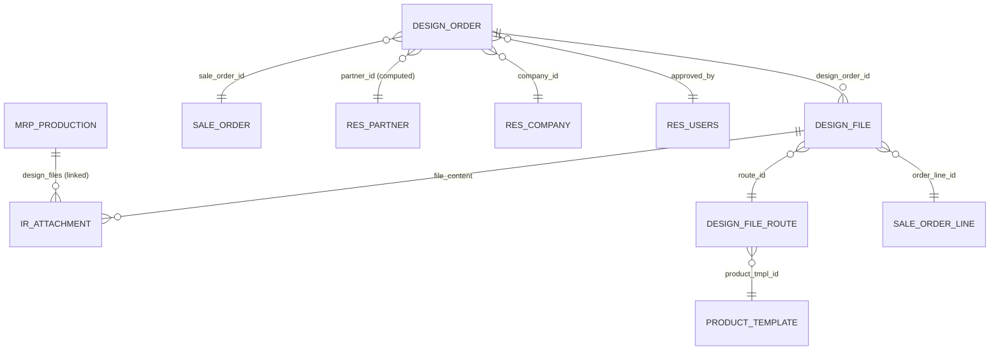
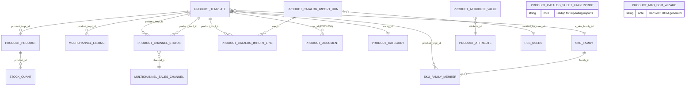
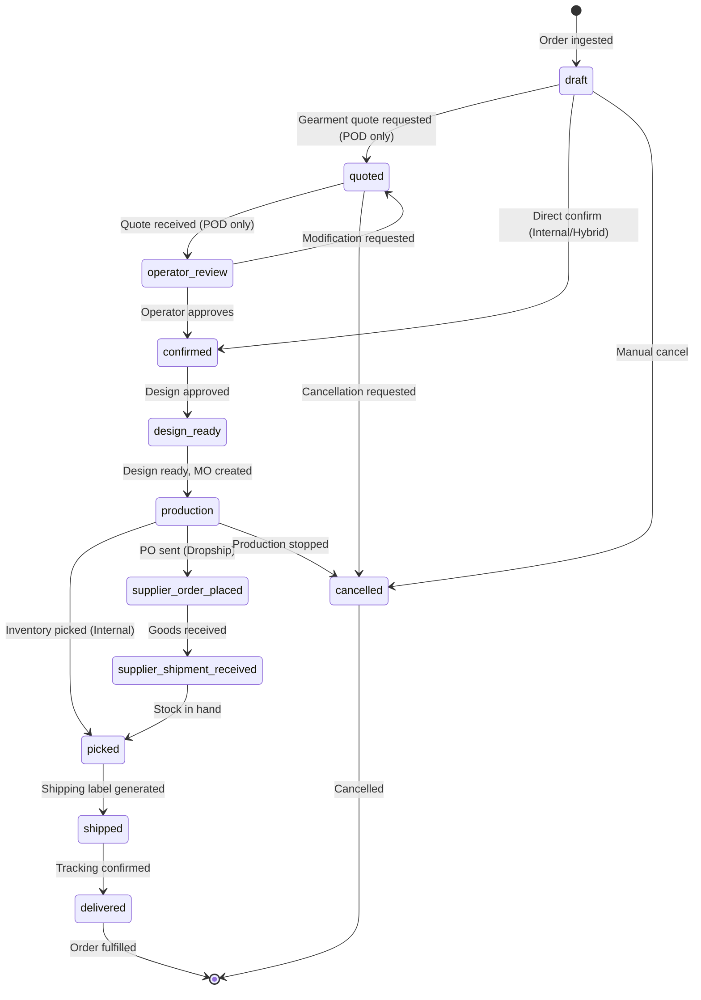
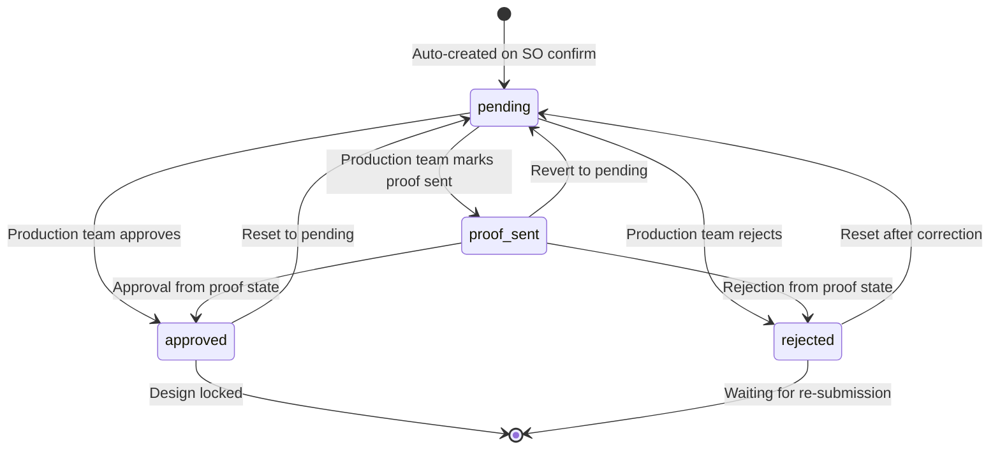
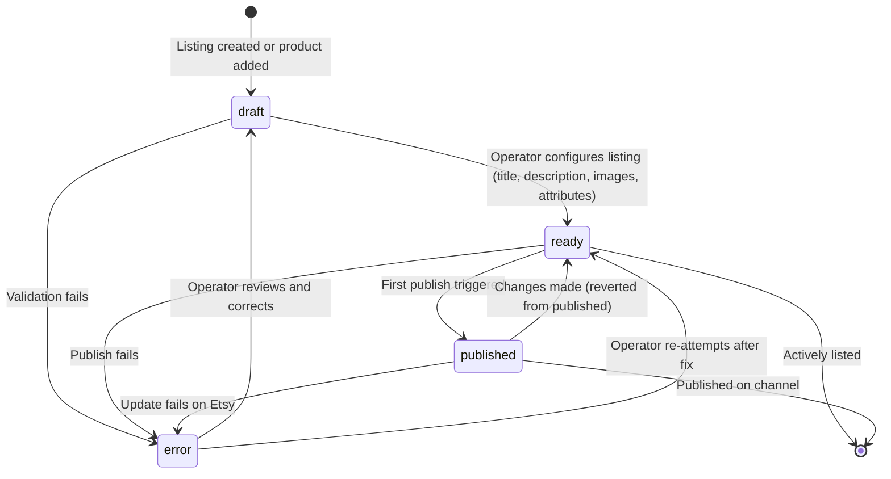
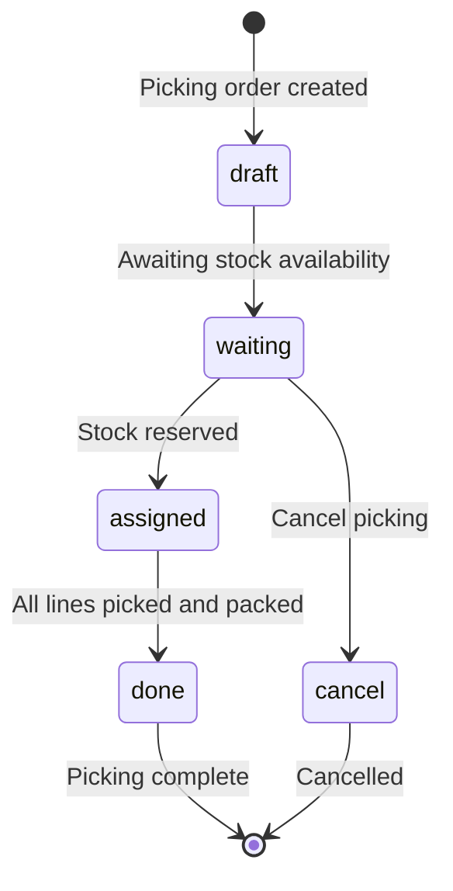
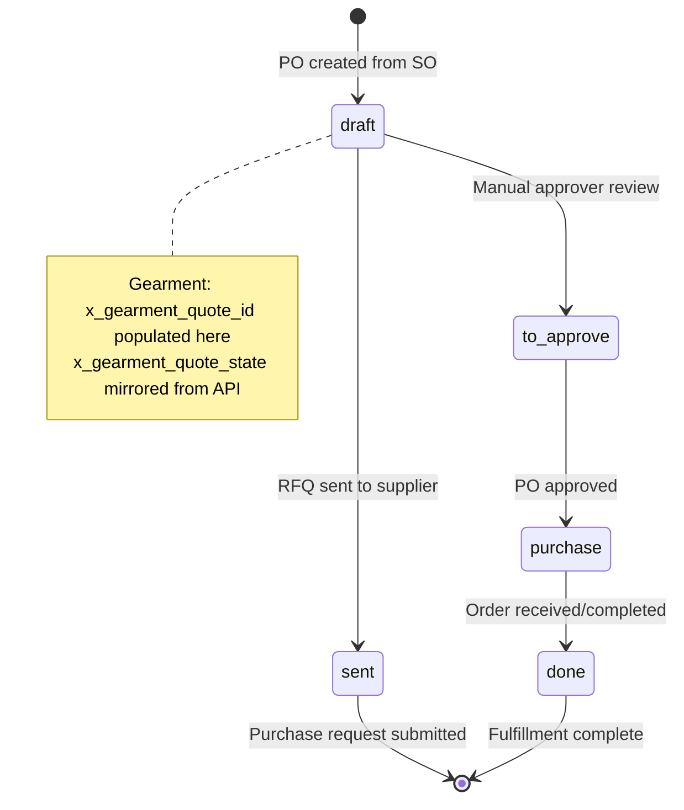
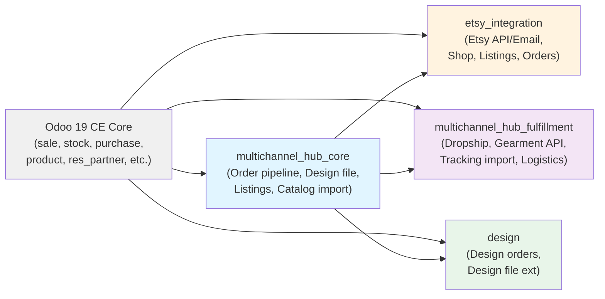

# System Design Specification 02b: Entity-Relationship Data Model (Clusters 4-5, Inheritance, State Machines)

Continuation of **02a**. This document covers the Design cluster, Catalog/Product hub cluster, the full Odoo inheritance hierarchy, and state machines across all models.

---

## 5. Domain Cluster 4: Design Orders & Files (Document Control)

Design orders (`design.order`) are first-class documents parallel to `sale.order` and `mrp.production`. They track the approval flow for customer-submitted artwork, organize design files, and attach approved files to manufacturing orders.

### 5.1 ER Diagram (Mermaid)

### 5.2 Model Reference Table

| Model | _name | Inherits | Purpose |
|-------|-------|----------|---------|
| Design Order | `design.order` | `mail.thread`, `mail.activity.mixin` | Document for design approval flow (phiếu design) |
| Design File (core) | `design.file` | `mail.thread`, `mail.activity.mixin` | Design file (artwork, mockup, proof) |
| Design File (design ext) | `design.file` | `design.file` (_inherit) | Extension with design_order_id link |
| Design File Route | `design.file.route` | `mail.thread`, `mail.activity.mixin` | Route template for design uploads (deprecated/archive) |
| Design File Upload Wizard | `design.file.upload.wizard` | — | Transient; file upload form |
| Sale Order (design ext) | `sale.order` (_inherit) | `sale.order` | Extensions: auto-create design orders |
| MO (design ext) | `mrp.production` (_inherit) | `mrp.production` | ESTY-249: computed `design_ready` + `design_order_id` (informational MO badge) |

### 5.3 Key Fields by Model

#### design.order
| Field | Type | Purpose | Notes |
|-------|------|---------|-------|
| **name** | Char | Document reference | Auto-assigned from sequence; readonly after creation; tracked |
| **sale_order_id** | Many2one → sale.order | Parent SO | Required; cascade delete; indexed; tracked |
| **partner_id** | Many2one → res.partner | Customer | Stored, computed from sale_order_id.partner_id; readonly |
| **company_id** | Many2one → res.company | Company | Required; defaults to current company; indexed |
| **state** | Selection | `pending` / `proof_sent` / `approved` / `rejected` | Readonly after pending; tracked; indexed; default: `pending` |
| **design_file_ids** | One2many → design.file | Child files | All design files linked to this order |
| **design_files_count** | Integer | Total file count | Computed; readonly |
| **approved_files_count** | Integer | Approved file count | Computed; readonly |
| **approved_by** | Many2one → res.users | Approver | Readonly; ondelete=set null |
| **approved_at** | Datetime | Approval timestamp | Readonly; auto-stamped |
| **rejection_reason** | Text | Rejection details | Shown when state=rejected; tracked |
| **create_date** | Datetime | Creation timestamp | Auto-stamped |
| **write_date** | Datetime | Last modification | Auto-stamped |

**Constraints:**
- SQL: `UNIQUE(sale_order_id)` — One design order per SO (enforced via init() raw SQL per project pattern).

#### design.file
| Field | Type | Purpose | Notes |
|-------|------|---------|-------|
| **name** | Char | File name | Display name; required |
| **order_id** | Many2one → sale.order | Header-level link | Design file at SO level (NULL if line-level) |
| **order_line_id** | Many2one → sale.order.line | Line-level link | Design file at line level (NULL if header-level) |
| **design_order_id** | Many2one → design.order | Parent order | Extension field (added by design module) |
| **storage_mode** | Selection | `small` / `url` / `gdrive` | Where the file is stored |
| **file_url** | Char | External URL | If storage_mode=url; clickable link |
| **gdrive_preview_url** | Char | GDrive preview | If storage_mode=gdrive; preview link |
| **design_file** | Binary | File binary | If storage_mode=small; binary data |
| **file_size** | Integer | File size | In bytes; computed |
| **route_id** | Many2one → design.file.route | Route (deprecated) | Legacy field; may be NULL |
| **state** | Selection | `draft` / `proof_sent` / `approved` / `rejected` | File approval state; tracked |
| **created_by_user_id** | Many2one → res.users | Uploader | Who uploaded the file |
| **created_at** | Datetime | Upload time | Auto-stamped |

**Inherits:** `mail.thread`, `mail.activity.mixin` — chatter per file.

#### design.file.route
| Field | Type | Purpose | Notes |
|-------|------|---------|-------|
| **name** | Char | Route name | e.g., "Custom T-Shirt Design" |
| **product_tmpl_id** | Many2one → product.template | Product template | Route scoped to a product |
| **active** | Boolean | Active flag | Default: True |

**Note:** This model is largely deprecated (use direct `design.file` links instead).

---

## 6. Domain Cluster 5: Catalog & Product Hub (SKU, Import, Channel Status)

The catalog layer manages product master data, channel-specific status tracking, bulk imports from spreadsheets, and SKU family groupings.

### 6.1 ER Diagram (Mermaid)

### 6.2 Model Reference Table

| Model | _name | Inherits | Purpose |
|-------|-------|----------|---------|
| Product Template (core+ext) | `product.template` | `product.template` (ext x2) | Product master + channel SKU + import tracking |
| Product Product (core+ext) | `product.product` | `product.product` (_inherit) | Variant + Etsy link |
| Product Attribute Value (core+ext) | `product.attribute.value` | `product.attribute.value` (_inherit) | Variant attribute value + Etsy mapping |
| Product Attribute (ext) | `product.attribute` (_inherit) | `product.attribute` | Attribute definition + Etsy mapping |
| Product Document (ext) | `product.document` (_inherit) | `product.document` | Design files (AI/PSD/PDF) tagged for Original Design tab (ESTY-250) |
| Product Channel Status | `product.channel.status` | None | Per-channel publish status + error log |
| Product Catalog Import Run | `product.catalog.import.run` | None | Batch import execution record |
| Product Catalog Import Line | `product.catalog.import.line` | None | Individual row from XLSX import |
| Product Catalog Sheet Fingerprint | `product.catalog.sheet.fingerprint` | None | Dedup tracking for repeating imports |
| SKU Family | `mhc.sku.family` | None | Grouping of related SKUs |
| Product MTO BOM Wizard | `product.mto.bom.wizard` | — | Transient; BOM generation helper |
| Product Category (ext) | `product.category` (_inherit) | `product.category` | Category + pipeline assignment |

### 6.3 Key Fields by Model

#### product.template (extensions)
| Field | Type | Purpose | Notes |
|-------|------|---------|-------|
| **name** | Char | Product name | Canonical product name |
| **description_sale** | Text | Sales description | Tier-1 fallback for listing description |
| **image_1920** | Image | Hero image | Tier-1 fallback for listing image |
| **x_extra_image_ids** | One2many → multichannel.product.image | Gallery images | Shared across all channels (Wave 2) |
| **x_original_design_ids** | One2many → product.document | Original design files | Design source files (AI/PSD/PDF) filtered via domain `x_is_original_design=True` (ESTY-250); distinct from generic Documents smart button |
| **x_sku_family_id** | Many2one → mhc.sku.family | SKU family | Logical grouping of related variants |
| **categ_id** | Many2one → product.category | Category | Odoo category + pipeline assignment |
| **list_price** | Float | List price (Monetary) | Standard Odoo selling price |
| **standard_price** | Float | Cost price | Standard Odoo cost |
| **weight** | Float | Weight | In kg (Odoo standard) |
| **product_variant_ids** | One2many → product.product | Variants | All variants of this product |
| **product_variant_count** | Integer | Variant count | Computed; readonly |
| **attribute_line_ids** | One2many → product.attribute.line | Variant attributes | Attributes that drive variants |
| **x_etsy_category_id** | Char | Etsy category | Cached Etsy taxonomy node ID (Wave 2) |
| **x_etsy_shipping_profile_id** | Char | Shipping profile | Cached Etsy profile ID (Wave 2) |

#### product.product (extensions)
| Field | Type | Purpose | Notes |
|-------|------|---------|-------|
| **product_tmpl_id** | Many2one → product.template | Template | Parent template |
| **default_code** | Char | SKU | Standard Odoo SKU field |
| **x_etsy_listing_ids** | One2many → etsy.listing.product | Etsy listings | Listings carrying this variant |

#### product.channel.status
| Field | Type | Purpose | Notes |
|-------|------|---------|-------|
| **product_tmpl_id** | Many2one → product.template | Product | Required; indexed |
| **channel_id** | Many2one → multichannel.sales.channel | Channel | Required; indexed |
| **publish_state** | Selection | `draft` / `published` / `error` / `out_of_stock` | Current status |
| **external_ref** | Char | Channel-side ID | e.g., Etsy listing_id |
| **last_sync_at** | Datetime | Last publish time | Read-only |
| **last_sync_error** | Text | Publisher error | Latest error message |
| **is_active** | Boolean | Active on channel | Should it be available? |

**Constraints:**
- SQL UNIQUE: `UNIQUE(product_tmpl_id, channel_id)` — One status per (product, channel).

#### product.catalog.import.run
| Field | Type | Purpose | Notes |
|-------|------|---------|-------|
| **name** | Char | Import reference | e.g., "Catalog 2026-06 Q2" |
| **import_file** | Binary | Uploaded XLSX | Raw spreadsheet data |
| **import_status** | Selection | `draft` / `processing` / `completed` / `error` | Lifecycle |
| **processed_count** | Integer | Processed rows | Count of rows parsed |
| **error_count** | Integer | Failed rows | Count of validation failures |
| **import_error** | Text | Error details | First error message |
| **created_by_user_id** | Many2one → res.users | Uploader | Who initiated import |
| **created_at** | Datetime | Upload time | Auto-stamped |
| **imported_at** | Datetime | Completion time | Auto-stamped; NULL if not yet completed |
| **import_line_ids** | One2many → product.catalog.import.line | Detail rows | Each imported row |

#### product.catalog.import.line
| Field | Type | Purpose | Notes |
|-------|------|---------|-------|
| **run_id** | Many2one → product.catalog.import.run | Parent run | Required; FK |
| **product_tmpl_id** | Many2one → product.template | Linked product | NULL if not yet matched |
| **sku** | Char | SKU from XLSX | Reference for matching |
| **name** | Char | Product name | From XLSX |
| **description** | Text | Product description | From XLSX |
| **cost_price** | Float | Cost | From XLSX |
| **list_price** | Float | Selling price | From XLSX |
| **weight** | Float | Weight | From XLSX (kg) |
| **import_status** | Selection | `pending` / `matched` / `created` / `error` | Line status |
| **import_error** | Text | Validation error | If import_status=error |

#### mhc.sku.family
| Field | Type | Purpose | Notes |
|-------|------|---------|-------|
| **name** | Char | Family name | e.g., "Classic T-Shirt" |
| **code** | Char | Family code | e.g., "classic-t"; indexed |
| **description** | Text | Family description | Marketing overview |
| **member_ids** | One2many → product.template | Members | Products in this family |
| **active** | Boolean | Active flag | Default: True |

#### product.attribute (extensions)
| Field | Type | Purpose | Notes |
|-------|------|---------|-------|
| **name** | Char | Attribute name | e.g., "Size", "Color" |
| **x_etsy_property_id** | Char | Default Etsy property | Etsy property_id mapping (Wave 2) |

#### product.attribute.value (extensions)
| Field | Type | Purpose | Notes |
|-------|------|---------|-------|
| **name** | Char | Attribute value | e.g., "Small", "Red" |
| **attribute_id** | Many2one → product.attribute | Parent attribute | Required |
| **x_etsy_value_id** | Char | Etsy value ID | Etsy-side value mapping (Wave 2) |

#### product.document (extensions, ESTY-250)
| Field | Type | Purpose | Notes |
|-------|------|---------|-------|
| **x_is_original_design** | Boolean | Original design tag | Tags document for display on product's "Original Design" tab; untagged rows excluded |
| **name** | Char | File name | Inherited from ir.attachment via delegation |
| **datas** | Binary | File content | Inherited from ir.attachment; size cap enforced if x_is_original_design=True |
| **res_model** | Char | Resource model | Always `product.template` for products |
| **res_id** | Integer | Resource ID | product.template.id; indexed |

**Constraints:**
- `@api.constrains('x_is_original_design', 'datas')` — Enforces size cap (default 10 MB) via multichannel_hub.large_file_threshold_bytes config parameter when x_is_original_design=True.

#### product.category (extensions)
| Field | Type | Purpose | Notes |
|-------|------|---------|-------|
| **name** | Char | Category name | Standard Odoo field |
| **parent_id** | Many2one → product.category | Parent category | Standard Odoo hierarchy |
| **x_pipeline_id** | Many2one → order.pipeline | Default pipeline | Products in this category default to this pipeline |

---

## 7. Inheritance Hierarchy (Flowchart)

All custom model extensions and their inheritance chains:

```mermaid
flowchart TD
    SO["sale.order<br/>(Odoo std)"]
    SO_MHC["sale.order<br/>(mhc ext)<br/>_inherit"]
    SO_ETSY["sale.order<br/>(etsy ext)<br/>_inherit"]
    SO_FUL["sale.order<br/>(fulfillment ext)<br/>_inherit"]

    SO --> SO_MHC
    SO_MHC --> SO_ETSY
    SO_ETSY --> SO_FUL

    SOL["sale.order.line<br/>(Odoo std)"]
    SOL_MHC["sale.order.line<br/>(mhc ext)<br/>_inherit"]
    SOL_ETSY["sale.order.line<br/>(etsy ext)<br/>_inherit"]
    SOL_FUL["sale.order.line<br/>(fulfillment ext)<br/>_inherit"]

    SOL --> SOL_MHC
    SOL_MHC --> SOL_ETSY
    SOL_ETSY --> SOL_FUL

    PT["product.template<br/>(Odoo std)"]
    PT_MHC["product.template<br/>(mhc ext)<br/>_inherit"]
    PT_ETSY["product.template<br/>(etsy ext)<br/>_inherit"]
    PT_FUL["product.template<br/>(fulfillment ext)<br/>_inherit"]

    PT --> PT_MHC
    PT_MHC --> PT_ETSY
    PT_ETSY --> PT_FUL

    PP["product.product<br/>(Odoo std)"]
    PP_MHC["product.product<br/>(mhc ext)<br/>_inherit"]
    PP_ETSY["product.product<br/>(etsy ext)<br/>_inherit"]

    PP --> PP_MHC
    PP_MHC --> PP_ETSY

    DF["design.file<br/>(mhc core)"]
    DF_DESIGN["design.file<br/>(design ext)<br/>_inherit"]

    DF --> DF_DESIGN

    SOF["sale.order.fulfillment<br/>(mhc core)"]
    SOF_FUL["sale.order.fulfillment<br/>(fulfillment ext)<br/>_inherit"]

    SOF --> SOF_FUL

    SP["stock.picking<br/>(Odoo std)"]
    SP_FUL["stock.picking<br/>(fulfillment ext)<br/>_inherit"]

    SP --> SP_FUL

    SM["stock.move<br/>(Odoo std)"]
    SM_FUL["stock.move<br/>(fulfillment ext)<br/>_inherit"]

    SM --> SM_FUL

    PO["purchase.order<br/>(Odoo std)"]
    PO_FUL["purchase.order<br/>(fulfillment ext)<br/>_inherit"]

    PO --> PO_FUL

    PA["product.attribute<br/>(Odoo std)"]
    PA_ETSY["product.attribute<br/>(etsy ext)<br/>_inherit"]

    PA --> PA_ETSY

    PAV["product.attribute.value<br/>(Odoo std)"]
    PAV_MHC["product.attribute.value<br/>(mhc ext)<br/>_inherit"]

    PAV --> PAV_MHC

    PCat["product.category<br/>(Odoo std)"]
    PCat_MHC["product.category<br/>(mhc ext)<br/>_inherit"]

    PCat --> PCat_MHC

    style SO_MHC fill:#e1f5ff
    style SO_ETSY fill:#fff3e0
    style SO_FUL fill:#f3e5f5
    style DF_DESIGN fill:#e8f5e9
```

**Color Legend:**
- Blue: `multichannel_hub_core` (mhc)
- Orange: `etsy_integration`
- Purple: `multichannel_hub_fulfillment`
- Green: `design`

---

## 8. State Machines (Mermaid)

### 8.1 Sale Order Pipeline States

Generic pipeline structure (varies per pipeline instance; 3 example pipelines):

**States by Pipeline:**

| Stage | Draft | Quoted | Operator Review | Confirmed | Design Ready | Production | Picked | Shipped | Delivered |
|-------|:-----:|:------:|:---------------:|:---------:|:------------:|:----------:|:------:|:-------:|:---------:|
| **VN Internal** | ✓ | - | - | ✓ | ✓ | ✓ | ✓ | ✓ | ✓ |
| **Gearment POD** | ✓ | ✓ | ✓ | ✓ | ✓ | ✓ | ✓ | ✓ | ✓ |
| **Hybrid MTO** | ✓ | - | - | ✓ | ✓ | ✓ | ✓ | ✓ | ✓ |

### 8.2 Design Order States

**State Transitions:**
- **pending** → **proof_sent**: Production team marks design as "proof sent to customer"
- **pending/proof_sent** → **approved**: Design approved; attaches files to MO; advances SO to `design_ready` stage
- **pending/proof_sent** → **rejected**: Requires non-empty rejection_reason; tracked in chatter
- **approved/rejected** → **pending**: Production team resets (for revisions)

### 8.3 Gearment POD Order States (x_gearment_outbound_state)

POD-specific substate (only active when `x_pipeline_id` = Gearment POD pipeline):

```mermaid
stateDiagram-v2
    [*] --> draft: Manual PO creation
    
    draft --> quoted: Gearment quote request sent
    quoted --> draft: Quote rejected/cancelled
    
    quoted --> operator_review: Quote received from Gearment
    operator_review --> quoted: Modifications requested
    
    operator_review --> confirmed: Operator approves quote
    confirmed --> [*]: PO confirmed; ready for production
```

**Relationship to sale.order.x_pipeline_state_id:**
- `x_gearment_outbound_state` = draft → sale.order state = confirmed (pending quote)
- `x_gearment_outbound_state` = quoted → sale.order state = quoted (awaiting operator review)
- `x_gearment_outbound_state` = operator_review → sale.order state = operator_review
- `x_gearment_outbound_state` = confirmed → sale.order state = confirmed (production-ready)

### 8.4 Multichannel Listing States

**Triggers:**
- Draft → Ready: All required fields filled (title, channel, product link)
- Ready → Published: Publisher runs successfully
- Published/Ready → Error: Validation or API failure
- Error → Draft/Ready: Operator correction

### 8.5 Stock Picking States (extended)

**Extensions by fulfillment module:**
- `x_gearment_shipping_label_url` populated when label PDF generated
- `x_logistics_partner_id` assigned based on carrier
- `x_tracking_number` populated by tracking.import.log

### 8.6 Purchase Order States (extended, Gearment/Dropship)

**Gearment-Specific Fields:**
- `x_gearment_quote_id` = Gearment quote reference
- `x_gearment_order_id` = Gearment order ID (after confirmation)
- `x_gearment_quote_state` = Synced from Gearment API (`draft`, `quoted`, `confirmed`, etc.)

---

## 9. Computed Fields & Related Fields Summary

### Computed (Read-Only) Fields

| Model | Field | Compute Method | Dependencies |
|-------|-------|-----------------|--------------|
| design.order | design_files_count | _compute_design_files_count | design_file_ids |
| design.order | approved_files_count | _compute_design_files_count | design_file_ids.state |
| mrp.production | design_ready | _compute_design_readiness | origin, company_id (non-stored; keyed on origin==SO.name) |
| mrp.production | design_order_id | _compute_design_readiness | origin, company_id (non-stored) |
| multichannel.listing | display_name | _compute_display_name | product_tmpl_id, channel_id, shop_ref |
| multichannel.listing | last_sync_error | _compute_last_sync_error | product_channel_status (via join) |
| etsy.shop | order_count | _compute_order_count | order_ids (one2many) |
| etsy.shop | revenue_total | _compute_order_count | order_ids.amount_total |
| sale.order | etsy_order_display | _compute_etsy_order_display | etsy_order_id (if populated) |
| product.template | product_variant_count | (std Odoo) | product_variant_ids |
| product.attribute.value | display_name | (std Odoo) | attribute_id, name |

### Related Fields (Stored, Linked)

| Model | Field | Related Source | Purpose |
|-------|-------|-----------------|---------|
| design.order | partner_id | sale_order_id.partner_id | Denormalized for sorting/filtering |
| design.file | order_id | order_line_id.order_id | Nullable; file can be header- or line-scoped |
| multichannel.listing | extra_image_ids | product_tmpl_id.x_extra_image_ids | Surface product gallery in listing form |

---

## 10. SQL Constraints (Raw init() Pattern)

Per project memory `project_sql_constraints_drift.md`, constraints are deployed both via ORM `_sql_constraints` and raw SQL in `init()` (belt-and-braces). Odoo 19 has issues with declarative enforcement.

### Deployed Constraints

| Model | Constraint Name | Columns | Type | Purpose |
|-------|-----------------|---------|------|---------|
| etsy.shop | name_unique | name | UNIQUE | Shop name unique |
| design.order | uniq_design_order_sale_order | sale_order_id | UNIQUE | One design order per SO |
| multichannel.listing | uniq_multichannel_listing_tmpl_channel_shop | product_tmpl_id, channel_id, COALESCE(shop_ref, '') | UNIQUE | One listing per (product, channel, shop) |
| product.channel.status | uniq_product_channel_status | product_tmpl_id, channel_id | UNIQUE | One status per (product, channel) |

All are enforced at PG level via `CREATE UNIQUE INDEX IF NOT EXISTS` in model `init()` methods.

---

## 11. Module Dependency Graph

**Dependency Rules:**
- All custom modules depend on Odoo 19 CE core
- etsy_integration, multichannel_hub_fulfillment, design all depend on multichannel_hub_core
- Only multichannel_hub_core extends Odoo models directly; channels extend mhc models
- **NO circular dependencies** — dependency graph is acyclic

---

## 12. Summary: Key ER Relationship Patterns

### One-to-Many (Parent → Child)

- Sale Order → Sale Order Fulfillment → Stock Picking
- Order Pipeline → Order Pipeline State
- Product Template → Product Product (variants)
- Etsy Shop → Etsy Shop Attribute Mapping
- Design Order → Design File

### Many-to-One (Child → Parent)

- Sale Order → Etsy Shop (NULL for non-Etsy)
- Sale Order → Order Pipeline
- Sale Order → Order Pipeline State
- Multichannel Listing → Product Template
- Multichannel Listing → Multichannel Sales Channel

### Self-Join (Hierarchy)

- Etsy Taxonomy Node → Parent Etsy Taxonomy Node (category tree)
- Product Category → Parent Product Category (standard Odoo)

### Many-to-Many (via Transient/Join)

- Product Attribute → Product Attribute Value (via product.attribute.line)
- Pipeline Team → Pipeline (Team operates multiple pipelines)

### Soft Links (External Reference)

- Sale Order → Etsy Shop via `etsy_shop_id` (NULL if not Etsy)
- Purchase Order → Sale Order via `x_sale_order_id` (dropship context)
- Multichannel Listing → External Ref (Etsy listing_id, stored as Char)

---

## Document Metadata

- **Date:** 2026-07-03
- **Status:** Draft for owner review
- **Odoo Version:** 19.0 CE
- **Module Scope:** design, multichannel_hub_core, multichannel_hub_fulfillment (partial)
- **Related SDS:** 02a-data-model.md (Clusters 1-3)
- **Code Verification:** All models, fields, state transitions, and constraints verified against `/home/odoo/odoo_dev/other_projects/odoo19_esty/custom_addons/` source code on 2026-07-03.

