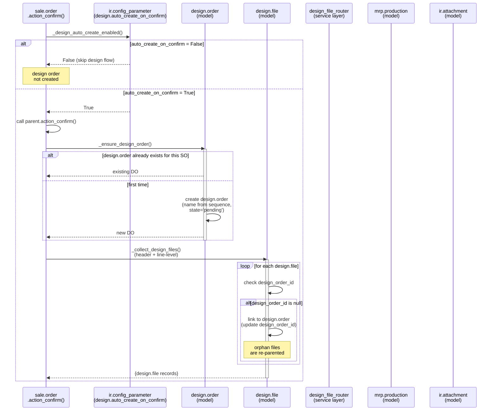
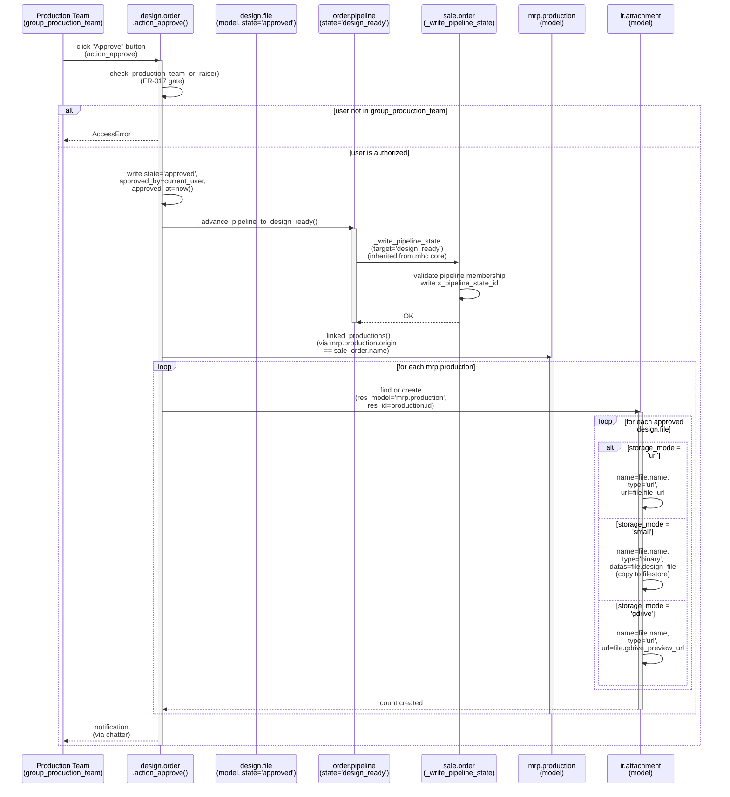
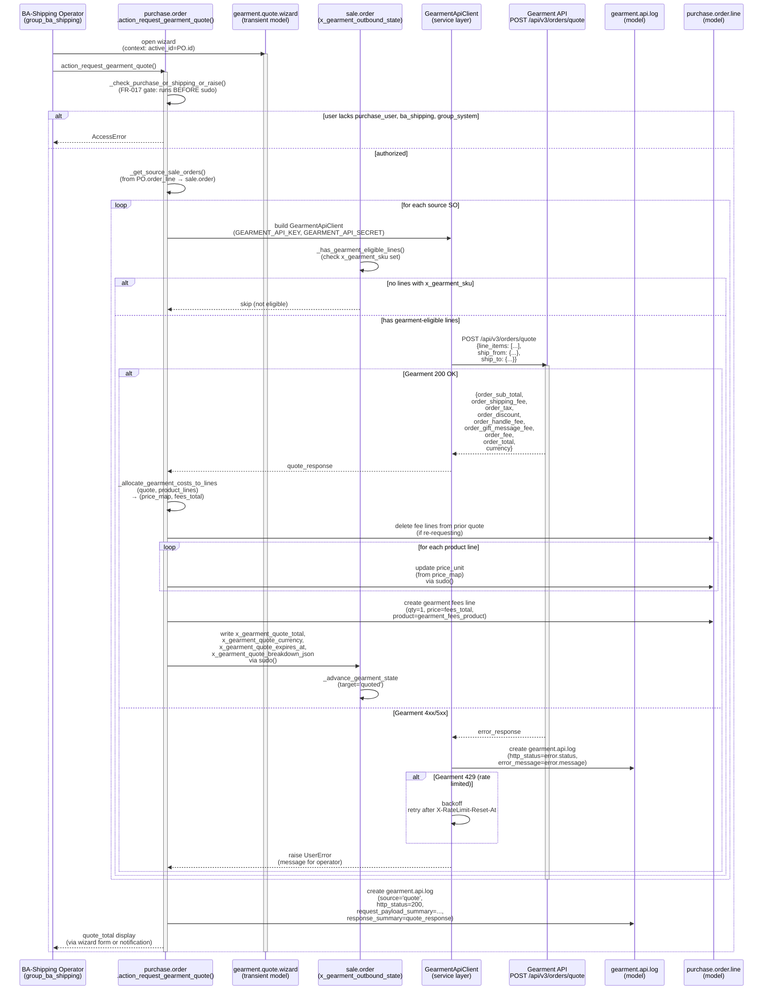
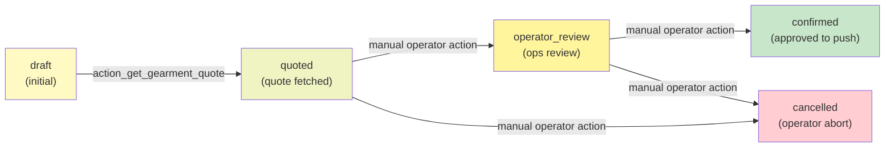
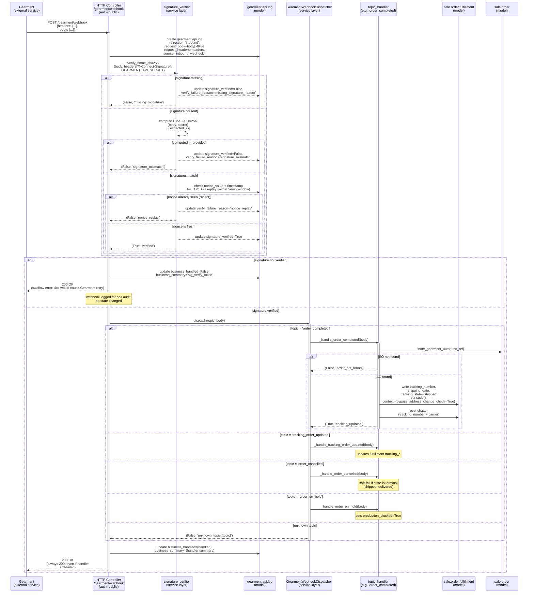
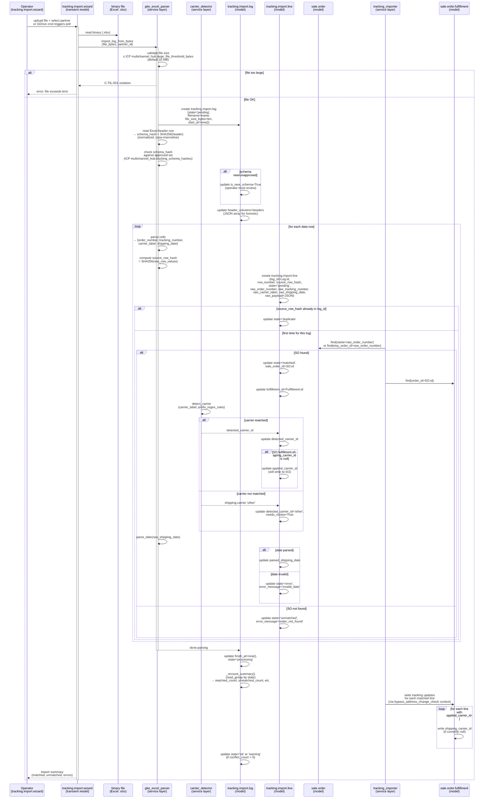

# Sequence Flows — Inbound Channels

This document defines 8 key workflows as mermaid sequence diagrams, traced through actual Odoo code. Each flow includes a brief prose walkthrough, error paths (alt/opt blocks), and participant names matching real classes/models.

All flows are **shipped and E2E verified on staging** as of 2026-07-03, consolidation to `main` complete.

---

## 1. Etsy Order Ingest via API (Spec 005, P1-11)

**Entry Point**: Cron `etsy.shop._cron_sync_orders()` (5-min interval)  
**Implemented**: Phase 0 (P0-16c EtsyOrderSyncer), Phase 1 (P1-11 pilot cutover)  
**Status**: Shipped, live on JaHandmadeArt (shop_id=60752333)

### Sequence Diagram

```mermaid
sequenceDiagram
    participant Cron as Cron<br/>etsy.shop._cron_sync_orders()
    participant Syncer as EtsyOrderSyncer<br/>(service layer)
    participant Adapter as EtsyApiAdapter<br/>(service layer)
    participant Client as EtsyApiClient<br/>(service layer)
    participant Etsy as Etsy API<br/>v3 /receipts
    participant Deduper as EtsyMessageDedupe<br/>(model)
    participant Creator as OrderCreator<br/>(service layer)
    participant SO as sale.order<br/>(model)

    Cron->>Syncer: sync_all_shops()
    activate Syncer
    
    Syncer->>Syncer: for each etsy.shop in (active, active_source='api')
    
    Syncer->>Client: build EtsyApiClient<br/>(etsy_oauth_access_token)
    activate Client
    
    Syncer->>Adapter: build EtsyApiAdapter(client)
    activate Adapter
    
    Adapter->>Etsy: GET /shops/{id}/receipts<br/>?min_last_modified={since}<br/>&limit=100&offset=0
    activate Etsy
    
    alt Etsy 401 (token expired)
        Etsy-->>Adapter: 401 Unauthorized
        Adapter->>Client: _refresh_access_token()
        Client->>Etsy: POST /oauth/token<br/>(refresh_token → access_token)
        Adapter->>Etsy: GET /shops/{id}/receipts (retry)
    end
    
    Etsy-->>Adapter: 200 OK<br/>{results: [receipt, ...],<br/>next_offset: N}
    deactivate Etsy
    
    loop for each receipt
        Adapter->>Adapter: _receipt_to_payload(receipt)<br/>→ EtsyOrderPayload
        
        Deduper->>Deduper: check dedup registry<br/>(etsy_order_id, shop_id)
        
        alt already seen (same last_modified)
            Deduper-->>Adapter: skip (dupe)
        else new or modified (last_modified changed)
            Adapter->>Creator: create(payload)
            activate Creator
            
            Creator->>SO: find_or_create<br/>(etsy_order_id, shop_id)
            activate SO
            
            alt sale.order exists + etsy_last_modified matches
                SO-->>Creator: found (no-op, skip)
            else first time or newer version
                SO->>SO: write fields<br/>(partner_id, line_ids,<br/>amount_total, etc.)
                
                alt amount_total <= 0
                    SO->>SO: _compute_etsy_price_anomaly()<br/>→ flag for review
                end
                
                SO-->>Creator: sale.order (created/updated)
            end
            
            deactivate SO
            
            Creator->>Deduper: register(etsy_order_id)<br/>(audit trail)
            Creator-->>Adapter: order_id
            
            deactivate Creator
        end
    end
    
    Adapter->>Etsy: GET /shops/{id}/receipts<br/>?offset=100 (page 2)
    alt next_offset missing or null
        return (pagination done)
    else next_offset present
        Etsy-->>Adapter: 200 OK {results: [...], next_offset: 200}
        Note over Adapter: loop repeats<br/>until no more pages
    end
    
    Syncer->>Syncer: on success: stamp<br/>shop.etsy_last_receipt_sync_at
    
    alt EtsyApiClient raises RateLimitError
        Syncer->>Syncer: backoff, retry after<br/>X-RateLimit-Reset-At
        Syncer->>Syncer: record to etsy.api.log<br/>(source='sync', http_status=429)
    end
    
    deactivate Adapter
    deactivate Client
    deactivate Syncer
```

### Prose Walkthrough

1. **Orchestration (Cron)**: Daily cron iterates all shops with `active_source='api'` and valid OAuth tokens. Instantiates a fresh `EtsyOrderSyncer` per transaction.

2. **API Client Setup**: Syncer builds an `EtsyApiClient` (P0-15) using the shop's `etsy_oauth_access_token`. Token is verified against expiry; if stale, a refresh is queued for the next transaction window.

3. **Adapter Pagination**: `EtsyApiAdapter` lazily fetches pages of receipts from `/shops/{shop_id}/receipts` with `min_last_modified={shop.etsy_last_receipt_sync_at}`. Each page yields up to 100 receipts.

4. **Receipt-to-Payload Conversion**: Each receipt is mapped to a canonical `EtsyOrderPayload` dataclass (carrier for order metadata, address, line items, totals). Money fields (amount, divisor) are normalized to floats.

5. **Deduplication**: Before creating a `sale.order`, the syncer checks `EtsyMessageDedupe` registry (keyed by `etsy_order_id, shop_id`). If the same `etsy_last_modified` timestamp is already recorded, the receipt is skipped (idempotent).

6. **Order Creation/Update**: For new or modified receipts, `OrderCreator.create()` finds or creates a `sale.order` with the matching `etsy_order_id`. Partner, address, and line items are synced from the payload. Timestamps are stamped.

7. **Anomaly Flagging**: If `amount_total <= 0`, the order is flagged with `etsy_price_anomaly=True` for ops review.

8. **Watermark Advance**: After all pages of receipts are consumed, the shop's `etsy_last_receipt_sync_at` is stamped to the latest receipt's `last_modified` timestamp, bounding the next sync.

### Error Paths

- **401 Unauthorized**: Token expired. Client auto-refreshes via refresh_token and retries. If refresh fails (e.g., user revoked consent), the syncer logs a CRITICAL event and stops (operator re-authorizes OAuth).
- **429 Too Many Requests**: Rate limit hit. Syncer respects `X-RateLimit-Reset-At` header and defers remaining shops to the next cron run.
- **Malformed Receipt**: `_receipt_to_payload()` may encounter missing fields (e.g., `transactions=null`). Catches and logs; that receipt is skipped, cron continues.
- **Network/Timeout**: Syncer rolls back the transaction, logs error, and re-queues for the next run.

---

## 2. Etsy Order Ingest via Email Fallback (Spec 002, Phase 0)

**Entry Point**: Cron `etsy_integration._cron_sync_emails()` (10-min interval, `active_source='email'`)  
**Implemented**: Phase 0 (P0-14 Gmail client), Phase 1 (optional for shops with email=fallback)  
**Status**: Shipped, live on legacy email-path shops; superseded by API for new cutover

### Sequence Diagram

```mermaid
sequenceDiagram
    participant Cron as Cron<br/>etsy_integration._cron_sync_emails()
    participant GmailClient as GmailClient<br/>(service layer)
    participant Gmail as Gmail API<br/>v1 /messages
    participant Parser as EmailParser<br/>(service layer)
    participant Log as etsy.email.log<br/>(model)
    participant Creator as OrderCreator<br/>(service layer)
    participant SO as sale.order<br/>(model)

    Cron->>GmailClient: poll_unread_messages()
    activate GmailClient
    
    GmailClient->>Gmail: GET /users/me/messages?q=from:info@etsy.com<br/>&labelIds=UNREAD
    activate Gmail
    
    alt Gmail 401 (token revoked)
        Gmail-->>GmailClient: 401 Unauthorized
        GmailClient->>GmailClient: log ERROR<br/>(user must re-auth)
        return
    end
    
    Gmail-->>GmailClient: 200 OK<br/>{messages: [{id: msg_id, ...}, ...]}<br/>(max 50 per page)
    deactivate Gmail
    
    loop for each unread message
        GmailClient->>Gmail: GET /users/me/messages/{id}?format=full
        Gmail-->>GmailClient: 200 OK<br/>{payload: {headers: [...],<br/>parts: [{mimeType, data}]}}
        
        GmailClient->>Parser: parse_etsy_order_email(body, subject)
        activate Parser
        
        alt email subject matches known pattern
            Parser->>Parser: extract order ID, buyer name,<br/>SKU, price, shipping address
            
            alt parser succeeds
                Parser-->>GmailClient: EtsyOrderPayload
            else parse fails (malformed body)
                Parser-->>GmailClient: ParseError
                Parser->>Log: create etsy.email.log<br/>(parse_status='parse_failed',<br/>error_message=...)
                Note over Parser: email is logged for<br/>operator manual review
            end
        else unknown pattern
            Parser-->>GmailClient: None
            Note over Parser: email is skipped
        end
        
        alt ParseError or None
            GmailClient->>Log: create etsy.email.log<br/>(parse_status='duplicate' or<br/>'parse_failed')
        else payload received
            Creator->>SO: find_or_create<br/>(etsy_order_id, shop_id)
            activate SO
            
            SO->>SO: write fields from payload
            
            SO-->>Creator: sale.order
            deactivate SO
            
            Creator->>Log: create etsy.email.log<br/>(parse_status='success',<br/>created_order_id=SO.id)
        end
    end
    
    GmailClient->>Gmail: PATCH /users/me/messages/{id}/modify<br/>?removeLabelIds=UNREAD
    Gmail-->>GmailClient: 200 OK
    
    deactivate GmailClient
```

### Prose Walkthrough

1. **Gmail Polling**: Cron queries Gmail API for unread emails from `info@etsy.com` (Etsy's order notification sender). Fetches up to 50 message IDs per page.

2. **Message Fetch**: For each unread message, GmailClient fetches the full message body (including headers and MIME parts).

3. **Email Parser**: `EmailParser.parse_etsy_order_email()` applies a regex-based state machine to extract:
   - Order ID (Etsy receipt number)
   - Buyer name and email
   - Shipping address
   - Line items (SKU, quantity, price)
   - Order total and shipping cost

4. **Order Creation**: Successful parses flow to `OrderCreator`, which finds or creates the corresponding `sale.order`. All fields are synced from the email body.

5. **Email Log Audit**: Whether success or failure, an `etsy.email.log` row is created with:
   - `parse_status` (success | parse_failed | duplicate)
   - `error_message` (if failed)
   - `created_order_id` (if successful)
   - Raw email body (for forensic replay)

6. **Mark Read**: After processing, the message is marked as read in Gmail so it is not re-polled.

### Error Paths

- **401 Unauthorized**: Gmail token revoked. Cron logs error and stops; operator must re-authorize OAuth.
- **Malformed Email**: EmailParser logs to `etsy.email.log` with `parse_status='parse_failed'`. Email is preserved for manual review.
- **Duplicate**: If the order ID is already in Odoo, email is logged but skipped (idempotent).
- **Network Timeout**: Cron transaction rolls back; re-queued for next run.

---

## 3. Design Approval Pipeline (ESTY-244, P1-02a/P1-02b)

**Entry Point**: Sale order confirmation → auto-create `design.order`  
**Implemented**: Phase 1 (P1-02a design file routing, P1-02b auto-create)  
**Status**: Shipped, E2E tested with 5-design rule set

### Sequence Diagram



### Design Approval Action Sequence



### Prose Walkthrough — Approval Flow

1. **Config Check**: On SO confirmation, if `design.auto_create_on_confirm=True` (default), a `design.order` is auto-created.

2. **Design File Collection**: All `design.file` rows linked to the SO (header-level via `order_id` or line-level via `order_line_id`) are collected and re-parented under the new `design.order` if orphaned.

3. **Approval Gate (FR-017)**: Production team clicks "Approve" button. System checks user is in `group_production_team` or `group_system` BEFORE any write.

4. **State Transition**: Design order transitions to `state='approved'`. Timestamps and approver name are recorded.

5. **Pipeline Sync**: Sale order advances to the `design_ready` pipeline stage (via mhc core's `_write_pipeline_state`). This is an automatic, audited transition (recorded in `order.pipeline.transition.log`).

6. **Attachment to Productions**: System queries for `mrp.production` records linked to the same SO (via `origin` field). For each production, approved design files are attached as `ir.attachment` records:
   - **URL storage**: Link-style attachment (no filestore copy)
   - **Binary (small)**: Copies the file binary to filestore (≤10 MB cap)
   - **GDrive storage**: Creates a link attachment with GDrive shareable URL

7. **Idempotency**: Attachments are deduplicated by (design.file_id, mrp.production_id) to avoid re-attaching on repeated approvals.

### Error Paths

- **AccessError**: Non-production-team user attempts approval. Blocked at the gate (FR-017 defense).
- **No Linked Productions**: If MO not yet created, `_linked_productions()` returns empty. No error; attachment step is skipped (idempotent).
- **File Size Exceeds 10 MB**: Design file creation fails at constraint check; operator must re-upload smaller file or use GDrive URL storage mode.
- **GDrive Preview URL Invalid**: `gdrive_preview_url` computed field returns null or malformed URL. Attachment is still created but operators will see blank link.

---

## 4. Dropship Quote Handshake (ESTY-246, ADR-018-gearment-po-quote)

**Entry Point**: Purchase order confirm → Gearment quote request (action/wizard)  
**Implemented**: Phase 1 (P4-01 sub-phases C–D completed 2026-05-10, hotfixes 2026-05-12)  
**Status**: Shipped, E2E integrated with webhook tracking (Phase 2)

### Sequence Diagram



### State Machine Diagram



### Prose Walkthrough

1. **Quote Request**: BA-Shipping operator clicks the "Request Gearment Quote" button on a purchase order. FR-017 gate checks authorization BEFORE any writes.

2. **Source Sales Orders**: PO identifies all source sale orders from its order lines (reverse-link via purchase.order_line). Filters for orders with ≥1 line marked `x_gearment_sku` (POD-eligible SKU).

3. **Quote Payload Build**: For each eligible SO, builds a Gearment POST payload with:
   - `line_items`: product SKU, quantity, unit price, printing options
   - `ship_from`: warehouse origin address
   - `ship_to`: order's delivery address

4. **API Call**: Sends quote request to Gearment `/api/v3/orders/quote`. On success, receives itemized cost breakdown (subtotal, shipping, tax, fees).

5. **Cost Allocation**: Allocates Gearment's order-level totals across PO lines:
   - Product lines: price_unit ← allocated share of order_sub_total
   - Fees line (one per SO): qty=1, price=remainder (shipping+tax+fees)
   - Residual rounding assigned to largest line

6. **Sale Order State Transition**: Sale order's `x_gearment_outbound_state` transitions `draft→quoted`. Quote breakdown (JSON serialized) is stored on the SO for operator visibility.

7. **Quote Expiry**: Gearment quotes are time-bound (e.g., 24 hours). Operator must confirm the PO within that window or re-fetch the quote.

### Error Paths

- **AccessError (FR-017)**: Non-authorized user attempts quote request. Blocked before any ORM writes.
- **No Eligible Lines**: SO has no `x_gearment_sku` set. Silently skipped (no error).
- **429 Rate Limit**: Gearment API rate limit hit. Client respects `X-RateLimit-Reset-At` header and backs off. Audit log records the 429.
- **Gearment 4xx/5xx**: Server error or validation failure (e.g., invalid address format). Wrapped in UserError and raised to operator.
- **Network Timeout**: Transaction rolls back; operator retries.

---

## 5. Gearment Webhook Inbound (P0-18b2c, ADR-015)

**Entry Point**: HTTP POST `/gearment/webhook`  
**Implemented**: Phase 0 (P0-18b2a audit log, P0-18b2b HMAC verify, P0-18b2c dispatch)  
**Status**: Shipped, E2E integrated with tracking updates and fulfillment state

### Sequence Diagram



### Prose Walkthrough

1. **HTTP Endpoint**: `GearmentWebhookController` (auth='public') receives inbound webhook POST. Request is logged to `gearment.api.log` before any processing.

2. **HMAC Verification**: Payload is HMAC-SHA256 verified using the Gearment secret key. Signature is extracted from `X-Connect-Signature` header. If verification fails, the webhook is logged (for audit) but silently returns 200 (so Gearment doesn't retry failed attempts).

3. **Replay Protection**: Nonce value (from `X-Connect-Nonce` header) and timestamp (from `X-Connect-Timestamp`) are checked against a UNIQUE partial index in `gearment.api.log`. If the (nonce, timestamp) pair is already verified in the DB, it's a replay—skipped.

4. **Topic Dispatch**: After verification, `GearmentWebhookDispatcher.dispatch()` routes the webhook to a per-topic handler:
   - `order_completed`: Order shipped from Gearment. Update fulfillment tracking, mark as shipped.
   - `tracking_order_updated`: Tracking number or carrier changed. Update fulfillment.
   - `order_cancelled`: Order was cancelled at Gearment. Rollback (soft-fail if already shipped).
   - `order_on_hold`: Production blocked (QA issue, etc.). Flag `production_blocked=True`.
   - Others (variants, address): Log-only (no state change).

5. **Address-Change Bypass (FR-017)**: Fulfillment writes use `bypass_address_change_check=True` context because webhooks are inbound, trusted events. This allows Gearment tracking to be recorded even if an operator has a pending address-change request.

6. **Chatter Notification**: Handler posts a chatter entry on the SO documenting the tracking number and carrier name (escaped for XSS prevention).

7. **Audit Trail**: Log row is updated with `business_handled=True/False` and `business_summary` (human-readable result). All 200 responses (even soft-failures) are returned to Gearment so it doesn't retry.

### Error Paths

- **Missing Signature Header**: Webhook logged, silently swallowed (200).
- **Signature Mismatch**: Possible tampering or secret misconfiguration. Logged, swallowed (200).
- **Nonce Replay**: Duplicate webhook detected. Swallowed (200).
- **Order Not Found**: SO with matching `x_gearment_outbound_ref` not found locally. Soft-fail, logged (200).
- **Address Change Conflict**: If operator has a pending address-change request and Gearment sends tracking, the tracking is still recorded (bypass is enabled). Operator resolves the conflict manually.

---

## 6. Tracking Import from GKE Excel (P2-01/P2-02)

**Entry Point**: Manual wizard upload or GDrive cron poll (gdrive_partner)  
**Implemented**: Phase 2 (P2-01 wizard, P2-02 carrier detection, P2-06 GDrive poller)  
**Status**: Shipped, E2E tested with 5-carrier detection ruleset

### Sequence Diagram



### Prose Walkthrough

1. **File Upload/GDrive Poll**: Operator uploads an Excel file via `tracking.import.wizard`, or GDrive cron polls the `logistics_partner` inbox for new .xlsx files.

2. **File Validation**: File size is checked against the 10 MB hard cap (C-TIL-001). Oversized files are rejected.

3. **Schema Validation**: First row (headers) is extracted and hashed (SHA-256, normalized). Hash is checked against an approved set (stored in ICP `multichannel_hub.tracking_schema_hashes`). If new schema, the log is flagged `is_new_schema=True` for operator review.

4. **Row Parsing**: For each data row:
   - Extract order number (Odoo SO name or Etsy receipt ID)
   - Extract tracking number
   - Extract carrier label (e.g., "USPS", "DHL")
   - Extract shipping date

5. **Row Deduplication**: Source row hash (SHA-256 of raw values) is checked against existing lines in the same import log. If duplicate, marked `state='duplicate'`.

6. **Order Matching**: Order number is looked up in `sale.order` by name or `etsy_order_id`. If found, the line is marked `state='matched'` and linked to the SO and its fulfillment record.

7. **Carrier Detection**: Carrier label is matched against a regex ruleset (e.g., `/^USPS/` → `shipping.carrier 'usps'`). If matched, `detected_carrier_id` is set. If no match, falls back to 'other' and sets `needs_review=True`.

8. **Date Parsing**: Shipping date is parsed; if invalid, the line is marked `state='error'` with an error message.

9. **Summary Recount**: After all rows are parsed, summary counts are recomputed via a `read_group` call on child lines by state.

10. **Fulfillment Updates**: Matched lines trigger writes to `sale.order.fulfillment`:
    - `tracking_number` ← raw tracking number
    - `tracking_state` ← 'shipped' (if not already shipped/delivered)
    - `shipping_carrier_id` ← detected carrier (only if currently null)
    - `shipping_date` ← parsed date

### Error Paths

- **File Too Large**: C-TIL-001 constraint violated. Rejected with error message.
- **New Schema**: Hash not in approved set. Log flagged; operator must review columns before import is considered valid.
- **Order Not Found**: Order number doesn't match any SO. Line marked `state='unmatched'`.
- **Invalid Date**: Date parsing fails. Line marked `state='error'`.
- **Carrier Not Detected**: Label matches no regex. Marked `needs_review=True` for operator to manually select carrier.
- **Duplicate Row**: Same source_row_hash seen in this import. Marked `state='duplicate'`, skipped.

---

## Outbound & Production Completion Workflows

**Workflows 7 (Listing Publish) and 8 (Production Completion)** are documented in the companion document **04b-sequence-flows.md**:

- **Workflow 7**: Etsy Listing Outbound Publish (P-PUB-PUBLISH, Spec 011) — Planned, Phase 3
- **Workflow 8**: Production Completion Hook (P2-03, ADR-016) — Shipped, integrated with fulfillment lifecycle

See 04b-sequence-flows.md for detailed sequence diagrams, error paths, and implementation notes.

---

## Audit & Observability

All 8 workflows emit structured audit logs:

| Workflow | Audit Table | Key Fields |
|----------|-------------|-----------|
| 1–2 (Order Ingest) | `etsy.api.log` / `etsy.email.log` | endpoint, http_status, request_summary, response_summary, error_message |
| 3 (Design) | `order.pipeline.transition.log` | sale_order_id, from_state, to_state, change_type, note, created_by |
| 4 (Quote) | `gearment.api.log` | sale_order_id, http_status, request_payload, response_summary, rate_limit_remaining |
| 5 (Webhook) | `gearment.api.log` | sale_order_id, signature_verified, verify_failure_reason, business_handled, business_summary |
| 6 (Tracking) | `tracking.import.log` / `tracking.import.line` | state, matched_count, unmatched_count, source_row_hash, detected_carrier, needs_review |
| 7 (Publish) | `etsy.api.log` (future) | endpoint, http_status, request_payload, listing_id, error_messages |
| 8 (Production) | `order.pipeline.transition.log` | fulfillment_status='produced', stock.move.purpose='production_completion' |

All logs are retained per ICP configuration (default 30 days for API logs, configurable).

---

## Document Metadata

**Last Updated**: 2026-07-03  
**Authored For**: Owner review + internal team reference  
**Code Verified Against**:
- `custom_addons/etsy_integration/` (v19.0.3.15.0)
- `custom_addons/multichannel_hub_core/` (v19.0.1.0.75)
- `custom_addons/multichannel_hub_fulfillment/` (v19.0.1.0.24)
- `custom_addons/design/` (v19.0.1.0.0)

**Entry Points for Workflows 1–6**:
1. Etsy API: `etsy.shop._cron_sync_orders()`
2. Email: `etsy_integration._cron_sync_emails()`
3. Design: `sale.order.action_confirm()` → `_ensure_design_order()`
4. Quote: `purchase.order.action_request_gearment_quote()` / wizard
5. Webhook: HTTP POST `/gearment/webhook`
6. Tracking: `tracking.import.wizard` or `logistics_partner._cron_poll_inbox()`

**Related Document**: See 04b-sequence-flows.md for entry points of workflows 7–8 (outbound publish, production completion).
