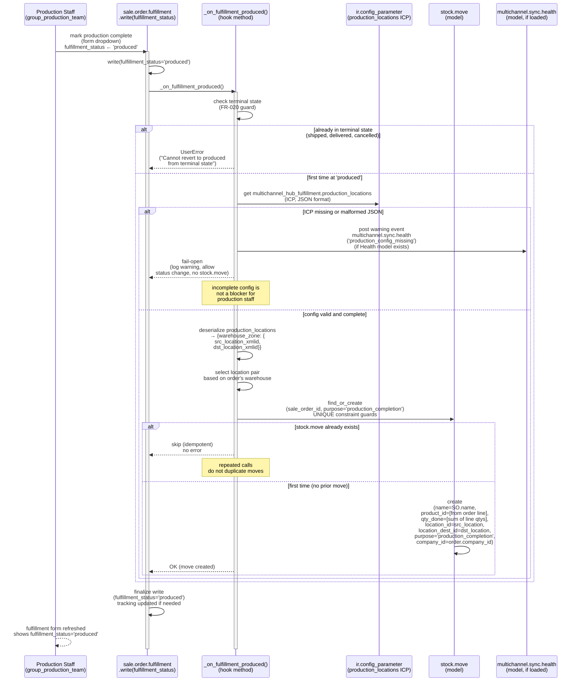
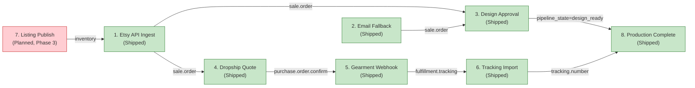

# Sequence Flows — Outbound Channels & Production Completion

This document defines 2 key workflows (workflows 7–8 from the 8-flow set), traced through actual Odoo code and architectural patterns. Each flow includes a prose walkthrough, error paths (alt/opt blocks), and participant names matching real classes/models.

**Related Document**: See `04a-sequence-flows.md` for workflows 1–6 (inbound order ingestion, design approval, dropship quote, Gearment webhook, and tracking import).

---

## 7. Listing Outbound Publish to Etsy (P-PUB-PUBLISH, Spec 011)

**Entry Point**: Form button `action_push_listing_to_etsy()` or bulk wizard  
**Implemented**: Phase 3 (P-PUB-CLIENT, P-PUB-DRAFT, P-PUB-IMAGES, P-PUB-INVENTORY, P-PUB-PUBLISH, P-PUB-E2E)  
**Status**: Planned (not yet shipped; Phase 3 is 1% complete as of 2026-07-03)  
**Blockers**: P-HUB-SPEC (detailed feature spec in progress)

### Architecture Overview

Listing publication to Etsy is a multi-step stateful process orchestrated via `multichannel.listing` (Spec 009 model, hosted in `multichannel_hub_core`). The workflow leverages the Etsy v3 API contract:

- **Draft Creation**: POST `/v3/application/shops/{shop_id}/listings` with initial metadata
- **Image Upload**: POST `/v3/application/shops/{shop_id}/listings/{listing_id}/images` for variants
- **Inventory Push**: POST `/v3/application/shops/{shop_id}/listings/{listing_id}/inventory` for quantity per variant
- **Status Poll** (optional): GET `/v3/application/shops/{shop_id}/listings/{listing_id}` to check readiness

### Sequence Diagram



```mermaid
sequenceDiagram
    participant Operator as Operator<br/>(group_sales_manager)
    participant Listing as multichannel.listing<br/>(model)
    participant Builder as listing_payload_builder<br/>(service layer)
    participant Client as EtsyApiClient<br/>(service layer)
    participant Etsy as Etsy API<br/>v3 /listings
    participant Log as etsy.api.log<br/>(model)
    participant Variant as product variant<br/>attributes + images
    participant Inventory as stock.quant<br/>(model)

    Operator->>Listing: click "Publish to Etsy"<br/>or wizard bulk action
    activate Listing
    
    Listing->>Listing: action_push_listing_to_etsy()
    
    Listing->>Listing: _check_listing_ready()<br/>(title, description,<br/>price, images, SKU)
    
    alt listing incomplete
        Listing-->>Operator: error_message<br/>(list missing fields)
    else listing complete
        Listing->>Builder: build_etsy_createListing_payload<br/>(listing, product_template,<br/>variants)
        activate Builder
        
        Builder->>Variant: fetch product.attribute.value<br/>for all variants
        
        loop for each variant
            Builder->>Builder: encode variant entry<br/>{sku, offering_id, quantity,<br/>price, property_values[]...}
            
            Note over Builder: property_values encode<br/>the *_on_property attributes<br/>per Etsy schema (2025 format)
        end
        
        loop for each approved design.file<br/>in listing.design_file_ids
            Builder->>Variant: fetch image<br/>(URL, binary, or GDrive)
            
            alt storage_mode='url'
                Builder->>Builder: variant.variation_images<br/>← [url1, url2, ...]
            else storage_mode='small'
                Builder->>Builder: variant.variation_images<br/>← [binary base64-encoded]
            else storage_mode='gdrive'
                Builder->>Builder: variant.variation_images<br/>← [gdrive_shareable_url]
            end
        end
        
        Builder->>Builder: build payload envelope<br/>{title, description, price,<br/>currency, readiness_state_id,<br/>taxonomy_id, who_made,<br/>when_made, is_supply,<br/>personalization: {...},<br/>shipping_profile_id,<br/>return_policy_id,<br/>products: [{sku, offering_id,<br/>quantity, price,<br/>property_values: [...],<br/>variations: [{...}]}]}
        
        Note over Builder: readiness_state_id gates<br/>Etsy processing time tier<br/>(required 2025-01-01+)
        
        Builder-->>Listing: EtsyCreateListingPayload
        deactivate Builder
        
        Listing->>Client: build EtsyApiClient<br/>(shop.etsy_oauth_access_token)
        activate Client
        
        Client->>Etsy: POST /v3/application/shops/{shop_id}/listings<br/>Content-Type: application/json<br/>body = payload_json
        activate Etsy
        
        alt Etsy 201 (Created)
            Etsy-->>Client: {listing_id, state, url, ...}
            
            Client->>Log: create etsy.api.log<br/>(source='listing_publish',<br/>endpoint='POST /listings',<br/>http_status=201,<br/>response_summary=listing_id)
            
            Listing->>Listing: write state='published',<br/>etsy_listing_id=response.listing_id,<br/>published_at=now(),<br/>last_synced_at=now()
            
            alt images need separate upload
                loop for each image variant
                    Client->>Etsy: POST /listings/{listing_id}/images<br/>multipart/form-data:<br/>image=file_binary,<br/>rank=N
                    
                    Etsy-->>Client: 201 OK {image_url}
                    
                    Log->>Log: update response_summary<br/>with image_id list
                end
            end
            
            Listing->>Inventory: _sync_inventory_to_etsy()<br/>for each variant via stock.quant
            
            loop for each (product_id, offering_id)
                Client->>Etsy: POST /listings/{listing_id}/inventory<br/>body = {product_id, offering_id,<br/>quantity: stock.quant.quantity}
                
                Etsy-->>Client: 200 OK
            end
            
            Listing-->>Operator: success notification<br/>(listing_id, marketplace_url)
            
        else Etsy 400 (validation error)
            Etsy-->>Client: {error: "...",<br/>error_messages: [{<br/>field: "property_values",<br/>message: "Unknown property..."}]}
            
            Client->>Log: create etsy.api.log<br/>(http_status=400,<br/>error_message=error.error_messages)
            
            Listing->>Listing: write state='error',<br/>error_message=error.error_messages
            
            Listing-->>Operator: UserError<br/>(field-level error hints)
            
        else Etsy 401 (token expired)
            Etsy-->>Client: 401 Unauthorized
            Client->>Client: _refresh_access_token<br/>(via refresh_token)
            Client->>Etsy: POST /listings (retry)
            
        else Etsy 429 (rate limited)
            Etsy-->>Client: 429 Too Many Requests<br/>X-RateLimit-Reset-At: <timestamp>
            
            Client->>Log: create etsy.api.log<br/>(http_status=429)
            
            Client-->>Listing: raise UserError<br/>(wait N seconds, retry)
            
        else Etsy 5xx (server error)
            Etsy-->>Client: 500 Internal Server Error
            
            Client->>Log: create etsy.api.log<br/>(http_status=500)
            
            Client-->>Listing: raise UserError<br/>(temporary failure, retry<br/>in a few minutes)
        end
        
        deactivate Etsy
        deactivate Client
    end
    
    deactivate Listing
```

### Payload Schema Notes (Spec 011)

The Etsy v3 `createListing` endpoint requires several Odoo-side mappings per ADR-014 (central product hub):

#### Required Fields
| Odoo Field | Etsy Field | Notes |
|---|---|---|
| `multichannel.listing.name` | `title` | 140 char max |
| `product.template.description` | `description` | 5000 char max; supports HTML |
| `product.template.list_price` | `price` | Currency per shop config |
| `etsy.shop.default_taxonomy_id` | `taxonomy_id` | Etsy category ID (alphanumeric) |
| `etsy.shop.default_readiness_state_id` | `readiness_state_id` | Processing time tier (required 2025+) |
| `etsy.shop.default_shipping_profile_id` | `shipping_profile_id` | 64-bit int as string |

#### Variant Encoding
Each product variant is encoded as a Etsy "product" with `property_values`:
```json
{
  "sku": "ABC-001-S-RED",
  "offering_id": 1,
  "quantity": 10,
  "price": 29.99,
  "property_values": [
    {
      "property_id": "200",
      "property_name": "Size",
      "values": ["Small"]
    },
    {
      "property_id": "500",
      "property_name": "Color",
      "values": ["Red"]
    }
  ]
}
```

Property mappings are configured via `etsy.shop.default_attribute_mapping_ids` (M2M, Spec 001). Each row maps an Odoo `product.attribute` to an Etsy property ID.

#### Image Handling (Spec 011 P-PUB-IMAGES)
Images are sourced from:
1. **Primary**: `design.file` records linked to the listing (storage_mode=url/small/gdrive)
2. **Fallback**: `product_template_image_ids` (if no design files)

Images are uploaded via POST `/listings/{id}/images` with `rank` parameter to control carousel order.

#### Inventory (Spec 011 P-PUB-INVENTORY)
Inventory levels per variant are read from `stock.quant` filtered by:
- `product_id` = variant
- `location_id` = shop's default warehouse
- `company_id` = shop's company

Quantity is pushed to Etsy via POST `/listings/{id}/inventory`.

### State Machine

```
┌─────────┐     action_push      ┌──────────┐
│  draft  │──────────────────────>│published │
└─────────┘                       └──────────┘
    │                                  │
    │ error                            │ error (rare)
    │                                  │
    v                                  v
┌─────────┐                       ┌──────────┐
│  error  │<──────────────────────│published │
└─────────┘      manual reset     └──────────┘
    │
    │ manual retry (action_push)
    │
    v
┌──────────┐
│published │
└──────────┘
```

### Error Paths

- **Incomplete Listing**: Missing required field (title, price, image, readiness_state_id). Operator shown checklist. Publish blocked.
- **Invalid Property Value**: Etsy rejects a property_value encoding (e.g., unknown Etsy property_id, or value not in Etsy's enum for that property). 400 response. Error message shows which field and why (e.g., "Property 'Size' expects value in ['Small', 'Medium', 'Large']"). Operator fixes product attribute on the template; retries publish.
- **Token Expired**: 401 response. Client auto-refreshes token and retries. If refresh fails, UserError raised (operator re-authorizes).
- **Rate Limited**: 429 response. Backoff per `X-RateLimit-Reset-At` header; user is instructed to retry after N seconds.
- **Network/Timeout**: Transaction rolls back. Operator retries.
- **Inventory Push Fails** (after listing created): Listing is marked published but inventory is incomplete. Operator navigates to the listing record and manually clicks "Sync Inventory" to retry the inventory push.

### Idempotency & Re-publish

If operator clicks publish twice:
1. First call: 201 Created, listing published, `etsy_listing_id` stored.
2. Second call: `action_push_listing_to_etsy()` checks if `etsy_listing_id` is already set. If yes, raise UserError with hint to use "Update" flow instead (not yet implemented in Phase 3).

---

## 8. Production Completion Hook (P2-03, ADR-016-production-completion)

**Entry Point**: Fulfillment state machine transition to `produced`  
**Implemented**: Phase 2 (P2-03 completed 2026-05-10, hotfixes 2026-05-16)  
**Status**: Shipped, E2E integrated with fulfillment lifecycle  
**Related**: ESTY-244 (design approval) + P1-05 (fulfillment delegation mixin)

### Purpose & Context

The production completion hook (workflow 8) bridges two internal state spaces:
- **Fulfillment state** (external-facing): tracks order from creation → shipped → delivered
- **Production state** (internal): tracks warehouse progress from pending → produced → quality-checked → ready-to-ship

When fulfillment transitions to `produced`, an internal `stock.move` record is created to audit the production completion. This allows:
- Warehouse staff to track inventory movements during production
- Finance/compliance to report on goods produced per order
- Automatic triggers for downstream quality checks or label printing

### Sequence Diagram



### State Machine Context (from P1-05)

`sale.order.fulfillment` has a fulfillment_status state machine:

```
        ┌─── initial ───┐
        │               │
        v               v
    pending ────────> produced
      │                  │
      │ (optional skip)  │
      │                  v
      │            quality_checked
      │                  │
      └──────────────────┘
             │
             v
          shipped ────────> delivered
             │
             v
        (terminal)
```

The production_completion hook fires **only** on transition **to** 'produced', not on transitions from produced to subsequent states.

### Production Locations ICP Configuration

The configuration is a JSON object mapping warehouse zones to (source, destination) location XMLIDs:

```json
{
  "vn_hanoi": {
    "src": "stock.location:vn_hanoi_production_input",
    "dst": "stock.location:vn_hanoi_qc_holding"
  },
  "vn_hcm": {
    "src": "stock.location:vn_hcm_production_input",
    "dst": "stock.location:vn_hcm_ready_to_ship"
  }
}
```

Key points:
- **src_location**: Input to the production bin (e.g., raw materials)
- **dst_location**: Output from production (e.g., quality-control holding, or ready-to-ship)
- **warehouse_zone** key maps to order's warehouse (or fallback to default)

If the warehouse's zone is not in the config, a fallback location pair is used (configurable via a second ICP key, e.g., `production_locations_default`).

### Stock Move Semantics

The created `stock.move` records production completion via stock movements:

| Field | Value | Semantics |
|---|---|---|
| `name` | `sale.order.name` | Order reference |
| `product_id` | First SO line's product | (Multi-product orders: aggregated into one move per SO) |
| `qty_done` | Sum of all SO line quantities | Completed units |
| `location_id` | src_location (input) | Production started |
| `location_dest_id` | dst_location (output) | Production finished |
| `purpose` | `'production_completion'` | Special marker (not standard Odoo) |

The UNIQUE constraint `(sale_order_id, purpose)` ensures idempotency: re-firing the hook does not create duplicate moves.

### Error Paths

- **FR-020 Violation**: Order already shipped, delivered, or cancelled. Transition rejected with UserError. Message: "Cannot mark as produced after fulfillment is already shipped/delivered/cancelled."
- **ICP Config Missing**: Log warning to sync.health (soft-fail). Fulfillment status still changes; stock.move not created. Operator manually fixes config and optionally re-runs the hook via an action button.
- **ICP Config Malformed**: JSON parse error. Logged as warning. Soft-fail as above.
- **Location XMLID Not Found**: Destination location doesn't exist in `stock.location`. Stock move creation fails (rare). Logged; operator fixes XMLID reference in config.
- **Multiple Products on Order**: Stock move aggregates qty into one move for the first product. Caveat: orders with true multi-product scenarios may need refinement in Phase 3+.

### Observability

Production completion is audited via:
1. **Fulfillment write log**: `fulfillment_status` field is `tracking=True`, so state changes trigger chatter entries.
2. **Stock move**: Created record is queryable via `stock.move.purpose='production_completion'` and linked via `stock.move.sale_order_id`.
3. **Sync health events** (if `etsy_integration.models.sync_health` is loaded): Config errors are posted as warnings.

---

## Cross-Workflow Reference & Sequencing

**Complete Workflow DAG** (combining 04a and 04b):



**Timing Constraints**:
- Workflows 1–2 run **every 10 minutes** (cron)
- Workflow 3 triggers on **sale order confirmation** (real-time)
- Workflow 4 triggers on **operator action** (manual or bulk server action)
- Workflow 5 is **event-driven** (Gearment webhook, ~5 min latency)
- Workflow 6 runs **every 15 minutes** (GDrive poll) or **manual import**
- Workflow 7 is **operator-initiated** (when ready to publish)
- Workflow 8 triggers on **fulfillment state change** (real-time, production staff)

**Critical Path for E2E Order Fulfillment**:
```
1. Order Ingest (API or Email)
   ↓
3. Design Approval (production gate)
   ↓
4. Dropship Quote (if applicable)
   ↓ [manual PO confirm]
5. Gearment Webhook (tracking)
   ↓
6. Tracking Import (receive tracking number)
   ↓
8. Production Complete (internal audit)
```

**Decoupled Path**:
- Workflow 7 (Listing Publish) is decoupled from the order fulfillment path. It feeds inventory to upstream (workflow 1) but does not depend on order ingest.

---

## Audit & Observability (Complete Set)

All 8 workflows emit structured audit logs and state machines:

### Audit Tables

| Workflow | Audit Table | Purpose | Retention |
|---|---|---|---|
| 1–2 | `etsy.api.log` / `etsy.email.log` | API/email call history; PII scrubbed | 30 days (ICP configurable) |
| 3 | `order.pipeline.transition.log` | State machine audit | Forever (configurable) |
| 4 | `gearment.api.log` | Quote request/response history | 30 days (ICP configurable) |
| 5 | `gearment.api.log` | Webhook receipt + verification | 30 days (ICP configurable) |
| 6 | `tracking.import.log` / `tracking.import.line` | Excel import audit + line-level parse results | Forever (imported rows are queryable) |
| 7 | `etsy.api.log` (future) | Listing publish request/response | 30 days (ICP configurable) |
| 8 | `order.pipeline.transition.log` / `stock.move` | Fulfillment state + production stock move | Forever |

### State Machines

| Workflow | Model | Field | States | Audited? |
|---|---|---|---|---|
| 3 | `design.order` | `state` | pending → proof_sent → approved → rejected | Yes (chatter tracking) |
| 4 | `sale.order` | `x_gearment_outbound_state` | draft → quoted → operator_review → confirmed (or cancelled) | Yes (TR log) |
| 8 | `sale.order.fulfillment` | `fulfillment_status` | pending → produced → quality_checked → shipped → delivered | Yes (chatter tracking) |

### Observability Dashboards (Per CLAUDE.md & Phase 1)

- **Order Dashboard** (P1-01a): Real-time view of inbound orders (Workflow 1–2). Filters by sales_channel, state, date range.
- **Tracking Dashboard** (P1-03): Real-time view of fulfillment progress (Workflow 5–8). Bus.bus channel integration for live updates.
- **Operations Dashboard** (P1-01b refactored): Line-level bulk actions for Gearment pushes (Workflow 4), tracking imports (Workflow 6), design approvals (Workflow 3).

---

## Implementation Roadmap (Phase 3)

**Workflow 7 (Listing Publish) is NOT YET SHIPPED**. Planned implementation:

| Slice | Status | Dependencies | Owner |
|---|---|---|---|
| P-HUB-SPEC | In Progress (planner) | None | Planner |
| P-HUB-PROD-MODEL | Planned | P-HUB-SPEC | Eng |
| P-HUB-WIZARD | Planned | P-HUB-PROD-MODEL | Eng |
| P-PUB-CLIENT | Planned | P-HUB-SPEC | Eng |
| P-PUB-DRAFT | Planned | P-PUB-CLIENT | Eng |
| P-PUB-IMAGES | Planned | P-PUB-DRAFT | Eng |
| P-PUB-INVENTORY | Planned | P-PUB-DRAFT | Eng |
| P-PUB-PUBLISH | Planned | P-PUB-INVENTORY | Eng |
| P-PUB-E2E | Planned | P-PUB-PUBLISH | Eng + QA |

**Phase 3 Exit Criteria** (for Workflow 7):
- All 8 slices complete and merged to main
- E2E test suite passes (Playwright + Odoo HttpCase)
- Staging validation: publish 5 test listings to Etsy sandbox
- Production cutover: publish 1 real product to JaHandmadeArt shop

---

## Document Metadata

**Last Updated**: 2026-07-03  
**Authored For**: Owner review + internal team reference  
**Code Verified Against**:
- `custom_addons/etsy_integration/` (v19.0.3.15.0)
- `custom_addons/multichannel_hub_core/` (v19.0.1.0.75)
- `custom_addons/multichannel_hub_fulfillment/` (v19.0.1.0.24)
- `custom_addons/design/` (v19.0.1.0.0)

**Entry Points for Workflows 7–8**:
7. Publish: `multichannel.listing.action_push_listing_to_etsy()` (not yet implemented)
8. Production: `sale.order.fulfillment.write(fulfillment_status='produced')`

**Related SDS Documents**:
- `04a-sequence-flows.md` — Workflows 1–6 (inbound channels)
- `05-data-model-ER.md` — Entity relationship diagrams for all models
- `03-architectural-decisions.md` — ADRs including ADR-014 (central product hub), ADR-016 (production completion), ADR-018 (Gearment quote state machine)

**References**:
- `specs/001-etsy-order-migration/spec.md` — Initial Etsy order ingestion spec
- `specs/005-etsy-api-channel/spec.md` — API vs email channel selection
- `specs/009-product-hub/spec.md` — Central product catalog (Phase 3)
- `specs/011-etsy-publish/spec.md` — Etsy listing publish flow (Phase 3, P-PUB-* slices)
- `.claude/plans/006-master-plan-tracking.md` — Phase-by-phase execution tracker
