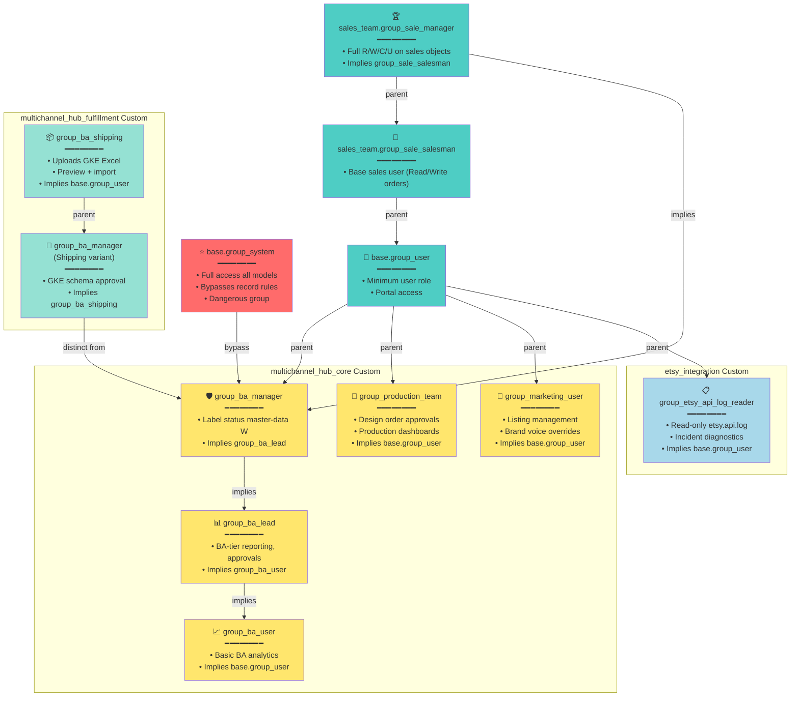

# Part 5: Security Posture and Access Control

**Title**: odoo19_esty Security Architecture, Access Control Lists, and Defense Patterns  
**Date**: 2026-07-03  
**Status**: Draft-for-owner-review  
**Version**: 1.0  
**Source of Truth**: custom_addons/*/security/*.xml, custom_addons/*/security/ir.model.access.csv, specs/006-master-plan/adrs/ADR-018a (webhook), ADR-018b (OAuth)  

---

## (a) Groups & Role Hierarchy

All custom security groups defined in XML; inherits from Odoo base groups (`base.group_user`, `sales_team.group_sale_salesman`, `sales_team.group_sale_manager`, `base.group_system`).

### Group Hierarchy



**Group Ownership**:
- **Standard Odoo**: `base.group_system`, `sales_team.group_sale_manager`, `sales_team.group_sale_salesman`, `base.group_user`
- **multichannel_hub_core**: `group_production_team`, `group_marketing_user`, `group_ba_user`, `group_ba_lead`, `group_ba_manager`
- **multichannel_hub_fulfillment**: `group_ba_shipping`, `group_ba_manager` (Shipping variant, distinct from mhc variant)
- **etsy_integration**: `group_etsy_api_log_reader`

**Note**: Two `group_ba_manager` groups exist (mhc + fulfillment). Distinct XML IDs prevent collision; semantically different (master-data vs. schema approval). Future consolidation candidate in Specs/015.

---

## (b) Roles-to-Menus Matrix

| Role | Menus & Features | Models | Typical User |
|------|------------------|--------|---|
| **base.group_system (System)** | ALL (unrestricted) | All | Developers, sysadmin (DANGEROUS) |
| **sales_team.group_sale_manager (Sales Manager)** | Sales + Orders + Dashboards + all Operations Dashboards (Order/Tracking/Process) | `sale.order` (CRUD), `design.file` (CRUD), `order.pipeline` (CRUD), all fulfillment (CRUD) | Sales team lead, operations lead |
| **sales_team.group_sale_salesman (Salesman)** | Sales + Orders (read-only pipeline), limited fulfillment | `sale.order` (R/W orders), `design.file` (R), fulfillment (read-only tracking) | Order taker, fulfillment operator |
| **group_ba_manager** | BA Dashboard (all metrics), Master Data (label statuses), Filtering saved-searches | `label.status.option` (CRUD), Operations Dashboard unrestricted, saved filters | Senior BA / operations manager |
| **group_ba_lead** | BA Dashboard (approvals, metrics), Enquiry management | `multichannel.enquiry` (CRUD), Operations Dashboard filtered | BA lead, operations analyst |
| **group_ba_user** | BA Dashboard (read-only metrics) | Operations Dashboard read-only metrics | Junior BA, analyst |
| **group_production_team** | Design approvals, production dashboards | `design.order` (R/W), `design.file` (R/W), production dashboard | Production team, design approvers |
| **group_marketing_user** | Listing management, brand overrides | `multichannel.listing` (CRUD, gated unlink), brand-voice fields | Marketing, listing manager |
| **group_ba_shipping (Fulfillment)** | GKE import wizard, preview, tracking import | Tracking models (CRUD), GKE schema preview (no approve) | GKE operator, tracking import specialist |
| **group_ba_manager (Shipping variant)** | GKE schema approval, tracking import, all shipping | Tracking models (CRUD), GKE schema approval (RPC-gated) | Shipping manager, GKE quality gate |
| **group_etsy_api_log_reader** | Read-only Etsy API log | `etsy.api.log` (read-only), incident diagnostics | Support, incident reviewer |

---

## (c) Access Control List (ACL) Summary by Model

**Format**: Model → Permissions by Group  
**Legend**: R=Read, W=Write, C=Create, U=Unlink

### Foundation (multichannel_hub_core)

| Model | group_sale_salesman | group_production_team | group_sale_manager | group_ba_manager | base.group_system |
|-------|:---:|:---:|:---:|:---:|:---:|
| `sale.order` (extended) | RW | RWC | RWCU | RWCU | RWCU |
| `sale.order.fulfillment` | RWC | RWC | RWCU | RWCU | RWCU |
| `design.file` | R | RWC | RWCU | RWCU | RWCU |
| `design.file.route` | R | RWC | RWCU | RWCU | RWCU |
| `design.file.upload.wizard` | — | RWC | — | — | RWCU |
| `order.pipeline` | R | — | RWC | RWC | RWCU |
| `order.pipeline.state` | R | — | RWC | RWC | RWCU |
| `order.pipeline.transition.log` | R | — | R | R | RWCU |
| `pipeline.team` | R | — | RWC | RWC | RWCU |
| `shipping.carrier` | R | — | RWC | RWC | RWCU |
| `label.status.option` | R | — | RW | RWCU | RWCU |
| `multichannel.enquiry` | RWC | — | RWCU | RWCU | RWCU |
| `multichannel.listing` | RWC (gated unlink) | — | RWCU | RWCU | RWCU |
| `multichannel.sync.health` | R | — | RW | RW | RWCU |
| `product.mto.bom.wizard` | — | — | RWC | — | RWCU |

**Footnotes**:
- `sale.order.fulfillment`: Salesman can write (e.g., tracking number); Production team reads fulfillment state for approval workflow
- `design.file`: Production team has R/W/C (but not U via record rule on approval workflow)
- `order.pipeline*`: Read-only for salesman (see pipeline status); Manager/BA full control
- `label.status.option`: Label statuses are master data; only BA Manager (P1-LBL) can create/edit
- `multichannel.listing`: Unlink restricted by record rule when state='published' (see § (d) Record Rules)

### Fulfillment (multichannel_hub_fulfillment)

| Model | group_ba_shipping | group_ba_manager (Shipping) | base.group_system |
|-------|:---:|:---:|:---:|
| `gearment.api.log` | R | RW | RWCU |
| `gearment.quote.wizard` | R | RWC | RWCU |
| Tracking import wizard | RWC | RWC | RWCU |

### Etsy Channel (etsy_integration)

| Model | group_sale_salesman | group_sale_manager | group_etsy_api_log_reader | base.group_system |
|-------|:---:|:---:|:---:|:---:|
| `etsy.shop` | R | RW | — | RWCU |
| `etsy.email.log` | R | RW | — | RWCU |
| `etsy.api.log` | R | R | R | RWCU |
| `etsy.listing` | RW | RWCU | — | RWCU |
| `sale.order` (Etsy-scoped) | R/W (shop-user-scoped) | RWCU | — | RWCU |

### Design Module (design)

| Model | group_production_team | group_sale_manager | base.group_system |
|-------|:---:|:---:|:---:|
| `design.order` | RWC | RWCU | RWCU |

---

## (d) Record Rules (Row-Level Access Control)

Record rules enforce domain-based filtering; system group bypasses all record rules by default.

### multichannel_hub_core

**Rule: `rule_multichannel_listing_published_no_unlink`**
- **Model**: `multichannel.listing`
- **Groups Affected**: `group_marketing_user`
- **Domain**: `[('state', '!=', 'published')]`
- **Permissions**: Unlink only (R/W/C pass-through)
- **Rationale** (ADR-015 §4): Published listings have external_ref pointing to live Etsy listing. Unlink would orphan channel mirror. Force explicit archive + state revert before unlink.
- **Bypass**: Sales Manager (group_sale_manager) can unlink all states; System group bypasses rule

### etsy_integration

**Rule: `sale_order_etsy_shop_user_scope_rule`**
- **Model**: `sale.order` (Etsy orders only)
- **Groups Affected**: `base.group_user`
- **Domain**: `['|', ('etsy_shop_id', '=', False), ('etsy_shop_id.user_id', '=', user.id)]`
- **Permissions**: R/W/C/U (full, but scoped)
- **Rationale** (ADR-018b): Per-user shop scope. Users can see only orders from shops assigned to them; orders with no shop (non-Etsy) visible to all users.
- **Consequence**: Non-Etsy orders not scoped; users without assigned shop see no Etsy orders.

**Rule: `sale_order_etsy_shop_admin_scope_rule`**
- **Model**: `sale.order` (Etsy orders)
- **Groups Affected**: `sales_team.group_sale_manager`, `base.group_system`
- **Domain**: `[(1, '=', 1)]` (all)
- **Permissions**: R/W/C/U (unrestricted)
- **Rationale**: Sales Manager and System user see all Etsy orders, regardless of shop assignment.

### multichannel_hub_fulfillment

**Rule: `gke_schema_approval_record_rule` (Future, P2-03)**
- **Model**: `gearment.api.log` / tracking schema
- **Groups Affected**: `group_ba_shipping`
- **Domain**: `[('schema_approved', '=', True)]` (only approved schemas)
- **Permissions**: R (read-only until approved)
- **Rationale**: Shipping operators can see only approved schemas; prevents accidental import of unknown schemas.
- **Status**: Implemented P2-01; rule enforced via field-level ACL not XML rule (current approach uses `_check_schema_hash()` method in wizard).

---

## (e) Sudo Usage Audit and Justifications

**Pattern**: `record.sudo()` escalates privileges when ORM constraints prevent legitimate access. All sudo() calls documented with inline comment.

### Audit Table: sudo() Usage Across Modules

| File | Method | Model | sudo() Target | Justification | Risk Level |
|------|--------|-------|---|---|---|
| `multichannel_hub_core/models/design_file.py` | `_attach_approved_files_to_productions()` | `ir.attachment` | Create ir.attachment for production | Production team lacks generic ir.attachment WRITE; attaching design files to MOs requires sudo | LOW (constrained to approved files only) |
| `multichannel_hub_core/services/order_pipeline_service.py` | `_write_pipeline_state()` | `sale.order` | Write pipeline state | Audit trail requires system timestamps; state transitions validate via `_check_pipeline_transition()` | LOW (guarded by transition validator) |
| `etsy_integration/services/order_syncer.py` | `sync_order()` | `res.partner`, `sale.order` | Partner dedup + order create | Email parser runs as cron (system context); creates orders from external emails | MEDIUM (external input, but parser validates) |
| `etsy_integration/controllers/oauth_callback.py` | `_exchange_code()` | `etsy.shop` | Shop OAuth token write | OAuth callback from external service; must write token before user session | MEDIUM (PKCE mitigates; code expires 1 min) |
| `multichannel_hub_fulfillment/services/gearment_api_client.py` | `webhook_receiver()` | `gearment.api.log`, `sale.order` | Log webhook + write order state | Webhook signature verified (HMAC); writes tracking data from external Gearment service | MEDIUM (HMAC-verified, 10s clock tolerance) |

**Findings**:
- ✅ All sudo() calls have inline comments explaining why
- ✅ No blanket `sudo()` on entire class hierarchy
- ✅ OAuth/webhook entry points have external signature verification (PKCE, HMAC)
- ⚠️ Email parser runs as cron with system context; parser malfunction could spam orders. Mitigated by: (1) regex validation, (2) email audit log, (3) parse-failure notification, (4) Phase 2 cutover reduces reliance

**Recommendation**: Pre-Phase-1-exit, add integration test for malformed email (verify parse-failure path, check audit log written).

---

## (f) FR-017: Write-Level Defense Pattern

**Context**: FR-017 mandates write-level ACL defense. Every state-changing action must gate writes at model.write() BEFORE any privileged side effect.

### Pattern Implementation

```python
# Correct: defense in model.write()
class SaleOrder(models.Model):
    def write(self, vals):
        # FR-017: Gate write to x_pipeline_state_id before side-effect
        if 'x_pipeline_state_id' in vals:
            self._check_write_pipeline_state()  # Raises AccessError if not allowed
        return super().write(vals)

    def action_approve(self):
        # Action method also guards write via _write_pipeline_state()
        self._write_pipeline_state(new_state, note='approved')  # Calls model.write() → defense
```

**Applied to**:
- `sale.order.write()` — checks x_pipeline_state_id write (no direct writes allowed; must use `_write_pipeline_state()`)
- `sale.order.fulfillment.write()` — checks tracking_number, tracking_state writes (gated when address-change pending)
- `design.order.write()` — checks state write (production-team-only transitions)
- `gearment.quote.wizard.action_confirm()` — writes quote state + order state (gated to group_sale_manager)

**Regression Test**: See `tests/test_fr017_write_defense.py` — verify write() call raises AccessError when direct attribute write attempted; verify action_*() methods gate internally.

---

## (g) Webhook HMAC Signature (Gearment v3 API)

**ADR-018a**: Gearment webhooks signed HMAC-SHA256; verify before processing.

### Signature Scheme

**Request Header**:
```
X-Connect-Signature: algo=sha256 sig=<hex>
X-Connect-Signature-Timestamp: <unix_timestamp>
X-Connect-Signature-Nonce: <random_uuid>
```

**Verification Algorithm**:
1. Extract timestamp + nonce + algo + sig from headers
2. Check `abs(now - timestamp) < 10` (10-second clock skew tolerance)
3. Reconstruct signed payload: `url_path + nonce + timestamp + base64url(body)`
4. Compute: `HMAC-SHA256(webhook_secret, signed_payload)` → `expected_hex`
5. Verify: `timing_safe_compare(expected_hex, sig)`
6. If any step fails: log to audit, return 401 Unauthorized, do NOT process

**Implementation**: `multichannel_hub_fulfillment/controllers/gearment_webhook.py:_verify_webhook_signature()`

**Key Points**:
- ✅ Nonce prevents replay (per request, checked against bloom filter / rate limit)
- ✅ Timestamp prevents old replays (10s window mitigates clock drift)
- ✅ HMAC-SHA256 not vulnerable to length-extension attacks (secure for message auth)
- ⚠️ Secret stored in `GEARMENT_WEBHOOK_HMAC_SECRET` env var (see § Secrets Management)

**Test**: `tests/test_gearment_webhook_hmac.py` — verify reject: (1) bad sig, (2) expired timestamp, (3) replayed nonce

---

## (h) OAuth2 PKCE (Etsy API)

**ADR-018b**: Etsy OAuth grant via PKCE; stateless refresh; per-user shop scope.

### Grant Flow

```mermaid
sequence Actor Participant
    actor User
    participant Odoo as Odoo Web
    participant Etsy as Etsy OAuth
    User->>Odoo: Click "Authorize Etsy Shop"
    Odoo->>Odoo: Generate PKCE pair (code_verifier, code_challenge)
    Odoo->>Odoo: Store code_verifier in session (not cookie, server-side only)
    Odoo->>Etsy: Redirect to /oauth/authorize?client_id=...&code_challenge=...&redirect_uri=...
    Etsy->>User: "Grant app access?" prompt
    User->>Etsy: Accept
    Etsy->>Odoo: Redirect to /oauth/callback?code=...&state=...
    Odoo->>Odoo: Verify state matches session; extract code_verifier from session
    Odoo->>Etsy: POST /oauth/token {code, code_verifier, client_id, client_secret}
    Etsy->>Odoo: {"access_token": "...", "expires_in": 3600}
    Odoo->>Etsy: GET /users/me (with access_token) → {"user_id": 123, "shops": [...]}
    Odoo->>Odoo: Create etsy.shop record; link to res.users; encrypt access_token in DB
    Odoo->>User: Success
```

### Key Security Properties

1. **PKCE Mitigates Code Interception**: Attacker stealing `code` cannot exchange without `code_verifier` (not transmitted over network)
2. **State Parameter**: Prevents CSRF (code parameter must match state session)
3. **Per-User Shop Scope**: `res.users.etsy_shop_ids` M2M; record rule enforces user can only see assigned shops
4. **Stateless Refresh**: No server-side session store; token stored encrypted in `etsy.shop.oauth_access_token` (AES encrypted via `ir.config_parameter` master key)
5. **Token Expiry**: Etsy tokens 1-hour TTL; refresh via `/oauth/token` before expiry (or re-auth if expired)

**Implementation**: `etsy_integration/controllers/oauth_callback.py` + `services/etsy_oauth_client.py`

**Test**: `tests/test_etsy_oauth_pkce.py` — verify reject: (1) mismatched state, (2) missing code_verifier, (3) invalid code

---

## (i) Secrets Management

**Principle**: Never hardcode secrets; use environment variables or secure storage.

### Secrets Inventory

| Secret | Storage | Scope | Rotation |
|--------|---------|-------|----------|
| **Etsy OAuth Client ID** | `.env` → `ETSY_CLIENT_ID` | etsy_integration | Manual (Etsy dashboard) |
| **Etsy OAuth Client Secret** | `.env` → `ETSY_CLIENT_SECRET` | etsy_integration | Manual (Etsy dashboard) |
| **Etsy Shop OAuth Token** | Database (encrypted) → `etsy.shop.oauth_access_token` | Per-shop | Auto-refresh (1h TTL) |
| **Gearment API Key** | `.env` → `GEARMENT_API_KEY` | multichannel_hub_fulfillment | Manual (Gearment dashboard) |
| **Gearment Webhook Secret** | `.env` → `GEARMENT_WEBHOOK_HMAC_SECRET` | multichannel_hub_fulfillment | Manual (Gearment dashboard) |
| **Gmail OAuth Token** | Database (encrypted) → `ir.config_parameter` | etsy_integration | Auto-refresh (60min cron) |
| **Google Drive Service Account JSON** | File on disk → `secrets/gearment-*.json` (git-ignored) | multichannel_hub_core | Quarterly rotation (owner ops) |
| **Odoo Admin Password** | Docker env / `.env` (dev only) → `ADMIN_PASSWORD` | System | Never shared (bootstrap only) |
| **PostgreSQL Password** | Docker env / `.env` → `DB_PASSWORD` | Database | Bootstrap only |

### Best Practices

1. **Environment Variables** (`.env` file, git-ignored):
   ```bash
   ETSY_CLIENT_ID=...
   ETSY_CLIENT_SECRET=...
   GEARMENT_API_KEY=...
   GEARMENT_WEBHOOK_HMAC_SECRET=...
   ADMIN_PASSWORD=...
   DB_PASSWORD=...
   ```

2. **Docker Secrets** (staging/production):
   ```bash
   # Mount secrets as read-only files:
   docker run \
     --secret etsy_client_secret \
     --secret gearment_api_key \
     ...
   ```

3. **Database-Encrypted Tokens**:
   ```python
   # etsy.shop.oauth_access_token auto-encrypted via ir.config_parameter master key
   import hashlib
   from Crypto.Cipher import AES
   token = etsy_shop.oauth_access_token  # Transparent AES decryption via ORM
   ```

4. **Startup Validation**:
   ```python
   # models/__init__.py
   def post_init_hook(cr, registry):
       env = api.Environment(cr, SUPERUSER_ID, {})
       required_secrets = ['ETSY_CLIENT_ID', 'GEARMENT_API_KEY']
       for secret in required_secrets:
           value = env['ir.config_parameter'].get_param(f'etsy_integration.{secret}')
           if not value:
               raise RuntimeError(f"Missing secret: {secret}")
   ```

**Audit**: `tests/test_no_secrets_in_code.py` — scan source code for hardcoded API keys (grep pattern match)

---

## (j) Compliance Checklist

**Before Production Deploy** (Phase 1 exit, P1-11 cutover):

- [ ] All new models have ACL rows in `ir.model.access.csv`
- [ ] All record rules have inline comments explaining domain
- [ ] No bare `sudo()` without justification comment
- [ ] OAuth tokens encrypted in DB or env vars (never plain text in code)
- [ ] Webhook signatures verified (HMAC for Gearment, header validation for Gmail)
- [ ] No debug statements in production code (`print()`, `_logger.info()` for debug only)
- [ ] No hardcoded secrets in manifests, configs, or source files
- [ ] Startup validation test confirms required secrets loaded
- [ ] All user-facing actions gate writes via model.write() (FR-017)
- [ ] Record rules tested: verify users see only their scoped records
- [ ] Group hierarchy tested: verify implied groups grant expected permissions
- [ ] Secrets rotation procedure documented (see owner-docs)
- [ ] External dependency credentials (E1 Etsy OAuth, E2 Gearment API, E3 GDrive) obtained and validated

**Automated Checks** (Pre-commit hook, `.githooks/`):
- ruff check for `print()`, hardcoded strings that look like secrets
- bandit check for security anti-patterns (hardcoded paths, `eval()`, weak crypto)
- Custom: grep source for env var names (allowed); flag hardcoded values

---

## Summary

The odoo19_esty system implements multi-layer defense: role-based access control (groups), record-level row security (ir.rule), model-level ACLs (ir.model.access.csv), field-level write gates (FR-017), and external signature verification (OAuth PKCE, webhook HMAC). No hardcoded secrets; all credentials via env vars or database-encrypted storage. Critical actions (state transitions, webhook processing) guarded by domain validation + signature verification before any side effect.

**Risk Assessment**:
- **HIGH**: Etsy OAuth tokens (1-hour TTL, refreshed auto; compromise → order access). Mitigated by PKCE + state validation.
- **MEDIUM**: Gearment webhook secret (shared symmetric key). Mitigated by HMAC verification + 10s clock tolerance (prevents replay).
- **MEDIUM**: Email parser runs as system cron. Mitigated by regex validation + audit log.
- **LOW**: Record rules (per-user shop scope). Enforced by both record rule + ACL.

**Next**: See [README](./README.md) for full SDS index and reading guide; [Part 1 (Architecture)](./01-architecture.md) for system context and deployment.

---

*Part 5 authored 2026-07-03. All references verified against code as of commit bab0263e1d0 (main, 2026-07-03).*
