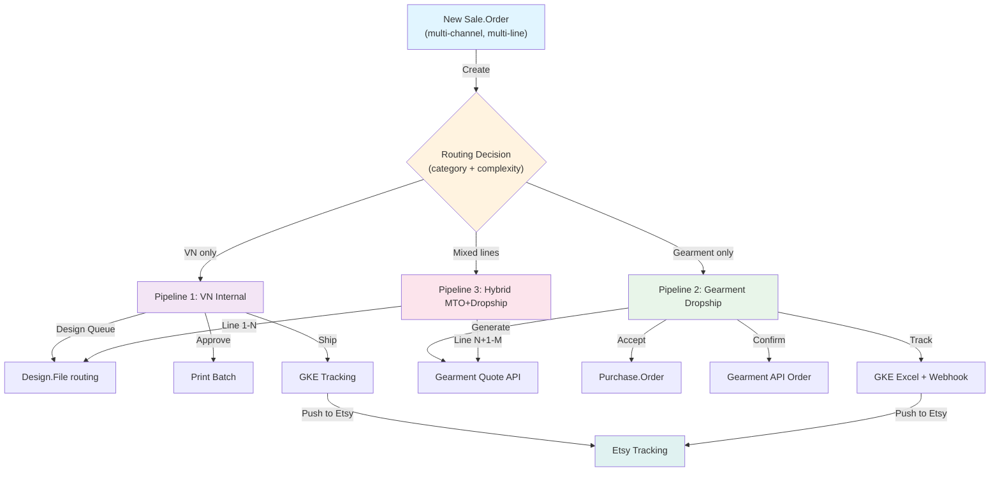

# Overview: Vision, Scope, Actors, and Fulfillment Pipelines

**Title:** Product Overview and Strategic Direction  
**Date:** 2026-07-03  
**Status:** Draft-for-owner-review  
**Source:** Master Plan 006 overview, module reports, and BA requirements from specs 001–014.

---

## 1. Product Vision

**Mission Statement:**  
Consolidate fragmented Etsy order management, design workflow, and fulfillment operations into a unified Odoo 19 CE platform that:

1. **Ingest Etsy orders** via API (primary) and email (fallback)
2. **Route fulfillment** to three pipelines: internal VN production, Gearment POD dropship, or hybrid
3. **Manage design workflow** from order → mockup approval → production files → pickup/drop-ship
4. **Track shipments** via GKE Excel + GDrive integrations and push tracking back to Etsy
5. **Control product catalog** via Excel bulk sync, multichannel listing logic, and Odoo-to-Etsy publish (Phase 3)

**Timeframe:** Phases 0–5 (2026-05 through 2026-10+). Phase 1 (order ingest + tracking + dashboards) live on staging 2026-07-03; Phase 3 (catalog publish) begins 2026-07-04.

---

## 2. Key Actors & Roles

### User Roles (5 primary)

| Role | Org Unit | Key Responsibilities | Module Group | ACL Gate |
|------|----------|----------------------|--------------|----------|
| **Operations Manager** | Fulfillment | Assign orders to internal/dropship, approve address changes, monitor tracking, manage inventory sync | OPS (dashboards, approvals, GKE tracking) | `group_multichannel_ops_lead` |
| **Production Lead (VN)** | Production | Manage design queue, mark orders ready-for-design, schedule picking, print batches, track in-house fulfillment | PRODUCTION (design file routing, fulfillment state, picking) | `group_vn_production_lead` |
| **Gearment Operator** | Fulfillment | Generate Gearment quotes, accept POes, monitor dropship status, reconcile shipping | DROPSHIP (GKE, Gearment API, tracking) | `group_gearment_dropship` |
| **Marketing / Etsy Manager** | Sales | Configure Etsy shop, publish listings, manage shipping profiles, monitor order dashboard | ETSY + CATALOG (shop config, listing publish, currency) | `group_etsy_shop_manager` |
| **BA/Product Lead** | Product | Create design rules, manage product catalog, configure category routing, set pricing overrides, generate Excel exports | CATALOG + OPS (multi-design rules, SKU derivation, export wizard) | `group_product_lead` |

### BA User Groups (7 backend groups per module)

| Group | Purpose | Module | Models | Permissions |
|-------|---------|--------|--------|-------------|
| `group_etsy_shop_manager` | Etsy shop OAuth, config, order view | etsy_integration | etsy.shop, sale.order | CREATE, WRITE (shop level), READ (orders by shop_id) |
| `group_multichannel_ops_lead` | Ops dashboard, order approvals, sync health | multichannel_hub_core | sale.order, sale.order.fulfillment, multichannel.sync.health | WRITE (approval, state transitions), READ (all) |
| `group_vn_production_lead` | Design file routing, production state | multichannel_hub_core | design.file, design.file.route, order.pipeline.state | CREATE (routes), WRITE (design approval, state), READ (all) |
| `group_gearment_dropship` | Gearment API access, quote/PO, tracking | multichannel_hub_fulfillment | gearment.po, gearment.quote, sale.order.fulfillment | READ/WRITE (quote + PO), READ (tracking) |
| `group_product_lead` | Product hub, catalog sync, listing override, publish | multichannel_hub_core | multichannel.listing, product.product, product_template_attribute_value | WRITE (listing override, publish), CREATE (catalog via import) |
| `group_multichannel_syncer` | Automated syncs (cron-triggered) | multichannel_hub_core, etsy_integration | multichannel.sync.health, etsy.email.log, multichannel.api.log | WRITE (health flag, log entry), READ (all) |
| `group_analytics_reader` | Dashboard-only read access | multichannel_hub_core | sale.order, sale.order.fulfillment (computed fields only) | READ (all dashboards, no CREATE/WRITE) |

---

## 3. Scope Boundaries

### In Scope (Phases 0–3)

- **Order Ingest** — Etsy API v3 (primary, Phase 1) and email (fallback, Phase 0 legacy)
- **Order Routing** — Fulfillment pipeline assignment by product category + design complexity
- **Design Workflow** — File upload, approval, production file routing, GDrive integration
- **Tracking Import** — GKE Excel + GDrive polling; tracking state machine
- **Etsy Tracking Push** — Sync tracking numbers back to Etsy shop
- **Product Catalog** — Excel bulk import, SKU auto-derivation, multichannel listing model
- **Etsy Listing Publish** — Odoo-initiated listing sync to Etsy (Phase 3, ~6% complete)
- **Dashboards** — Order status, tracking status, operations dashboard (all Phase 1)

### Out of Scope (Reserved for later phases or external systems)

- **Amazon integration** — Phase 5 (0% complete, lower priority)
- **Email/messaging after-sale** — `conversations_r` scope blocked; Phase 1-BLOCKED (3 tasks)
- **Financial reconciliation** — Phase 4 audit (deferred); no automated payment sync to Odoo
- **Advanced inventory forecasting** — SKU drift monitoring MVP only; demand forecasting Phase 5+
- **Returns/RMA workflow** — Phase 4 (75% complete, basic tracking only)
- **B2B wholesale channel** — Phase 5 or later

---

## 4. Three Fulfillment Pipelines

All order routing follows one of three pipelines defined in `order.pipeline` and orchestrated via `x_pipeline_id` computed field on `sale.order`. The routing decision is triggered at order creation and can be manually overridden per order.

### Pipeline 1: Internal VN Production

**Route:** `vn_internal_production` (code) / "VN Internal Production" (display name)

**Stages:** (from `order.pipeline.state`)
1. "New Order" — Awaiting design files
2. "Design In Queue" — Waiting for production team to pick up
3. "Design Complete" — Mockup(s) approved; ready to schedule
4. "Scheduled to Print" — Batch scheduled; production lead confirmed
5. "Printing" — On-press
6. "Quality Check" — Post-print verification
7. "Scheduled to Ship" — Ready for pickup
8. "Picked" — Physical item collected
9. "Shipped" — Tracking number recorded
10. "Delivered" — End customer received

**Trigger:** Order line product category in `{vn_production_eligible_category_ids}` AND no complex multi-variant personalization.

**Key Actors:** Production Lead (design routing), Operations Manager (approval), GKE Logistics (tracking).

**Data Models:** `design.file`, `design.file.route` (file → production), `order.pipeline.state`, `sale.order.fulfillment` (tracking).

---

### Pipeline 2: Gearment POD Dropship

**Route:** `gearment_dropship` (code) / "Gearment Dropship" (display name)

**Stages:**
1. "New Order" → "Quote Requested"
2. "Quote Received" — Gearment API `/quote` response retrieved
3. "PO Accepted" — Odoo user confirms Gearment `purchase.order` link
4. "Order Placed" — PO synced to Gearment API
5. "Order Confirmed" — Gearment API `/order` confirmation received
6. "Processing" — Gearment printing + fulfillment
7. "Ready to Ship" — Gearment reports fulfillment complete
8. "Shipped" — Gearment tracking number received + pushed to Etsy
9. "Delivered" — End customer confirms receipt (via Etsy or carrier)

**Trigger:** Order line product SKU in `{gearment_eligible_sku_set}` OR category flagged `gearment_only=True` OR user manual override.

**Key Integration:** Gearment API v3 (shop_product_id, quote, PO creation, tracking webhook).

**Key Actors:** Gearment Operator (quote accept), Operations Manager (approval), GKE Logistics (tracking push).

**Data Models:** `gearment.quote`, `gearment.po`, `sale.order.fulfillment` (tracking).

---

### Pipeline 3: Hybrid (Mixed MTO + Dropship)

**Route:** `hybrid_mto_dropship` (code) / "Hybrid MTO + Dropship" (display name)

**Stages:** Union of Pipeline 1 + Pipeline 2 stages; order lines can split across both routes.

**Trigger:** Order lines from multiple categories; some `vn_internal`, some `gearment_eligible`.

**Routing Logic:**  
At order creation, foreach line:
- Resolve category chain (product → category → parent category)
- Check `category.vn_production_only`, `category.gearment_only`, `category.hybrid_eligible`
- Assign line to sub-pipeline (internal or dropship)
- Override available if user manually assigns line to different pipeline

**Complexity:** Line-level state machine; order-level "stuck route" badge if any line pending > 2 hours (Phase 1 P1-01a).

**Key Models:** `sale.order.line` (pipeline assignment), `order.pipeline.state` (line-level state), `sale.order` (stuck_route_badge computed field).

---

## 5. Fulfillment Pipeline Diagram

---

## 6. Success Metrics (Phase 1 Exit Criteria)

| Metric | Target | Evidence |
|--------|--------|----------|
| **Order Ingest Latency** | <5 min (API), <15 min (email fallback) | Cron log + etsy.email.log.created_at timestamp |
| **Design Workflow TAT** | <24h from order to approved design | design.file.transition_log timeline |
| **Tracking Accuracy** | 95%+ order tracking numbers matched to carrier | multichannel.sync.health.last_sync_error rate |
| **Etsy Tracking Push** | 100% successful order tracking synced to Etsy within 1h | sale.order.fulfillment.etsy_tracking_pushed_at |
| **Dashboard Uptime** | >99.5% availability (order + tracking + ops dashboards) | bus.bus channel + web client session logs |
| **Fulfillment Route Accuracy** | 98%+ orders routed to correct pipeline (no manual override needed) | x_pipeline_id audit trail vs. actual fulfillment path |

---

## 7. Out-of-Scope Technical Debt (Phase 2+)

- **Inventory forecasting:** Phase 5. Current state: SKU drift detection only (P-HUB-SKU-AUTODERIVE).
- **AI-powered design routing:** Phase 5. Current: rule-based category logic.
- **Multi-currency pricing:** Partial Phase 1 (listing_currency_id on etsy.shop). Full Phase 3.
- **Advanced analytics:** Phase 4. Current: pivot views + dashboards only.

---

**Document Version:** 1.0  
**Next Section:** [02-channel-etsy.md](02-channel-etsy.md) — Etsy Shop Management, OAuth, Order Ingest
